

  

**Universidad Peruana de Ciencias Aplicadas**

**Ingeniería de Software**

**1ASI0657 | Fundamentos de Arquitectura de Software** 
**202620**

**NRC: 15987**

**Profesor: Jorge Luis Delgado Vite**

## Trabajo Final

**Nombre del producto: CrediCasa** 

**Integrantes:**

| Código | Apellidos y nombres |
|---|---|
| u202312912 | Jonseck Choque, Oliver |
| u20251c350 | Godoy Santillan, Jesus Andres |
| u202219266 | Pumahualcca Garcia, Diego Rodrigo |
| u202224130 | Ramos Hinostroza, Diego Antonio |
| u202310349 | Rubio Otiz, Luis Sebastián |

# Registro de Versiones del Informe

| Versión | Fecha | Autor(es) | Descripción de modificación |
|---|---|---|---|
| 1.0 | 03/09/2026 | Diego Antonio Ramos Hinostroza | Creación del documento y estructura base |
| 1.0.0.1 | 03/09/2026 | Luis Sebastián Rubio Ortiz | Modificación de nombre y agregado de código de estudiante |
| 1.0.0.2 | 06/09/2026 | Diego Antonio Ramos Hinostroza | Se añadió todo el contenido del Capitulo I |
| 1.0.0.3 | 17/09/2026 | Grupo FidiaCorp | Se completó las últimas mejoras con formato y capítulos pendientes AV1 |
| 1.0.0.4 | 22/09/2026 | Grupo FidiaCorp | Se completo las ultimas mejoras con formato e capitulos pendientes AV2. |
| 1.0.0.5 | 08/10/2026 | Grupo FidiaCorp | Se completo las ultimas mejoras con formato e capitulos pendientes TP1. |

# Contenido

- [Student Outcome](#student-outcome)
- [Capítulo I: Introducción](#capítulo-i-introducción)
	- [1.1. Startup Profile](#11-startup-profile)
		- [1.1.1. Descripción de la startup](#111-descripción-de-la-startup)
		- [1.1.2. Perfiles de integrantes del equipo](#112-perfiles-de-integrantes-del-equipo)
	- [1.2. Solution Profile](#12-solution-profile)
		- [1.2.1. Nombre del producto](#121-nombre-del-producto)
		- [1.2.2. Antecedentes y problemática](#122-antecedentes-y-problemática)
		- [1.2.3. Lean UX Process](#123-lean-ux-process)
			- [1.2.3.1. Lean UX Problem Statement](#1231-lean-ux-problem-statement)
			- [1.2.3.2. Lean UX Assumptions](#1232-lean-ux-assumptions)
			- [1.2.3.3. Lean UX Hypothesis](#1233-lean-ux-hypothesis)
			- [1.2.3.4. Lean UX Canvas](#1234-lean-ux-canvas)
	- [1.3. Segmentos objetivo](#13-segmentos-objetivo)
- [Capítulo II: Requirements Elicitation & Analysis](#capítulo-ii-requirements-elicitation--analysis)
	- [2.1. Competidores](#21-competidores)
		- [2.1.1. Análisis competitivo](#211-análisis-competitivo)
		- [2.1.2. Estrategias y tácticas frente a competidores](#212-estrategias-y-tácticas-frente-a-competidores)
	- [2.2. Entrevistas](#22-entrevistas)
		- [2.2.1. Diseño de entrevistas](#221-diseño-de-entrevistas)
		- [2.2.2. Registro de entrevistas](#222-registro-de-entrevistas)
		- [2.2.3. Análisis de entrevistas](#223-análisis-de-entrevistas)
	- [2.3. Needfinding](#23-needfinding)
		- [2.3.1. User Personas](#231-user-personas)
		- [2.3.2. User Task Matrix](#232-user-task-matrix)
		- [2.3.3. User Journey Mapping](#233-user-journey-mapping)
		- [2.3.4. Empathy Mapping](#234-empathy-mapping)
		- [2.3.5. As-Is Scenario Mapping](#235-as-is-scenario-mapping)
	- [2.4. Big Picture EventStorming](#24-big-picture-eventstorming)
	- [2.5. Ubiquitous Language](#25-ubiquitous-language)
- [Capítulo III: Requirements Specification](#capítulo-iii-requirements-specification)
	- [3.1. To-Be Scenario Mapping](#31-to-be-scenario-mapping)
	- [3.2. User Stories](#32-user-stories)
	- [3.3. Impact Map](#33-impact-map)
	- [3.4. Product Backlog](#34-product-backlog)
- [Capítulo IV: Product Architecture Design](#capítulo-iv-product-architecture-design)
	- [4.1. Design Concepts, ViewPoints & ER Diagrams](#41-design-concepts-viewpoints--er-diagrams)
		- [4.1.1. Principles Statements](#411-principles-statements)
		- [4.1.2. Approaches Statements Architectural Styles & Patterns](#412-approaches-statements-architectural-styles--patterns)
		- [4.1.3. Context Diagram](#413-context-diagram)
		- [4.1.4. Approach Driven ViewPoints Diagrams](#414-approach-driven-viewpoints-diagrams)
		- [4.1.5. Relational/Non Relational Database Diagram](#415-relationalnon-relational-database-diagram)
		- [4.1.6. Design Patterns](#416-design-patterns)
		- [4.1.7. Tactics](#417-tactics)
	- [4.2. Architectural Drivers](#42-architectural-drivers)
		- [4.2.1. Design Purpose](#421-design-purpose)
		- [4.2.2. Primary Functionality](#422-primary-functionality)
		- [4.2.3. Quality Attribute Scenarios](#423-quality-attribute-scenarios)
		- [4.2.4. Constraints](#424-constraints)
		- [4.2.5. Architectural Concerns](#425-architectural-concerns)
	- [4.3. ADD Iterations — Attribute-Driven Design](#43-add-iterations--attribute-driven-design)
		- [4.3.1. Iteration 1: Estructura Global del Sistema y Asignación de Responsabilidades](#431-iteration-1-estructura-global-del-sistema-y-asignación-de-responsabilidades)
		- [4.3.2. Iteration 2: Diseño y Refinamiento del Núcleo Financiero](#432-iteration-2-diseño-y-refinamiento-del-núcleo-financiero)
		- [4.3.3. Iteration 3: Trazabilidad, Versionado y Exportación de Cotizaciones](#433-iteration-3-trazabilidad-versionado-y-exportación-de-cotizaciones)
- [Conclusiones](#conclusiones)
- [Recomendaciones](#recomendaciones)
- [Referencias Bibliográficas](#referencias-bibliográficas)
- [Anexos](#anexos)
	- [Anexo A — Código fuente de los diagramas Mermaid](#anexo-a--código-fuente-de-los-diagramas-mermaid)

# Student Outcome

<table>
	<thead>
		<tr>
			<th>Criterio</th>
			<th>Acción realizada</th>
			<th>Conclusión</th>
		</tr>
	</thead>
	<tbody>
		<tr>
			<td>Actualiza conceptos y conocimientos necesarios para su desarrollo profesional y en especial para su proyecto en soluciones de software.</td>
			<td><strong>Jonseck Choque, Oliver:</strong>  AV1: Realice los primeros bocetos e ideas del startup, junto a ello desarrolle la documentacion acerca de los diferentes requerimientos necesarios y las necesidades del cliente. <strong> Godoy Santillan, Jesus Andres:</strong>  AV1: Investigué y apliqué de manera autónoma metodologías avanzadas de diseño centrado en el usuario (UCD) y análisis de requerimientos para optimizar la experiencia en la plataforma CrediCasa. Conduje las entrevistas a profundidad correspondientes al segmento 1, lo que me permitió extraer insights reales del mercado para estructurar el Mapa de Empatía y definir los User Personas. A partir de estos hallazgos, elaboré el User Task Matrix, el Scenario Mapping y el User Journey Mapping, traduciendo las necesidades de los clientes en mejoras estratégicas y funcionales directas para los flujos de interacción del usuario con los servicios del sistema. <strong> Pumahualcca Garcia, Diego Rodrigo:</strong>  AV1: Investigué y actualicé de manera autónoma mis conocimientos en patrones de arquitectura orientados a microservicios y despliegue en la nube (Cloud Computing), evaluando su aplicabilidad específica para el entorno SaaS de CrediCasa. Además, me documenté sobre la integración segura de APIs financieras, lo cual fue clave para estructurar la comunicación entre el simulador de cuotas y el motor de cálculo, garantizando la correcta aplicación del método francés y los lineamientos de la SBS. <strong> Ramos Hinostroza, Diego Antonio:</strong>  AV1: Investigué y actualicé de manera autónoma conceptos avanzados de arquitectura empresarial y descomposición por microservicios basados en Domain-Driven Design (DDD). Asimismo, asimilé la normativa técnica y financiera de la SBS relativa a la transparencia en créditos hipotecarios, lo que me permitió traducir reglas de negocio complejas (método francés, conversión de regímenes de capitalización, VAN, TIR y TCEA) en especificaciones directas para el modelado del motor de cálculo y el diseño preliminar de los bounded contexts de la plataforma CrediCasa. <strong> Rubio Ortiz, Luis Sebastián:</strong>  AV1:</td>
			<td>AV1:</td>
		</tr>
		<tr>
			<td>Reconoce la necesidad del aprendizaje permanente para el desempeño profesional y el desarrollo de proyectos en soluciones de software.</td>
			<td><strong>Jonseck Choque, Oliver:</strong>  AV1: Descubri la importancia de enteder al cliente y sus necesidades al momento de realizar pagos de suma importantcia. <strong> Godoy Santillan, Jesus Andres:</strong>  AV1: Reconocí que la evolución constante de las expectativas y comportamientos del usuario en el ecosistema financiero y proptech exige una mentalidad de aprendizaje permanente. Al enfrentarme al reto de traducir los hallazgos de las entrevistas en artefactos de diseño centrado en el usuario (Mapa de Empatía, User Journey Mapping y Scenario Mapping), comprendí que mi desempeño profesional requiere una actualización continua en nuevas metodologías de investigación (User Research) y psicología del consumidor. Asimilé que, para garantizar el éxito y la adopción de nuestras soluciones de software, debo investigar y adoptar proactivamente nuevos estándares de usabilidad y accesibilidad que me permitan anticiparme a las demandas dinámicas del mercado. <strong> Pumahualcca Garcia, Diego Rodrigo::</strong>  AV1: Comprendí que el desarrollo de soluciones dentro del ecosistema financiero y proptech exige una actualización tecnológica y regulatoria constante. Al enfrentarme a los cálculos de TCEA, VAN y TIR, reconocí que como ingeniero de software debo integrar proactivamente nuevas herramientas de la industria, arquitecturas escalables y estándares de seguridad para asegurar que la plataforma pueda adaptarse rápidamente a futuros cambios en el mercado inmobiliario y las normativas peruanas. <strong> Ramos Hinostroza, Diego Antonio:</strong>  AV1: Reconocí la importancia de la autoformación continua al enfrentar la brecha entre los requerimientos funcionales del dominio inmobiliario-financiero y la definición de requerimientos de calidad arquitectónicos (ASRs). Comprendí que el rol de arquitecto de software exige investigar activamente estándares emergentes de la industria, metodologías de diseño como Attribute-Driven Design (ADD) y patrones cloud nativos para garantizar soluciones escalables, auditables y con alta mantenibilidad frente a entornos regulatorios dinámicos. <strong> Rubio Ortiz, Luis Sebastián:</strong>  AV1:</td>
			<td>AV1:</td>
		</tr>
	</tbody>
</table>

## 1.1. Startup Profile

### 1.1.1. Descripción de la startup

**FidiaCorp** es una iniciativa tecnológica concebida y desarrollada por estudiantes de la carrera de Ingeniería de Software de la Universidad Peruana de Ciencias Aplicadas (UPC). La propuesta se materializa a través de CrediCasa, un ecosistema digital y plataforma FinTech/PropTech orientada a transformar radicalmente el proceso de simulación, estructuración y originación de créditos hipotecarios en el mercado peruano, transitando desde modelos de asesoría financiera tradicionales, lentos y asimétricos hacia un esquema digital, transparente y analíticamente riguroso.

CrediCasa articula una arquitectura empresarial moderna basada en microservicios y servicios en la nube, integrando un motor financiero especializado capaz de computar cronogramas de amortización mediante el método francés vencido ordinario (bajo convención de meses de 30 días o año bancario de 360 días). El sistema soporta operaciones multimoneda (Soles y Dólares), maneja conversión estricta entre tasas de interés efectivas y nominales con períodos variables de capitalización, incorpora períodos de gracia total o parcial, y procesa esquemas de financiamiento estructurado con cuotas balón. Asimismo, automatiza la evaluación de rentabilidad y costo financiero para el prestatario mediante el cálculo del Valor Actual Neto (VAN), la Tasa Interna de Retorno (TIR) desde la óptica del deudor, y la Tasa de Costo Efectivo Anual (TCEA), transparentando primas de seguro de desgravamen y seguros multirriesgo del bien inmueble conforme a las disposiciones normativas de la Superintendencia de Banca, Seguros y AFP (SBS).

**Misión:** Transformar la experiencia de adquisición de vivienda y estructuración de crédito hipotecario en el Perú mediante el desarrollo de software confiable, auditable y escalable, eliminando la asimetría informativa financiera y optimizando la toma de decisiones económicas tanto para familias compradoras como para entidades promotoras e intermediarias.

**Visión:** Consolidarnos como la plataforma PropTech/FinTech de referencia a nivel nacional y regional en la simulación, evaluación y orquestación arquitectónica de créditos hipotecarios e inversión inmobiliaria, promoviendo la bancarización transparente, la eficiencia operativa en el sector de la construcción y el acceso universal a instrumentos financieros justos y comprensibles.

### 1.1.2. Perfiles de integrantes del equipo

<table>
	<thead>
		<tr>
			<th>Integrante</th>
			<th>Perfil</th>
			<th>Imagen</th>
		</tr>
	</thead>
	<tbody>
		<tr>
			<td>Jonseck Choque, Oliver - u202312912</td>
			<td>Mi nombre es Oliver, poseo 21 años. Poseo mucho interés en la programación y llevo haciendo varios proyectos personales desde que ingrese a la universidad. No trabajo bajo contrato actualmente, pero trabajo cómo freelancer por periodos de tiempo</td>
			<td>   </td>
		</tr>
		<tr>
			<td>Godoy Santillan, Jesus Andres - u20251c350</td>
			<td>Soy Jesús, tengo 22 años, me gusta mucho programar desde pequeño haciendo pequeños proyectos en videojuegos hasta lo último que hice que fue un gran proyecto en un evento online con creadores de contenido, patrocinadores y premios. Actualmente no trabajo formalmente pero ayudo a mi padre y junto a mi hermano haciendo sistemas y programas de una empresa que tiene junto a su amigo relacionado con la agroindustria y con el conocimiento que tengo de tecnología y solución de problemas también asesoró o ayudó a amigos de mi padre que tienen problemas técnicos relacionados con la tecnología ya sea personales o de trabajo.</td>
			<td>   </td>
		</tr>
		<tr>
			<td>Pumahualcca Garcia, Diego Rodrigo - u202219266</td>
			<td>Estudiante de sexto ciclo de la carrera de Ingeniería de Software en la Universidad Peruana de Ciencias Aplicadas (UPC). Cuento con un conocimiento en el diseño de arquitectura de software y desarrollo backend. En el desarrollo de CrediCasa, mi objetivo principal es utilizar la tecnología para resolver un problema real y social: la falta de transparencia en los créditos hipotecarios.</td>
			<td>[Por completar]</td>
		</tr>
		<tr>
			<td>Ramos Hinostroza, Diego Antonio - u202224130</td>
			<td>Estudiante de sexto ciclo de la carrera de Ingeniería de Software en la Universidad Peruana de Ciencias Aplicadas (UPC). Cuenta con dominio en diseño de arquitectura de software, desarrollo backend y consumo/integración de servicios web bajo estándares de la industria. Posee experiencia técnica en la construcción e integración de APIs REST utilizando Java (Spring Boot), C# y Python, así como en el diseño y modelado de bases de datos relacionales y NoSQL.</td>
			<td>   </td>
		</tr>
		<tr>
			<td>Rubio Ortiz, Luis Sebastián - u202310349</td>
			<td>Soy Sebastián, soy estudiante de la carrera de ingenieria de software, tengo 20 años y me gusta lograr grandes cosas programando, suelo interesarme mucho por aprender cosas nuevas en el mundo de la programacián más que nada. Me gusta apoyar a mis compañeros para los trabajos, considero que soy de trabajar en equipo. Tengo conocimientos en C#, C++, JavaScript, Python y TypeScript.</td>
			<td>  </td>
		</tr>
	</tbody>
</table>

## 1.2. Solution Profile

### 1.2.1. Nombre del producto

**CrediCasa** es la denominación comercial y técnica de nuestra plataforma digital. El nombre surge de la integración conceptual de dos pilares esenciales: el prefijo "Credi-", que remite tanto al concepto de crédito hipotecario como a su raíz etimológica latina credere (creer, confiar y dar fe), y el sustantivo "-Casa", que simboliza el anhelo patrimonial y habitacional central de las familias peruanas.

### 1.2.2. Antecedentes y problemática

El sector inmobiliario peruano experimenta una paradoja estructural: mientras la demanda habitacional supera las 1.8 millones de unidades a nivel nacional debido al déficit habitacional cualitativo y cuantitativo registrado por el Ministerio de Vivienda, Construcción y Saneamiento (MVCS, 2024), la tasa de colocación de créditos hipotecarios enfrenta severas barreras de entrada motivadas por la complejidad financiera y la desconfianza del usuario frente al sistema bancario.

De acuerdo con reportes de la Superintendencia de Banca, Seguros y AFP (SBS, 2025), más del 65% de los solicitantes de crédito para vivienda declaran incomprensión de las hojas de liquidación y los factores que integran la Tasa de Costo Efectivo Anual (TCEA), confundiendo frecuentemente la Tasa Efectiva Anual (TEA) contractual con el desembolso total periódico. Esta opacidad se agudiza por la incorporación de conceptos como primas de seguro de desgravamen (con tasas fijas o porcentuales sobre saldo insoluto), pólizas multirriesgo obligatorias, comisiones de estructuración y esquemas de amortización con cuotas dobles o cuotas balón diferidas.

Asimismo, las empresas inmobiliarias y promotoras pierden entre un 25% y un 35% de prospectos calificados durante el proceso de preventa debido a los extensos tiempos de respuesta y la falta de herramientas inmediatas de pre-calificación que permitan modelar en tiempo real distintos escenarios financieros adaptados al perfil del comprador (financiamiento en Soles o Dólares, tasas fijas o mixtas, y períodos de gracia total o parcial).

Para estructurar formalmente el análisis de la problemática, se aplica la técnica 5 W's y 2 H's:

| Pregunta | Respuesta |
|---|---|
| **What (qué)** | La existencia de asimetría informativa, falta de transparencia y lentitud en la simulación, estructuración y evaluación matemática de créditos hipotecarios en el Perú, impidiendo que el comprador visualice el costo real del financiamiento (TCEA, VAN, TIR) y que la empresa inmobiliaria concrete colocaciones de forma ágil y fidedigna. |
| **Why (por qué)** | Debido a la dispersión de la información bancaria, la complejidad de las fórmulas financieras aplicadas (conversiones entre tasas nominales/efectivas con capitalizaciones no estándar, cálculo francés de cuota constante con gracia e inclusión de seguros) y la dependencia de simuladores web bancarios cerrados, desactualizados y con omisión sistemática de gastos colaterales obligatorios. |
| **Who (quién)** | Afecta en primera instancia a las familias y profesionales peruanos con intención de compra de su primer inmueble (deudores), y en segunda instancia a las empresas promotoras, constructoras e inmobiliarias que necesitan cerrar compromisos de venta sustentados en la viabilidad crediticia de sus clientes. |
| **When (cuándo)** | Se suscita durante la etapa crítica de preventa y evaluación crediticia inicial, momento en el cual el comprador explora opciones de inmuebles y requiere definir su estructura de financiamiento a mediano o largo plazo (de 5 a 25 años) sin contar con certezas sobre su carga financiera mensual futura. |
| **Where (dónde)** | El entorno de estudio se focaliza en el mercado inmobiliario de Lima Metropolitana, zona que concentra más del 55% de los créditos hipotecarios emitidos en el Perú (CAPECO, 2025), con visión de escalabilidad e integración a nivel nacional en las principales urbes del país. |
| **How (cómo)** | A través de una plataforma web y móvil empresarial basada en microservicios que ofrece un motor de cálculo financiero auditable. Este motor modela el plan de pagos por el método francés vencido ordinario a 30 días, calcula indicadores financieros clave de decisión (VAN y TIR del deudor, TCEA oficial), evalúa opciones de configuración multimoneda, regímenes de tasa y períodos de gracia, y provee comparativas directas frente a benchmarks del sistema financiero autorizado. |
| **How much (cuánto)** | A nivel de mercado, la caída de operaciones de preventa por falta de financiamiento viable representa pérdidas comerciales anuales estimadas en más de US$ 120 millones para el sector constructor limeño. A nivel técnico, el desarrollo e implementación de la arquitectura cloud de CrediCasa proyecta un presupuesto de inversión inicial acotado entre S/. 35,000 y S/. 65,000 para su fase de MVP y despliegue sobre infraestructura serverless y contenedores de alta disponibilidad. |

### 1.2.3. Lean UX Process

#### 1.2.3.1. Lean UX Problem Statement

**Problem Statement 1: Segmento Demandante - Comprador de Vivienda**

El acceso a la primera vivienda en el Perú representa una de las decisiones patrimoniales más trascendentales de un individuo o grupo familiar; no obstante, el proceso de obtención de un crédito hipotecario está marcado por la opacidad en el cálculo de las cuotas y la desinformación en torno al costo total del crédito. Los postulantes a financiamiento habitacional se enfrentan a cronogramas bancarios difíciles de auditar, donde la Tasa de Costo Efectivo Anual (TCEA) real no es transparente desde el inicio y los períodos de gracia (totales o parciales) o cuotas extraordinarias son presentados sin desglosar su impacto matemático en los intereses acumulados.

*¿Cómo podemos diseñar una solución digital intuitiva y rigurosa que permita a los futuros propietarios simular, personalizar y comprender con precisión matemática y transparencia legal el plan de amortización, el costo efectivo real y la viabilidad económica de su crédito hipotecario antes de contraer un compromiso crediticio a largo plazo?*

**Problem Statement 2: Segmento Oferente - Empresas Inmobiliarias y Asesores**

Las empresas promotoras e inmobiliarias peruanas enfrentan una alta tasa de deserción de compradores potenciales durante la etapa de cotización debido a la incapacidad de calcular de forma instantánea y fidedigna planes de financiamiento estructurado adaptados a la capacidad económica real de cada cliente. La necesidad de derivar al comprador a múltiples agentes bancarios para cotizaciones manuales genera fricción operativa, tiempos muertos de hasta 20 días laborales y pérdida irreversible de reservas de compra.

*¿Cómo podemos proveer a las inmobiliarias y gestores comerciales de un sistema centralizado de simulación y evaluación hipotecaria multientidad que acelere la pre-calificación crediticia, optimice el cierre de ventas y genere cronogramas normativos en cuestión de minutos?*

#### 1.2.3.2. Lean UX Assumptions

##### Business Assumptions

1. Lograr una tasa de adopción de más de 1,500 simulaciones mensuales durante los primeros 4 meses de operaciones en Lima Metropolitana.
2. Alcanzar alianzas con al menos 10 empresas promotoras inmobiliarias para integrar el motor de simulación de CrediCasa en sus salas de venta.
3. Monetizar la plataforma a través de un modelo SaaS B2B para inmobiliarias (licenciamiento por sala de ventas y gestión de leads pre-calificados) y comisiones de referenciación con entidades financieras aliadas.
4. Posicionar la marca FidiaCorp como líder tecnológico en soluciones FinTech y PropTech en el ámbito académico y profesional.

##### User Assumptions

1. **¿Quién es el usuario?:** Individuos y familias con capacidad de ahorro y estabilidad laboral que buscan adquirir una vivienda mediante crédito hipotecario (B2C), así como asesores comerciales y gestores de venta de proyectos inmobiliarios (B2B).
2. **¿Dónde encaja el producto en su rutina?:** Como una plataforma de autoservicio y asesoría comercial accesible desde dispositivos móviles y navegadores web durante la fase de búsqueda de inmuebles, cotización y negociación de condiciones de crédito.
3. **¿Cuándo y cómo se utiliza?:** Al momento de evaluar un proyecto inmobiliario específico, cotizar cuotas iniciales y plazos, comparar alternativas de tasa (efectiva vs. nominal con distintas capitalizaciones) o definir la pertinencia de solicitar meses de gracia.
4. **¿Qué problemas resuelve la solución?:** Elimina la opacidad financiera, evita sobrecostos imprevistos derivados de primas y comisiones ocultas, y automatiza la generación de cronogramas de pagos bajo el método francés vencido con balance a saldo cero verificado matemáticamente.
5. **¿Qué características son prioritarias?:**
   - Gestión de Identidades
   - Registro de propietario e inmobiliario
   - Consulta de entidades bancarias
   - Cálculo de métricas de decisión de inversión
   - Generación de cronogramas y ayudas contextuales
6. **¿Cómo debe comportarse la plataforma?:** La interfaz debe ser limpia, libre de tecnicismos bancarios confusos, con visualizaciones gráficas del flujo de amortización vs. intereses, y con tiempos de respuesta sub-segundo en el cálculo dinámico de cuotas.

#### 1.2.3.3. Lean UX Hypothesis

1. **H1:** Creemos que proporcionar a los compradores de vivienda una herramienta interactiva de simulación en tiempo real que transparente la TCEA y el cronograma de amortización francés aumentará su confianza y determinación de compra. Sabremos que hemos tenido éxito cuando alcancemos una tasa de conversión superior al 25% entre los usuarios que configuran una simulación completa y aquellos que solicitan la formalización de su expediente de crédito.
2. **H2:** Creemos que al permitir a los promotores inmobiliarios estructurar planes de financiamiento con tasas nominales/efectivas, cuotas dobles y períodos de gracia total y parcial desde una sola plataforma se reducirán drásticamente los tiempos de cotización. Sabremos que hemos tenido éxito cuando el tiempo de atención y emisión de una propuesta de financiamiento en salas de venta disminuya de 45 minutos a menos de 5 minutos, validado en encuestas de satisfacción técnica de nuestros socios B2B.
3. **H3:** Creemos que incorporar los indicadores VAN y TIR evaluados estrictamente desde la óptica del deudor permitirá a los usuarios comparar objetivamente las ofertas entre entidades financieras. Sabremos que esto es cierto cuando el 70% de los usuarios recurrentes utilicen la función de comparación multientidad antes de definir la entidad financiera para su solicitud formal.

#### 1.2.3.4. Lean UX Canvas

<table>
    <tr>
        <td valign="top">
            
 <b>Business Problem</b>
 
            
El mercado de financiamiento hipotecario en Lima Metropolitana presenta una severa asimetría informativa y opacidad financiera, donde más del 65% de los solicitantes de crédito no comprende la composición real de la TCEA, seguros obligatorios ni el impacto de los períodos de gracia. A su vez, las empresas inmobiliarias experimentan pérdidas operativas y caídas de reservas de entre el 25% y el 35% debido a la lentitud en la evaluación crediticia y a la falta de herramientas ágiles de simulación en salas de venta.  ¿Cómo podríamos facilitar un ecosistema digital confiable y auditable que automatice la simulación financiera hipotecaria multientidad, acelerando la pre-calificación comercial y transparentando el costo efectivo real (TCEA, VAN y TIR) para el deudor?
 
        </td>
        <td rowspan="2" valign="top">
            
 <b>Solutions</b>
 
            <ul>
                <li>Desarrollar un motor financiero cloud nativo que compute cronogramas de pago bajo el método francés ordinario vencido (meses de 30 días), soportando cuotas balón y períodos de gracia total o parcial.</li> 
                <li>Implementar un módulo de configuración financiera flexible para operaciones multimoneda (PEN y USD) con conversión de tasas efectivas y nominales según su capitalización.</li> 
                <li>Construir un dashboard interactivo de simulación para compradores que desglose en tiempo real cuotas, primas de seguros y métricas de rentabilidad (VAN y TIR desde la óptica del deudor).</li> 
                <li>Integrar un módulo de gestión de ventas para promotoras e inmobiliarias que permita generar cotizaciones formales, exportar cronogramas normativos en PDF/Excel y contrastar ofertas frente a benchmarks de la SBS.</li> 
            </ul> 
        </td>
        <td valign="top">
            
 <b>Business Outcomes</b>
 
            <ul>
                <li>Alcanzar un volumen superior a las 1,500 simulaciones mensuales completadas durante los primeros 4 meses de despliegue en Lima Metropolitana.</li> 
                <li>Concretar alianzas estratégicas con al menos 10 empresas promotoras e inmobiliarias para integrar CrediCasa en sus salas de venta en el primer semestre.</li> 
                <li>Reducir el tiempo promedio de estructuración y emisión de cotizaciones hipotecarias en sala de ventas de 45 minutos a menos de 5 minutos.</li> 
                <li>Lograr una tasa de conversión igual o mayor al 25% entre usuarios que configuran una simulación completa y aquellos que inician su pre-calificación formal.</li>
            </ul> 
        </td>
    </tr>
    <tr>
        <td valign="top">
            
 <b>Users</b>
 
            <ul>
                <li><b>Empresas inmobiliarias y promotores de vivienda en Lima (B2B):</b> Jefes de venta y asesores comerciales que necesitan pre-calificar clientes y emitir cotizaciones financieras fidedignas al instante.</li> 
                <li><b>Compradores de vivienda y deudores hipotecarios (B2C):</b> Familias y profesionales bancarizados que buscan certidumbre sobre el desembolso mensual, tasas reales y costos colaterales de su financiamiento patrimonial.</li>
            </ul> 
        </td>
        <td valign="top">
            
 <b>User Outcomes & Benefits</b>
 
            <ul>
                <li><b>Inmobiliarias:</b> Reducción de la tasa de cancelación de reservas, cierre ágil de preventas y asesoría comercial respaldada en cálculos financieros exactos y normativos.</li> 
                <li><b>Compradores:</b> Claridad absoluta del costo total de la deuda (TCEA), mitigación del sobreendeudamiento y visualización de la evolución real del saldo insoluto con balances a cero.</li> 
                <li><b>Ambos:</b> Eliminación de fricciones comerciales y asimetrías de información mediante cotizaciones estandarizadas y verificables frente al sistema bancario.</li>
            </ul> 
        </td>
    </tr>
    <tr>
        <td valign="top">
            
 <b>Hypotheses</b>
 
            
Creemos que la plataforma CrediCasa incrementará la colocación de viviendas y la certidumbre del deudor al transparentar el cronograma francés, la TCEA real y los indicadores VAN/TIR mediante un motor analítico en tiempo real.  Sabremos que esto es cierto cuando al menos el 70% de los usuarios recurrentes comparen ofertas financieras en la plataforma y se registre una conversión superior al 25% de simulaciones hacia solicitudes crediticias formalizadas en las salas de venta aliadas.
 
        </td>
        <td valign="top">
            
 <b>What's the most important thing we need to learn first?</b>
 
            <ul>
                <li>Validar si los compradores comprenden la diferencia e impacto económico entre una tasa nominal/efectiva y la TCEA con seguros de desgravamen incluidos.</li> 
                <li>Comprobar si los asesores inmobiliarios están dispuestos a sustituir sus plantillas locales en Excel por una solución web integrada para atender al cliente en sala.</li> 
                <li>Determinar qué indicadores de decisión (cuota mensual, TCEA o VAN/TIR) resultan más determinantes para que el usuario elija una entidad financiera.</li>
            </ul> 
        </td>
        <td valign="top">
            
 <b>What's the least amount of work we need to do to learn the next most important thing?</b>
 
            <ul>
                <li>Desplegar un MVP funcional del simulador con el motor de cálculo francés, opciones de gracia total/parcial y desglose de TCEA conforme a la SBS.</li> 
                <li>Realizar pruebas piloto de usabilidad y cotización en vivo con 10 compradores potenciales y 5 asesores de proyectos inmobiliarios en Lima.</li> 
                <li>Auditar la concordancia matemática entre los cronogramas generados por la plataforma y liquidaciones bancarias reales para garantizar error cero.</li>
            </ul> 
        </td>
    </tr>
</table>

## 1.3. Segmentos objetivo

La propuesta de valor de FidiaCorp mediante el ecosistema CrediCasa se estructura bajo un modelo de mercado bilateral (two-sided market) dentro del sector inmobiliario y financiero de Lima Metropolitana. Este modelo articula a dos segmentos interdependientes cuyas operaciones son armonizadas mediante servicios cloud nativos y aplicaciones digitales:

### Segmento 1: Empresas Inmobiliarias y Promotoras de Vivienda

#### Definición y Perfil Demográfico
Empresas promotoras, constructoras y comercializadoras de proyectos residenciales que operan en los distritos de Lima Moderna, Lima Top y Lima Centro. Los actores representativos dentro de este segmento comprenden a gerentes comerciales, jefes de sala de ventas y asesores inmobiliarios técnicos con edades comprendidas entre los 28 y 55 años. Este perfil cuenta con educación superior y amplio dominio del proceso comercial de preventa, pero adolece de autonomía técnica en modelado financiero y depende de múltiples ventanillas bancarias para simular créditos a sus prospectos.

#### Sustento Estadístico y Problemática del Dominio
- Según el 30° Informe del Mercado de Edificaciones Urbanas de CAPECO (2025), el tiempo promedio que una promotora inmobiliaria invierte en estructurar, derivar y confirmar la viabilidad crediticia de un cliente en sala de ventas oscila entre 15 y 25 días hábiles.
- Esta fricción en el embudo comercial genera una tasa de desistimiento o pérdida de reservas de compra situada entre el 25% y el 35% de los leads atendidos en sala, provocada por la incertidumbre financiera del comprador y la incapacidad del asesor de presentar cronogramas normativos inmediatos.
- Las inmobiliarias asumen sobrecostos operativos derivados del reprocesamiento de expedientes y la dispersión de datos entre hojas de cálculo locales desarticuladas y no auditables.

#### Articulación con la Solución CrediCasa
CrediCasa entrega a este segmento un módulo SaaS B2B para gestión de salas de venta, provisto de:
- Un motor de cálculo financiero que genera cronogramas hipotecarios según el método francés a 30 días en menos de 5 segundos.
- Capacidad de parametrizar cuotas iniciales, plazos (hasta 300 meses), tasas efectivas y nominales multimoneda (PEN y USD), e incorporar períodos de gracia total o parcial y cuotas balón según convenios promotor-banco.
- Generación de cotizaciones formales auditables en PDF y Excel con desglose legal de la TCEA, reduciendo el ciclo de venta en más de un 80% y garantizando consistencia normativa ante la SBS.

### Segmento 2: Compradores de Inmuebles Residenciales y Deudores Hipotecarios

#### Definición y Perfil Demográfico
Personas naturales y núcleos familiares bancarizados residentes en Lima Metropolitana, con edades entre los 25 y 52 años, pertenecientes a los niveles socioeconómicos A, B y C+. Este segmento se compone de profesionales dependientes e independientes con capacidad demostrada de pago y ahorro para la cuota inicial (del 10% al 30% del valor del inmueble), motivados por adquirir su primera vivienda o invertir en un activo inmobiliario patrimonial.

#### Sustento Estadístico y Problemática del Dominio
- De acuerdo con el Instituto Peruano de Economía (IPE, 2024) y datos de la SBS (2025), más del 65% de los deudores hipotecarios en el Perú admite no comprender la diferencia matemática entre la Tasa Efectiva Anual (TEA) y la Tasa de Costo Efectivo Anual (TCEA), ni la forma en que los seguros obligatorios (desgravamen y multirriesgo del bien) incrementan la cuota mensual.
- La asimetría informativa bancaria y la falta de simuladores independientes multientidad inducen a decisiones subóptimas de endeudamiento a 15, 20 o 25 años, donde el comprador desconoce el costo real acumulado de los intereses y el impacto de solicitar meses de gracia.
- El 78% de los compradores potenciales manifiesta desconfianza frente a los simuladores de los propios bancos comerciales al percibir omisión de comisiones ocultas y poca flexibilidad para comparar ofertas entre distintas entidades financieras.

#### Articulación con la Solución CrediCasa
CrediCasa empodera al deudor hipotecario mediante una aplicación web de autoservicio provista de:
- Simulación transparente multimoneda con balance a cero comprobado matemáticamente, permitiendo al usuario ingresar el precio del inmueble, cuota inicial, plazo y tasa para computar de inmediato su plan de amortización.
- Desglose transparente e inalterable de amortización de capital, intereses, seguro de desgravamen y seguro multirriesgo según los estándares de la SBS.
- Visualización de indicadores financieros de decisión de inversión: cálculo del Valor Actual Neto (VAN) y la Tasa Interna de Retorno (TIR) evaluados estrictamente desde la perspectiva del deudor, facilitando la comparación técnica entre múltiples propuestas bancarias antes de asumir un compromiso crediticio a largo plazo.

# Capítulo II: Requirements Elicitation & Analysis

Se consideran dos segmentos objetivo: Comprador, personas que buscan financiar una vivienda en Lima Metropolitana; e Inmobiliaria/Banca, segmento profesional que abarca la preparación de cotizaciones por la inmobiliaria y la evaluación por la banca.

Estado de la investigación: el análisis competitivo utiliza fuentes públicas consultadas el 10 de septiembre de 2026. Los perfiles, tareas y escenarios son modelos preliminares basados en el capítulo I; su contraste con usuarios se realizará durante la ejecución de las entrevistas.

## 2.1. Competidores

CrediCasa participa en el espacio de simulación, comparación y preparación de propuestas de crédito hipotecario para vivienda en Lima Metropolitana. Sus alternativas actuales comprenden herramientas digitales especializadas, simuladores de entidades financieras y procesos tradicionales con hojas de cálculo.

- **Comparabien:** competidor directo en comparación de financiamiento. Su formulario hipotecario permite variar moneda, valor de la vivienda, inicial y plazo, y presenta una lista de productos ordenados por cuota estimada o TCEA. No ofrece simulación detallada de cuotas dobles, períodos de gracia ni integración con promotoras.
- **BCP:** competidor indirecto mediante la simulación de sus propios productos. Su herramienta permite variar inicial, plazo y tipo de cuota, e informa cuota referencial, TEA y TCEA. Su alcance está limitado a sus propias condiciones y requiere derivación a sus canales comerciales.
- **BBVA Perú:** competidor indirecto mediante su oferta y simulación hipotecaria. Publica un flujo de estimación con requisitos y tasas referenciales para sus productos. Mantiene las mismas limitaciones de ecosistema cerrado y cálculo dependiente de sus políticas internas.

Las hojas de cálculo y la coordinación por correo o mensajería se consideran sustitutos informales relevantes en las salas de venta.

### 2.1.1. Análisis competitivo

Competitive Analysis Landscape. El análisis busca identificar oportunidades para combinar comprensión del costo para el Comprador y agilidad en la cotización para Inmobiliaria/Banca.

| Dimensión | CrediCasa — propuesta | Comparabien | BCP | BBVA Perú |
|---|---|---|---|---|
| Perfil | Plataforma de simulación y estructuración hipotecaria independiente con desglose normativo y enfoque multientidad. | Comparador de productos financieros. | Entidad financiera con simulación propia de créditos hipotecarios. | Entidad financiera con simulación y asesoría para sus productos. |
| Mercado objetivo | Comprador e Inmobiliaria/Banca. | Personas que comparan alternativas de crédito. | Personas interesadas en financiamiento BCP. | Personas interesadas en financiamiento BBVA. |
| Precios y condiciones | Acceso libre para Comprador en simulación referencial; esquema propuesto para inmobiliarias por uso y servicios de integración. | Gratuito para el usuario; ingresos por referenciación y publicidad. | Costo incorporado en los productos de crédito de la entidad. | Costo incorporado en los productos de crédito de la entidad. |
| Modelo de amortización | Método francés vencido con balance a cero comprobado; soporta cuotas simples, dobles, gracia total y parcial, y cuota balón. | Cuota estimada; no detalla fórmulas de amortización periódica. | Cronograma referencial basado en sus políticas y producto elegido. | Cronograma referencial basado en sus políticas y producto elegido. |
| Transparencia de costos | Expone TCEA, TEA, desgravamen, multirriesgo, gastos y cronograma completo; incluye VAN y TIR desde la perspectiva del deudor. | Muestra cuota estimada y TCEA informada por las entidades; sin desglose de seguros ni flujos del deudor. | Informa cuota, TEA y TCEA de la alternativa simulada; desglose en cronograma preliminar. | Informa cuota, TEA y TCEA de la alternativa simulada; desglose en cronograma preliminar. |
| Multimoneda y regímenes | PEN y USD; conversión entre tasa nominal y efectiva con capitalización configurable. | Opciones en PEN y USD con supuestos fijos por producto. | Simulaciones en PEN y USD para productos de la entidad. | Simulaciones en PEN y USD para productos de la entidad. |
| Integración con el proceso comercial | Orientado a conectar la simulación del Comprador con la cotización de la inmobiliaria y derivación a entidades. | Redirige a formularios de solicitud o sitios de las entidades participantes. | Canaliza la solicitud a ejecutivos y agencias BCP. | Canaliza la solicitud a ejecutivos y agencias BBVA. |
| Experiencia de usuario | Explicación interactiva de cuotas, indicadores de rentabilidad y escenarios comparativos en tiempo real. | Tabla comparativa ordenada por cuota o TCEA; navegación rápida. | Flujo guiado por pasos para clientes y no clientes BCP. | Flujo guiado por pasos integrado a la banca digital BBVA. |

Las descripciones de las alternativas se sustentan en las fuentes públicas enlazadas en la bibliografía y consultas a [Comparabien](https://comparabien.com.pe/creditos-hipotecarios), [BCP](https://www.viabcp.com/creditos/bmo-credito-hipotecario/simulador-credito-hipotecario) y [BBVA](https://www.bbva.pe/personas/productos/prestamos/credito-hipotecario/hipotecario-bbva.html).

#### Análisis SWOT de CrediCasa

| Componente | Análisis |
|---|---|
| Fortalezas propuestas | Especialización hipotecaria, cálculo explicable según método francés, soporte multimoneda, gracia total/parcial, cuotas dobles, evaluación de VAN y TIR del deudor, y articulación entre comprador e inmobiliaria. |
| Debilidades | Marca nueva, recursos limitados y dependencia de que las condiciones ingresadas reflejen ofertas vigentes del mercado. |
| Oportunidades | Complejidad percibida en la TCEA y desgravamen, necesidad de cotizaciones ágiles en inmobiliarias y demanda de herramientas independientes y transparentes. |
| Amenazas | Cambios regulatorios o de tasas, acuerdos comerciales exclusivos entre inmobiliarias y bancos, y simuladores propios con precalificación directa. |

### 2.1.2. Estrategias y tácticas frente a competidores

| Estrategia | Tácticas propuestas |
|---|---|
| Facilitar la comprensión | Desglosar capital, intereses, seguros y gastos; explicar la diferencia entre TEA y TCEA; advertir supuestos del cronograma; mostrar VAN y TIR del deudor con indicaciones claras para su interpretación. |
| Comparar escenarios equivalentes | Mostrar monto, moneda, plazo, fecha y fuente de los parámetros; advertir si una oferta incluye o no gastos obligatorios; mantener visibles las diferencias al modificar variables. |
| Articular al Comprador con la Inmobiliaria | Permitir que el comprador comparta su simulación; que el asesor prepare una propuesta referencial reutilizando los datos sin reingresarlos; y emitir cotizaciones identificables con versión y fecha. |
| Delimitar la simulación frente a la aprobación | Indicar que los resultados son referenciales y dependen de la evaluación de la entidad; no declarar preaprobaciones crediticias sin integración formal verificada. |
| Mantener parámetros comprobables | Registrar fecha y procedencia de tasas, seguros y comisiones; advertir vigencia antes de calcular; documentar la convención de días utilizada en el cálculo. |

El énfasis en explicar el costo se sustenta en la orientación de la SBS: la TCEA refleja el costo total incorporando intereses, comisiones y gastos aplicables.

## 2.2. Entrevistas

### 2.2.1. Diseño de entrevistas

**Objetivo general:** comprender cómo ambos segmentos buscan, elaboran, comparan y explican propuestas hipotecarias; identificar dudas sobre amortización, seguros, gracia y TCEA; y levantar requerimientos para el motor financiero y la experiencia de simulación.

Se realizarán entrevistas semiestructuradas de 30 a 40 minutos, presenciales o virtuales con grabación consentida.

| Segmento | Criterios de selección | Variación buscada | Objetivo específico |
|---|---|---|---|
| Comprador | Mayor de edad, vinculado a Lima Metropolitana, en búsqueda activa o con crédito contratado hace menos de 24 meses; dependiente o independiente. | Etapa de compra, trabajo dependiente o independiente, ingresos fijos o variables, y nivel de conocimiento financiero. | Identificar dudas, información necesaria, fuentes consultadas y dificultades para comparar alternativas y entender pagos. |
| Inmobiliaria/Banca | Profesional que cotiza, asesora o evalúa créditos hipotecarios en Lima Metropolitana (asesores inmobiliarios, ejecutivos bancarios). | Inmobiliarias y bancos; responsabilidades comerciales y de evaluación crediticia; herramientas utilizadas (Excel vs. sistemas propios). | Reconstruir procesos, controles y traspasos; registrar parámetros utilizados; identificar demoras y errores frecuentes en salas de venta. |

#### Procedimiento y Fases de la Entrevista

| Momento | Duración orientativa | Intervención del entrevistador |
|---|---|---|
| Apertura y consentimiento | 3 minutos | Explicar propósito académico y confidencialidad; solicitar consentimiento para grabar y transcribir. |
| Contexto personal o profesional | 5 minutos | Recoger la ficha de contexto y la experiencia con financiamiento hipotecario. |
| Exploración de la experiencia real | 15 minutos | Preguntar por un caso reciente: búsqueda, preparación, dudas, comparación y decisiones. |
| Reacción ante el concepto CrediCasa | 10 minutos | Presentar el concepto; observar la interpretación de una simulación ficticia; recoger utilidad percibida y observaciones. |
| Cierre y prioridades | 2 minutos | Preguntar qué aspecto es imprescindible y cuál no usarían; agradecer la participación. |

#### Guion de preguntas para Comprador

1. Cuéntanos cómo fue la última vez que buscaste financiamiento para una vivienda. ¿En qué etapa estás actualmente?
2. ¿Cómo determinaste la cuota inicial y el pago mensual que podrías asumir?
3. ¿Qué bancos, simuladores u otras herramientas consultaste y qué hiciste con sus resultados?
4. ¿Qué información comparaste entre propuestas? ¿Qué datos te faltaron?
5. ¿Cómo interpretaste la tasa y la cuota recibidas? ¿Qué entendiste por TEA y TCEA?
6. ¿Qué conceptos adicionales aparecieron y cuáles necesitaste que te explicaran?
7. ¿Recibiste opciones con cuotas dobles, balón o gracia? ¿Cómo las evaluaste?
8. ¿Encontraste diferencias entre una simulación y una propuesta posterior? ¿Cómo las manejaste?
9. ¿Cómo guardaste o compartiste alternativas con quienes participan en tu decisión?
10. ¿Qué te hizo avanzar, detenerte o descartar una oferta? Describe un caso.
11. ¿Qué respaldo necesitarías para confiar en un simulador independiente?
12. Tras revisar CrediCasa, ¿qué parte te resultaría útil y cuál no usarías? ¿Por qué?

**Tarea exploratoria del Comprador:** presentar dos propuestas ficticias con igual moneda, monto y plazo pero distinta cuota y TCEA; observar si identifica los componentes que explican la diferencia y qué información adicional solicita.

#### Guion de preguntas para Inmobiliaria/Banca

1. ¿Cuál es su rol y en qué etapas de la operación participa?
2. Describa la última cotización que preparó o revisó, desde la solicitud hasta la respuesta al comprador.
3. ¿Qué datos recibe del comprador y del inmueble? ¿Cuáles suelen faltar?
4. ¿Qué herramientas utiliza y dónde vuelve a ingresar la misma información?
5. ¿De dónde obtiene tasas, seguros y condiciones? ¿Cómo comprueba su vigencia?
6. ¿Cómo maneja monedas distintas, gracia o pagos extraordinarios?
7. ¿Qué revisa antes de entregar una propuesta y quién valida el resultado?
8. ¿Qué dudas repiten los compradores y cómo las explica?
9. ¿En qué etapas se producen esperas o correcciones? Describa un caso reciente.
10. ¿Cómo comunica la diferencia entre simulación, cotización y aprobación crediticia?
11. ¿Cómo conserva versiones, identifica responsables y comparte información con la banca?
12. ¿Qué requisitos de acceso, exportación o integración necesita para adoptar una herramienta como CrediCasa?
13. ¿Qué condiciones justificarían contratar CrediCasa y quién tomaría esa decisión?
14. Tras revisar el concepto, ¿qué parte no encaja con su trabajo?

**Tarea exploratoria de Inmobiliaria/Banca:** entregar datos ficticios de un inmueble y un comprador, solicitar una propuesta y luego cambiar el plazo. Observar preparación, comprobación, explicación y conservación de ambas versiones.

### 2.2.2. Registro de entrevistas

El registro de grabaciones, transcripciones y consentimientos se realizará durante la ejecución de las entrevistas. La tabla organiza las sesiones previstas y no acredita entrevistas realizadas.

| Códigos previstos | Segmento y rol | Sesiones | Estado | Evidencia |
|---|---|---|---|---|
| COM-01 a COM-04 | Comprador | 4 | Pendientes de reclutamiento y ejecución | Sin evidencia disponible. |
| INM-01 a INM-02 | Inmobiliaria/Banca — asesor o responsable inmobiliario | 2 | Pendientes de reclutamiento y ejecución | Sin evidencia disponible. |
| BAN-01 a BAN-02 | Inmobiliaria/Banca — ejecutivo hipotecario | 2 | Pendientes de reclutamiento y ejecución | Sin evidencia disponible. |

Por sesión se registrarán código, nombres y apellidos autorizados, edad, distrito, fecha, entrevistador, duración, rol, consentimiento, captura de un cuadro del video, URL de YouTube y tiempo de inicio de la entrevista. También se redactará un resumen descriptivo de las principales respuestas y se conservarán marcas de tiempo para cada hallazgo. Los datos de contacto se mantendrán separados del informe público. Está disponible la [plantilla de registro y análisis](Resources/avance-1/plantilla-entrevistas.md) para completar con las sesiones reales.

#### Entrevistado #1

- **Sexo:** Masculino
- **Edad:** 30 años
- **Distrito en el que vive:** San Borja
- **Ocupación:** Arquitecto
- **Enlace de la entrevista:** [Ver grabación en YouTube](https://youtu.be/dxpYHIc_uVc)

**Resumen:**
Carlos, arquitecto de 30 años residente en San Borja, compartió su experiencia durante la búsqueda de su primer crédito hipotecario para financiar un departamento en planos. Carlos señaló que el proceso resultó pesado y confuso debido a la falta de transparencia bancaria, las letras pequeñas y cargos imprevistos como los seguros de desgravamen y del inmueble. Aunque él define de forma autónoma el diseño y la ubicación por su profesión, consulta el presupuesto con su familia, fijando como meta dar un 20% de cuota inicial y no comprometer más del 30% de sus ingresos mensuales. Para evaluar opciones, utilizó simuladores web (BCP y Scotiabank) y armó comparativas en Excel; sin embargo, experimentó frustración al ver que la cuota real en agencia se elevó notablemente frente a la simulación inicial por su perfil de riesgo. Además, descartó ofertas con cuotas dobles o condiciones atadas a otros productos financieros debido a la variabilidad de sus ingresos por proyectos. Finalmente, Carlos destacó que para confiar en un simulador independiente este debería estar respaldado por la SBS y presentar desgloses gráficos precisos del destino del dinero mes a mes.

### 2.2.3. Análisis de entrevistas

Se aplicará codificación temática y agrupación por afinidad sobre notas y transcripciones. Cada hallazgo tendrá evidencia identificable, distinguirá declaraciones de conductas observadas e incluirá casos contradictorios. La recurrencia se expresará como número de participantes y porcentaje sobre el total de respuestas válidas del segmento para esa pregunta: `porcentaje = participantes con la característica / participantes con respuesta válida × 100`. Se indicarán las no respuestas y, dentro de Inmobiliaria/Banca, los resultados por rol. Los porcentajes describirán únicamente la muestra entrevistada, sin extrapolar al mercado.

**Comprador — hipótesis por contrastar**

| ID | Hipótesis del capítulo I | Evidencia buscada | Necesidad candidata |
|---|---|---|---|
| HC-01 | La cuota aislada no permite comprender todos los pagos. | Interpretación espontánea y dudas sobre componentes. | Desglose comprensible de cuota, seguros y gastos. |
| HC-02 | Comparar ofertas exige reconstruir datos dispersos. | Pasos y documentos de una comparación real; diferencias no advertidas. | Escenarios guardados con supuestos visibles y comparación estructurada. |
| HC-03 | Quien busca crédito necesita respaldo antes de confiar en una simulación externa. | Fuentes consultadas, preguntas al asesor y dudas sobre cálculos. | Supuestos explícitos, respaldo metodológico y advertencia referencial. |

**Inmobiliaria/Banca — hipótesis por contrastar**

| ID | Hipótesis del capítulo I | Evidencia buscada | Necesidad candidata |
|---|---|---|---|
| HI-01 | Reingresar información retrasa cotizaciones y provoca errores. | Secuencia, repeticiones y tiempos por ronda; errores corregidos. | Reutilizar datos y reducir pasos manuales en salas de venta. |
| HI-02 | Identificar condiciones y versiones facilita explicar la propuesta. | Procedimiento de actualización y resolución de discrepancias con clientes o bancos. | Registrar fuente, fecha, parámetros y versión de cada cotización. |
| HI-03 | El traspaso entre inmobiliaria y banco presenta demoras por datos incompletos. | Información faltante habitual y consultas previas a la evaluación formal. | Datos mínimos requeridos para derivar y estado visible de la solicitud. |

**Síntesis cruzada preliminar:** ambos segmentos necesitan comprender la misma propuesta. El Comprador para evaluar su compromiso financiero y la Inmobiliaria/Banca para explicarla con respaldo y derivarla sin reprocesos. La confirmación de necesidades candidatas se completará con los resultados de las entrevistas.

## 2.3. Needfinding

Los siguientes artefactos sintetizan el capítulo I como modelos preliminares. Los perfiles son ficticios y sus comportamientos, emociones y frecuencias deberán contrastarse mediante entrevistas.

Las fichas y mapas gráficos disponibles en `Resources` se incorporan como borradores. Las frases en primera persona, rasgos y cifras que contienen son ilustraciones o supuestos de diseño; solo las hipótesis explícitas del capítulo I constituyen afirmaciones del equipo.

### 2.3.1. User Personas

Las fichas relacionan las necesidades candidatas HC-01 a HC-03 con el Comprador y HI-01 a HI-03 con el asesor inmobiliario. El análisis competitivo orienta la exploración de comparación y continuidad de cotizaciones. La relación con resultados de entrevistas se incorporará cuando existan evidencias; actualmente son proto-personas.

#### Persona 1: Lucía Torres — Comprador

**Resumen:** Ingeniera de 32 años con trabajo dependiente e ingresos fijos en Lima. Busca su primera vivienda, reúne ahorros para la inicial y evalúa cuotas mensuales con apoyo de familiares.

**Objetivos:** Encontrar una cuota predecible, comprender qué incluye el pago mensual, comparar bancos sin recorrer agencias y conservar alternativas para consultar con su entorno.

**Frustraciones:** Simuladores que no explican seguros ni gastos; ofertas que parecen iguales pero tienen costos distintos; dificultad para saber si cumple los requisitos antes de solicitar evaluación.

  

#### Persona 2: Daniel Rojas — Inmobiliaria/Banca

**Resumen:** Asesor de sala de ventas de 38 años en una promotora inmobiliaria de Lima. Atiende a compradores interesados, cotiza financiamientos con pautas de bancos aliados y deriva operaciones a ejecutivos hipotecarios.

**Objetivos:** Responder cotizaciones rápidamente, explicar el pago sin discrepancias con el banco, reutilizar datos del inmueble y dar seguimiento a los prospectos interesados.

**Frustraciones:** Reingresar los mismos datos en varias herramientas; parámetros desactualizados de tasas y seguros; compradores que desisten por no entender la cuota calculada.

  

### 2.3.2. User Task Matrix

La matriz compara a Lucía (Comprador) y Daniel (asesor inmobiliario del segmento Inmobiliaria/Banca). Las tareas describen objetivos que pueden realizarse con herramientas actuales, antes de CrediCasa. La frecuencia es una estimación durante la búsqueda activa de Lucía y la jornada habitual de Daniel: alta, varias veces en ese contexto; media, en determinados momentos; baja, de manera puntual. La importancia refleja el impacto de resolver la tarea adecuadamente: alta, condiciona continuar; media, aporta valor pero admite alternativas; baja, complementaria.

| Tarea | Lucía: frecuencia | Lucía: importancia | Daniel: frecuencia | Daniel: importancia |
|---|---|---|---|---|
| Registrar datos de inmueble y financiamiento | Media | Alta | Alta | Alta |
| Modificar inicial, moneda o plazo | Alta | Alta | Alta | Alta |
| Seleccionar tipo de tasa y período | Media | Media | Alta | Alta |
| Incluir cuotas dobles o gracia | Baja | Media | Media | Alta |
| Consultar desglose de la cuota y seguros | Alta | Alta | Alta | Alta |
| Revisar cronograma de pagos periódico | Media | Alta | Media | Alta |
| Consultar TCEA y costo total | Alta | Alta | Media | Alta |
| Evaluar indicadores de rentabilidad (VAN, TIR) | Media | Media | Baja | Media |
| Guardar escenarios para consultar después | Alta | Alta | Alta | Alta |
| Comparar dos o más alternativas | Alta | Alta | Media | Alta |
| Emitir o imprimir propuesta identificable | Baja | Media | Alta | Alta |
| Derivar información a la entidad financiera | Baja | Alta | Alta | Alta |

**Lectura preliminar:** comparar alternativas, ajustar el financiamiento e interpretar los pagos reúnen alta importancia en ambos segmentos. Daniel ejecuta tareas de preparación y emisión con mayor frecuencia; Lucía concentra su esfuerzo en simulación, comparación y revisión del costo total.

### 2.3.3. User Journey Mapping

Los recorridos describen la experiencia actual supuesta, previa a CrediCasa. Las oportunidades servirán de entrada al To-Be Scenario Mapping del capítulo III.

#### Recorrido del Comprador (Lucía Torres)

| Etapa | Acción y contacto | Emoción o pregunta prevista | Dolor supuesto | Oportunidad |
|---|---|---|---|---|
| Explorar vivienda | Consulta anuncios y visita proyectos. | Ilusión: ¿qué vivienda puedo financiar? | Precio desconectado de su presupuesto de cuota. | Relacionar precio, inicial y financiamiento estimado. |
| Buscar crédito | Consulta páginas y bancos. | Incertidumbre sobre requisitos. | Información dispersa. | Reunir condiciones y fuentes en un solo lugar. |
| Simular cuotas | Usa simuladores web. | Confusión ante la cuota informada. | Omisión de seguros y gastos adicionales. | Desglosar capital, intereses y seguros obligatorios. |
| Comparar ofertas | Anota en hojas o capturas. | Duda: ¿cuál alternativa conviene realmente? | Supuestos distintos entre simulaciones. | Comparar escenarios equivalentes lado a lado. |
| Solicitar crédito | Acude al banco o asesor. | Tensión ante la evaluación formal. | Esperas y discrepancias con la simulación. | Generar resumen claro de la alternativa elegida. |

#### Recorrido de Inmobiliaria/Banca (Daniel Rojas)

| Etapa | Acción y contacto | Emoción o pregunta prevista | Dolor supuesto | Oportunidad |
|---|---|---|---|---|
| Atender | Inmobiliaria recoge datos del comprador en sala. | Interés por orientar la venta. | Información incompleta o repartida. | Estructurar datos iniciales del prospecto. |
| Preparar | Asesor consulta condiciones y calcula en plantillas. | Presión por responder pronto. | Cambios manuales y fuentes difíciles de comprobar. | Reutilizar datos y registrar parámetros vigentes. |
| Explicar | Presenta la cuota y responde dudas del comprador. | Cautela al explicar los costos. | El comprador duda de los cargos adicionales. | Exponer desglose explicable y transparente. |
| Derivar | Envía datos a ejecutivos bancarios por correo o chat. | Deseo de que la solicitud avance. | Reprocesos por datos faltantes en el expediente. | Estandarizar información mínima de derivación. |
| Seguimiento | Consulta el estado de la evaluación bancaria. | Impaciencia por el cierre. | Falta de visibilidad del estado de la solicitud. | Mantener referencia del escenario acordado. |

### 2.3.4. Empathy Mapping

Los mapas organizan hipótesis sobre qué dice, hace, piensa y siente cada segmento en su contexto actual. Se contrastarán durante las entrevistas para incorporar citas textuales y conductas reales.

#### Mapa de empatía — Comprador (Lucía Torres)
- **¿Qué piensa y siente?:** Quiere seguridad para su patrimonio familiar; le preocupa comprometerse con una deuda a 20 años sin conocer los costos imprevistos; desea sentir control de sus finanzas.
- **¿Qué ve?:** Publicidad inmobiliaria atractiva, cuotas anunciadas "desde", simuladores bancarios con cifras divergentes y opiniones variadas de amigos y familiares.
- **¿Qué dice y hace?:** Compara capturas en hojas de cálculo personales, pide opiniones familiares, visita salas de venta y pregunta reiteradamente qué incluye cada monto.
- **Esfuerzos:** Inseguridad ante la letra pequeña bancaria, temor al sobreendeudamiento, frustración por trámites repetitivos.
- **Resultados:** Adquirir su departamento propio con un plan financiero predecible y una TCEA justa y transparente.

  

#### Mapa de empatía — Inmobiliaria/Banca (Daniel Rojas)
- **¿Qué piensa y siente?:** Siente la presión por cumplir metas mensuales de venta; teme que un prospecto se caiga por lentitud en la cotización; desea que la relación con los bancos sea transparente.
- **¿Qué ve?:** Prospectos que dudan en sala, plantillas de Excel no oficiales, folletos bancarios con tasas desactualizadas y alta competencia de otros proyectos.
- **¿Qué dice y hace?:** Promete cotizaciones rápidas, ingresa datos manualmente en múltiples formatos, contacta por WhatsApp a ejecutivos bancarios para validar tasas.
- **Esfuerzos:** Pérdida de tiempo reingresando información, desacuerdos con clientes cuando la aprobación difiere de la cotización, falta de respaldo técnico en sus cálculos.
- **Resultados:** Cerrar reservas de venta en menor tiempo, brindar asesoría financiera respaldada y acelerar la derivación bancaria.

  

### 2.3.5. As-Is Scenario Mapping

Los escenarios organizan las fases en columnas bajo las dimensiones *Phases, Doing, Thinking y Feeling*. Lucía cubre explorar vivienda, buscar crédito, simular escenarios y comparar/decidir. Daniel cubre atender, preparar cotización, explicar y derivar al banco.

#### Segmento 1 — Comprador (Lucía Torres)

  

#### Segmento 2 — Inmobiliaria/Banco (Daniel Rojas)

  

## 2.4. Big Picture EventStorming

Se propone un primer mapa de eventos para revisar en un taller con representantes de ambos segmentos. Es un modelo elaborado a partir del capítulo I y las necesidades candidatas, no el resultado de un taller realizado. Los eventos se nombran en pasado y los comandos expresan acciones que los provocan.

  

```mermaid
flowchart LR
    A[Datos del escenario registrados] --> B[Condiciones seleccionadas]
    B --> C[Simulación calculada]
    C --> D[Cronograma generado]
    D --> E[Indicadores calculados]
    E --> F[Escenario guardado]
    F --> G[Escenarios comparados]
    F --> H[Cotización emitida]
    G --> H
    H --> I[Derivación solicitada]
    I --> J[Solicitud recibida por la banca]
    J --> K[Evaluación bancaria externa]
```

| Actor | Comando | Evento | Regla o información propuesta |
|---|---|---|---|
| Comprador o asesor | Registrar escenario | Datos del escenario registrados | Precio, inicial, monto, moneda y plazo coherentes. |
| Usuario autorizado | Seleccionar condiciones | Condiciones seleccionadas | Tasa, capitalización, seguros, gastos y pagos; conservar fuente y fecha. |
| Comprador o asesor | Solicitar simulación | Simulación calculada | Entradas válidas y versión del motor identificable. |
| Motor financiero | Generar cronograma | Cronograma generado | Desglose según condiciones y convenciones declaradas. |
| Motor financiero | Calcular indicadores | Indicadores calculados | Flujos del deudor y supuestos explícitos; informar indicadores no calculables. |
| Comprador o asesor | Guardar escenario | Escenario guardado | Conservar entradas, resultados y versión. |
| Comprador o asesor | Comparar escenarios | Escenarios comparados | Exponer diferencias de monto, moneda, plazo y costos. |
| Asesor o ejecutivo autorizado | Emitir cotización | Cotización emitida | Autor, versión, fecha y carácter referencial. |
| Comprador con apoyo del asesor | Solicitar derivación | Derivación solicitada | Destinatario y autorización sobre datos compartidos. |
| Ejecutivo o canal acordado | Confirmar recepción | Solicitud recibida por la banca | Registrar solo con evidencia de recepción; no asumir una integración disponible. |

**Excepciones y puntos por resolver en el taller:**
- Si existen datos inconsistentes, informar qué corregir antes de calcular.
- Al cambiar condiciones, crear una nueva versión conservando la propuesta anterior.
- Definir quién incorpora y valida parámetros y cómo comunica su vigencia.
- Acordar reglas de gracia, cuotas dobles, balón, redondeo y ajuste final del saldo.
- Determinar qué intercambio con la banca será manual y cuál requerirá integración futura.
- Tratar aprobación y rechazo como resultados del proceso bancario externo, registrables solo mediante comunicación verificable.

Se plantean como agrupaciones preliminares la configuración financiera, la simulación, la gestión de escenarios y la cotización/derivación. Estas agrupaciones orientan el análisis del dominio sin fijar todavía una arquitectura de microservicios.

## 2.5. Ubiquitous Language

El siguiente vocabulario se utilizará en entrevistas, modelos e historias de usuario. Las definiciones operativas se basan en el alcance del capítulo I y deberán ajustarse al validar reglas con especialistas.

| Término | Significado dentro de CrediCasa |
|---|---|
| Comprador | Persona que explora o solicita financiamiento para adquirir vivienda. |
| Inmobiliaria/Banca | Segmento profesional que agrupa preparación comercial y evaluación bancaria con responsabilidades distintas. |
| Asesor inmobiliario | Usuario que prepara y explica propuestas de un inmueble y acompaña su derivación. |
| Ejecutivo bancario | Representante que revisa solicitudes dentro del proceso de su entidad. |
| Inmueble | Vivienda cuyo precio y características contextualizan la simulación. |
| Cuota inicial | Aporte inicial del comprador utilizado para determinar el financiamiento. |
| Monto financiado | Capital del escenario; debe explicitar si incorpora gastos financiados. |
| Escenario | Conjunto de entradas y supuestos de una alternativa hipotecaria. |
| Simulación | Cálculo referencial del escenario; no constituye aprobación crediticia. |
| Moneda | Unidad del escenario: PEN o USD según el alcance del proyecto. |
| Tasa nominal | Tasa que se interpreta junto con su período y frecuencia de capitalización. |
| Tasa efectiva / TEA | Tasa de un período que refleja capitalización; TEA designa su expresión anual. |
| TCEA | Medida anual del costo efectivo que incorpora intereses, comisiones y gastos aplicables, distinta de la TEA. |
| Método francés vencido | Esquema base con pago al final del período y cuota de capital e intereses constante bajo condiciones fijas, antes de ajustes por esquemas especiales. |
| Cronograma | Detalle periódico de saldo, amortización, intereses, seguros, gastos y pago total. |
| Amortización | Parte del pago que reduce el capital adeudado. |
| Saldo insoluto | Capital pendiente de amortizar. |
| Gracia total | En el modelo propuesto, intervalo sin pago de capital ni intereses, con tratamiento explícito de intereses acumulados y cargos. |
| Gracia parcial | En el modelo propuesto, intervalo sin amortización de capital, con pago de intereses y cargos según condiciones. |
| Cuota doble | Pago programado superior al ordinario en períodos definidos; su composición debe especificarse. |
| Cuota balón | Pago extraordinario concentrado en una fecha y reflejado en el cronograma. |
| Seguros y gastos | Componentes adicionales con importe o tasa, base de cálculo y periodicidad identificables. |
| Flujo del deudor | Entradas y salidas desde el comprador: financiamiento recibido y pagos por realizar. |
| VAN del deudor | Valor de flujos descontados a una tasa declarada; su interpretación depende de esa tasa y del escenario. |
| TIR del deudor | Tasa que hace cero el VAN; debe indicarse periodicidad y advertirse si no existe una solución única interpretable. |
| Cotización | Documento referencial de una versión del escenario, con autor, fecha y condiciones. |
| Versión | Registro de entradas, reglas y resultados que permite reconstruir una propuesta. |
| Precalificación comercial | Orientación preliminar distinta de la decisión crediticia de la entidad. |
| Derivación | Traspaso autorizado de información para iniciar o continuar la atención bancaria. |
| Aprobación crediticia | Decisión de la entidad financiera, externa al motor de simulación. |

La distinción entre tasa de interés y TCEA se apoya en la [orientación de la SBS sobre créditos](https://www.sbs.gob.pe/usuarios/aprende-con-la-sbs/aprende-sobre-creditos). El carácter referencial y la separación de la evaluación crediticia se explicitan también en el [simulador BCP](https://www.viabcp.com/creditos/bmo-credito-hipotecario/simulador-credito-hipotecario). Las demás convenciones describen el modelo del proyecto y no presuponen condiciones idénticas en todas las entidades.

# Capítulo III: Requirements Specification

## 3.1. To-Be Scenario Mapping

Los escenarios proponen cómo Lucía y Daniel realizarían sus tareas con CrediCasa. Se elaboran a partir de los As-Is preliminares de 2.3.5 y las necesidades candidatas HC-01 a HC-03 e HI-01 a HI-03. Las acciones, pensamientos y emociones describen una experiencia deseada; todavía no son resultados de pruebas con usuarios.

**Preparación y revisión:** se conservan las cuatro fases de cada As-Is para comparar el proceso actual supuesto con el propuesto. Para cada fase se especifica qué haría la persona, qué necesitaría comprender y cómo se espera que se sienta. La lluvia de ideas individual, el acuerdo de fases por el equipo y la revisión con participantes quedan pendientes. Los gráficos locales permiten revisar el contenido antes de elaborarlo en Lucidchart/Miro y adjuntar las capturas exigidas por la guía.

### Escenario propuesto de Lucía — Comprador

**Situación:** Lucía ha encontrado una vivienda y quiere comparar alternativas de financiamiento antes de solicitar una evaluación. El escenario termina con una alternativa guardada y las condiciones pendientes de confirmar identificadas.

| Phases | Explorar vivienda | Buscar crédito | Simular escenarios | Comparar y decidir |
|---|---|---|---|---|
| Doing | Registra precio, moneda e inicial de la vivienda que está evaluando. | Revisa condiciones disponibles, fuente y fecha; identifica datos que debe confirmar con la entidad. | Ajusta plazo y condiciones; consulta cuota, seguros, gastos y cronograma. | Compara escenarios con sus diferencias visibles, guarda la alternativa y prepara sus consultas al asesor. |
| Thinking | ¿Qué monto necesitaría financiar con mis ahorros? | ¿Estas condiciones corresponden a mi caso y siguen vigentes? | ¿Qué incluye el pago y cómo cambia si modifico el plazo o la gracia? | ¿Qué cambia entre las alternativas y qué falta confirmar antes de solicitar evaluación? |
| Feeling | Orientación inicial al relacionar vivienda y presupuesto. | Cautela informada sobre el origen de las condiciones. | Mayor comprensión al revisar el detalle de los pagos. | Mayor claridad para decidir el siguiente paso. |

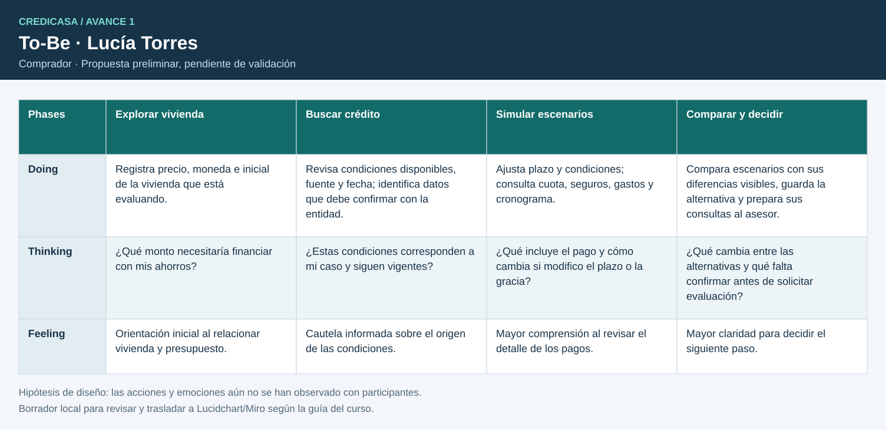

### Escenario propuesto de Daniel — Asesor inmobiliario

**Situación:** Daniel atiende a un comprador interesado en un inmueble y prepara una propuesta para explicarla y, si el comprador lo solicita, compartirla con el canal bancario acordado. La evaluación crediticia ocurre fuera del simulador.

| Phases | Atender al cliente | Preparar cotización | Explicar propuesta | Derivar al banco |
|---|---|---|---|---|
| Doing | Reúne los datos necesarios del inmueble y del financiamiento; identifica información faltante. | Reutiliza los datos, verifica fuente y fecha de parámetros y genera un escenario con versión identificable. | Revisa con el comprador el desglose y las alternativas; conserva la versión elegida. | Obtiene autorización para compartir, entrega la cotización identificada y registra el envío; confirma recepción solo con evidencia. |
| Thinking | ¿Tengo los datos suficientes para una propuesta referencial? | ¿Puedo explicar de dónde salen estas condiciones y reconstruir el cálculo? | ¿El comprador comprende los pagos y el carácter referencial de la propuesta? | ¿Qué envié, a quién y qué falta para que la entidad lo evalúe? |
| Feeling | Mayor orden al iniciar la atención. | Confianza condicionada a parámetros verificables. | Claridad para explicar y responder preguntas. | Mayor control del seguimiento, sin anticipar la decisión bancaria. |

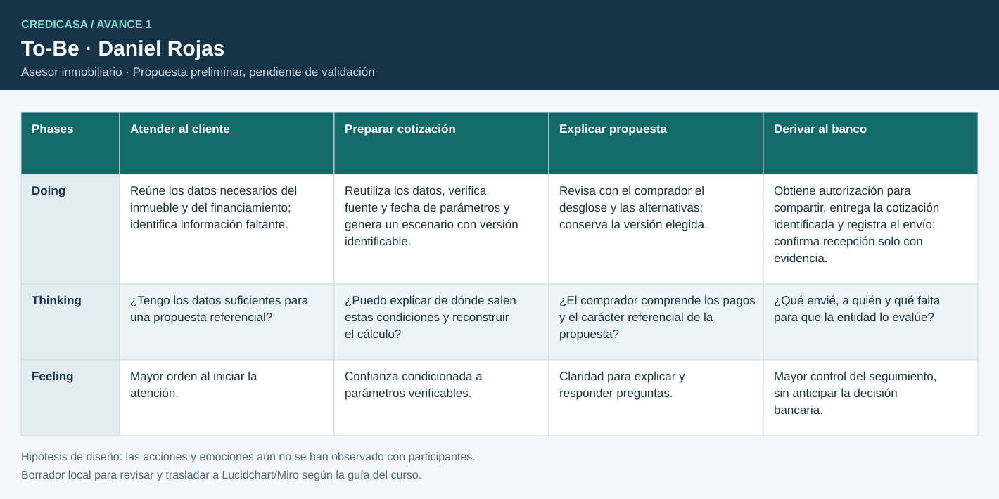

### Cambios propuestos frente al As-Is

| Persona y fase | Dificultad supuesta en el As-Is | Cambio propuesto en el To-Be | Comprobación futura |
|---|---|---|---|
| Lucía: explorar y buscar | Consulta precio y condiciones por separado. | Relaciona precio, inicial y monto; revisa procedencia y vigencia de condiciones. | Observar si identifica monto y datos pendientes de confirmar. |
| Lucía: simular | Desconoce qué costos incluye el resultado. | Accede al desglose y al efecto de modificar condiciones. | Pedir que explique los componentes de un pago con sus propias palabras. |
| Lucía: comparar | Reconstruye diferencias desde capturas. | Compara escenarios guardados y reconoce supuestos distintos. | Observar si identifica diferencias de monto, plazo y gastos. |
| Daniel: atender y preparar | Reingresa información y pierde referencia de parámetros. | Reutiliza datos y conserva fuente, fecha y versión. | Medir preparación y comprobar si recupera el contexto de la cotización. |
| Daniel: explicar y derivar | Comunica un resultado aislado y comparte documentos dispersos. | Explica el detalle y comparte una versión identificada con autorización. | Revisar comprensión del comprador e integridad de la información compartida. |

**Excepciones que deben contemplarse:** datos incompletos o incompatibles requieren corrección antes del cálculo; condiciones sin fecha o fuente se señalan como pendientes de confirmación; modificar un escenario guardado genera una nueva versión; un envío sin acuse no se presenta como recibido; ninguna simulación representa una aprobación bancaria. El canal de derivación y los parámetros financieros concretos requieren definición posterior con los responsables correspondientes.

## 3.2. User Stories

### E01 - Gestión de cuentas y autentificación

**Descripción:** Como usuario, requiero de un sistema de autentificación que me permita registrarme, iniciar sesión, modificar y cerrar sesión, para acceder de manera segura a la plataforma. 
  **Objetivo:** Proveer al usuario con un sistema sencillo, capaz y seguro para ingresar. 
  **Criterios de aceptación:**  
- Ingresar a la plataforma mediante correo y contraseña.
- Actualización de la información del perfil.
- Autentificación de dos pasos.

### E02 - Pago de la suscripción

**Descripción:** Como usuario, requiero de un sistema de pagos simple que me permita ingresar mis datos bancarios de manera segura, para pagar mi suscripción. 
  **Objetivo:** Proveer al usuario una página fácil de utilizar para realizar un pago. 
  **Criterios de aceptación:**  
- Pago por medio de diversos procesadores de pago.
- Verificación del estado del pago.

### E03 - Gestión de los bienes inmobiliarios

**Descripción:** Como usuario, deseo un sistema que me permita registrar mis bienes inmobiliarios de manera fácil y rápida, además de verificar la legitimidad de este. 
  **Objetivo:** Proveer al usuario con un sistema intuitivo que permita registrar y autentificar los bienes. 
  **Criterios de aceptación:**  
- Registrar un bien inmobiliario.
- Eliminar un bien inmobiliario ya registrado.
- Verificar que se trate de un bien genuino.

### E04 - Revisión del crédito ofrecido

**Descripción:** Como usuario, deseo que el sistema me avise una vez el banco me haya ofrecido el crédito, junto a su tasa, frecuencia de pago, etc. 
  **Objetivo:** Crear un sistema que ayude al cliente cuando ya se le haya ofrecido un crédito por la inmobiliaria. 
  **Criterios de aceptación:**  
- Notificación cuando se haya ofrecido un bien.
- Creación de un cronograma de pagos.
- Botón para descargar el cronograma como un archivo .xlsx.

### E05 - Sistema de búsqueda

**Descripción:** Como usuario, deseo que el aplicativo me permita revisar también otros inmuebles, el crédito que podría recibir por estos e información al respecto. 
  **Objetivo:** Crear un sistema que permita al usuario buscar inmuebles según diversos "Tags". 
  **Criterios de aceptación:**  
- Implementar una barra de búsqueda.
- Búsqueda de inmuebles por tags.
- Implementar una IA para apoyar al usuario en su búsqueda.

### E06 - Mensajería

**Descripción:** Como usuario, deseo poseer un sistema de mensajería para comunicarme con los bancos o propietarios del inmueble. 
  **Objetivo:** Implementar un sistema de mensajería que apoye al usuario. 
  **Criterios de aceptación:**  
- Implementar un sistema de mensajería.
- Implementar una opción para bloquear a otros usuarios.
- Implementar un botón para descargar la conversación.

#### Catálogo Detallado de Historias de Usuario

| ID | Epic | User Story | Criterios de aceptación |
|---|---|---|---|
| US01 | E01 | Como usuario, quiero utilizar mi correo y contraseña, para ingresar a mi cuenta. | **Scenario 1: el usuario posee los datos correctos**   *Given* que el usuario tenga el correo y contraseña correctos   *When* ingresa sus datos para ingresar a la plataforma   *Then* Ingresa de manera exitosa   **Scenario 2: el usuario no posee los datos correctos**   *Given* que el usuario no tenga el correo y contraseña correctos   *When* ingresa sus datos para ingresar a la plataforma   *Then* Bota el error de "correo o contraseña incorrectos" |
| US02 | E01 | Como usuario, quiero modificar los datos de mi perfil, para mantener mi información actualizada. | **Scenario 1: actualización exitosa de datos**   *Given* que el usuario está autenticado en su perfil   *When* modifica sus datos personales y guarda los cambios   *Then* el sistema guarda la nueva información y muestra un mensaje de éxito   **Scenario 2: intento de guardar campos obligatorios vacíos**   *Given* que el usuario está editando su perfil   *When* deja un campo obligatorio vacío e intenta guardar   *Then* el sistema no guarda los cambios y muestra un mensaje de error |
| US03 | E01 | Como usuario, quiero habilitar la autenticación de dos pasos, para añadir una capa extra de seguridad a mi cuenta. | **Scenario 1: configuración exitosa del segundo factor**   *Given* que el usuario solicita activar la autenticación de dos pasos   *When* vincula su método preferido e ingresa el código de verificación correcto   *Then* el sistema activa la función y confirma la seguridad adicional   **Scenario 2: código de verificación incorrecto**   *Given* que el usuario está configurando la autenticación de dos pasos   *When* ingresa un código de verificación incorrecto o expirado   *Then* el sistema deniega la activación y solicita un nuevo código |
| US04 | E01 | Como usuario, quiero cerrar mi sesión activa, para proteger mi cuenta al dejar de usar la plataforma. | **Scenario 1: cierre de sesión exitoso**   *Given* que el usuario tiene una sesión activa en el sistema   *When* selecciona la opción de cerrar sesión   *Then* el sistema destruye la sesión y redirige al usuario a la pantalla de inicio |
| US05 | E02 | Como usuario, quiero seleccionar entre diversos procesadores de pago, para realizar la transacción con mi método preferido. | **Scenario 1: pago procesado con éxito**   *Given* que el usuario selecciona un procesador de pago disponible   *When* ingresa los datos requeridos y confirma la transacción   *Then* el procesador autoriza el movimiento y se completa la compra   **Scenario 2: fondos insuficientes o rechazo de pasarela**   *Given* que el usuario intenta pagar con un método seleccionado   *When* el procesador de pagos rechaza la transacción por falta de fondos o datos inválidos   *Then* el sistema notifica el fallo y permite reintentar el pago |
| US06 | E02 | Como usuario, quiero verificar el estado de mi pago, para confirmar que mi suscripción está activa. | **Scenario 1: visualización de pago exitoso**   *Given* que el sistema recibe la confirmación de la pasarela de pago   *When* el usuario consulta el estado de su suscripción   *Then* el sistema muestra el estado como "Pagado" o "Activo"   **Scenario 2: visualización de pago pendiente o fallido**   *Given* que la transacción quedó retenida o fue rechazada   *When* el usuario revisa el módulo de pagos   *Then* el sistema detalla el error o el estado "Pendiente" junto con opciones de soporte |
| US07 | E03 | Como usuario, quiero registrar un bien inmobiliario, para guardarlo en mi cuenta y gestionar sus detalles. | **Scenario 1: registro exitoso del inmueble**   *Given* que el usuario completa todos los datos obligatorios del inmueble   *When* presiona el botón de registrar   *Then* el sistema guarda la propiedad y la muestra en su lista de bienes   **Scenario 2: campos obligatorios incompletos**   *Given* que el usuario deja campos requeridos vacíos   *When* intenta registrar el inmueble   *Then* el sistema muestra alertas en los campos faltantes y no procesa el registro |
| US08 | E03 | Como usuario, quiero eliminar un bien inmobiliario ya registrado, para quitar de mi lista las propiedades que ya no poseo. | **Scenario 1: eliminación confirmada del inmueble**   *Given* que el usuario selecciona un inmueble de su lista   *When* presiona eliminar y confirma la acción en la ventana emergente   *Then* el sistema borra el inmueble de la base de datos y actualiza la vista   **Scenario 2: cancelación de la eliminación**   *Given* que el usuario presiona eliminar por error   *When* cancela la acción en la ventana de confirmación   *Then* el sistema mantiene el inmueble intacto en la lista |
| US09 | E03 | Como usuario, quiero verificar la legitimidad de mi bien inmobiliario, para demostrar que es un inmueble genuino y legal. | **Scenario 1: verificación aprobada por el sistema**   *Given* que el usuario adjunta los documentos legales solicitados   *When* el sistema procesa la validación registral   *Then* el inmueble recibe una etiqueta o estado de "Verificado/Genuino"   **Scenario 2: rechazo por documentos inválidos**   *Given* que los documentos cargados están corruptos, incompletos o son rechazados   *When* finaliza la revisión automática o manual   *Then* el sistema cambia el estado a "Rechazado" e indica el motivo del fallo |
| US10 | E04 | Como usuario, quiero recibir una notificación inmediata cuando un banco me ofrezca un crédito, para enterarme al instante de las oportunidades disponibles. | **Scenario 1: recepción de notificación push/in-app**   *Given* que un banco aprueba y emite una oferta crediticia para el usuario   *When* la oferta se procesa en el sistema   *Then* el usuario recibe una notificación en tiempo real con los detalles clave (tasa, frecuencia, etc.) |
| US11 | E04 | Como usuario, quiero visualizar el cronograma de pagos detallado del crédito ofrecido, para planificar mis finanzas con precisión. | **Scenario 1: generación correcta del cronograma**   *Given* que el usuario abre los detalles de la oferta de crédito recibida   *When* navega a la sección de pagos   *Then* el sistema despliega una tabla con las fechas de vencimiento, amortización, interés y saldo restante |
| US12 | E04 | Como usuario, quiero descargar el cronograma de pagos en un archivo .xlsx, para revisarlo sin conexión o compartirlo fácilmente. | **Scenario 1: descarga exitosa del archivo Excel**   *Given* que el usuario está visualizando el cronograma de pagos   *When* hace clic en el botón de descargar archivo .xlsx   *Then* el sistema genera y descarga automáticamente el documento de Excel formateado correctamente |
| US13 | E05 | Como usuario, quiero utilizar una barra de búsqueda en el aplicativo, para localizar inmuebles específicos de manera rápida. | **Scenario 1: búsqueda con resultados coincidentes**   *Given* que el usuario ingresa un término o palabra clave en la barra de búsqueda   *When* presiona buscar o escribe   *Then* el sistema muestra un listado con todos los inmuebles que coinciden con la búsqueda   **Scenario 2: búsqueda sin resultados**   *Given* que el usuario busca un término que no existe en la plataforma   *When* ejecuta la búsqueda   *Then* el sistema muestra un mensaje indicando que no se encontraron coincidencias |
| US14 | E05 | Como usuario, quiero buscar inmuebles utilizando filtros por tags, para encontrar propiedades que se adapten a mis preferencias específicas. | **Scenario 1: filtrado exitoso por tags**   *Given* que el usuario selecciona uno o varios tags (ej. "con terraza", "estacionamiento")   *When* aplica los filtros en la búsqueda   *Then* el sistema reduce la lista y muestra solo los inmuebles que cumplen con todas las etiquetas seleccionadas |
| US15 | E05 | Como usuario, quiero interactuar con una IA de apoyo en la búsqueda, para recibir recomendaciones personalizadas y resolver dudas sobre los inmuebles. | **Scenario 1: consulta exitosa a la IA**   *Given* que el usuario abre el chat de asistencia de la IA   *When* redacta una consulta sobre qué inmuebles le convienen según su crédito   *Then* la IA analiza los datos y le responde con sugerencias precisas y enlaces a las propiedades |
| US16 | E06 | Como usuario, quiero utilizar un sistema de mensajería integrado, para comunicarme directamente con los bancos o propietarios de los inmuebles. | **Scenario 1: envío y recepción de mensajes en tiempo real**   *Given* que el usuario inicia un chat desde la ficha de un inmueble   *When* escribe y envía un mensaje al propietario o banco   *Then* el mensaje se entrega instantáneamente y se visualiza correctamente en la ventana de chat |
| US17 | E06 | Como usuario, quiero tener la opción de bloquear a otros usuarios en la mensajería, para evitar comunicaciones no deseadas o molestas. | **Scenario 1: bloqueo exitoso de un contacto**   *Given* que el usuario está dentro de una conversación activa   *When* selecciona la opción de bloquear a ese usuario y confirma la acción   *Then* el sistema restringe el envío de nuevos mensajes por parte de ese contacto y oculta el chat |
| US18 | E06 | Como usuario, quiero descargar el historial de una conversación en un botón dedicado, para mantener un respaldo de los acuerdos o charlas sostenidas. | **Scenario 1: descarga completa del historial de chat**   *Given* que el usuario está revisando una conversación   *When* hace clic en el botón de descargar conversación   *Then* el sistema procesa el chat y genera un archivo descargable con todo el texto cronológico |

## 3.3. Impact Map

El mapa conecta objetivos de negocio, cambios deseados en el comportamiento de las proto-personas y entregables propuestos. Se basa en las hipótesis del capítulo I y los escenarios de 3.1. Las metas son propuestas para medir después del lanzamiento o piloto; no son resultados obtenidos ni compromisos cuya viabilidad ya esté demostrada.

### Objetivos de negocio propuestos

| ID | Objetivo medible y plazo | Medición propuesta | Relación con el capítulo I |
|---|---|---|---|
| BG-01 | Lograr que al menos el 25% de compradores que completen una simulación soliciten continuar con una evaluación durante el cuarto mes desde el lanzamiento. | Compradores únicos con simulación completa y solicitud de continuación / compradores únicos con simulación completa en ese mes × 100. Si no hay casos, informar «sin datos». | H1: conversión de simulación a solicitud. Solicitar evaluación no equivale a obtener crédito. |
| BG-02 | Conseguir que al menos el 70% de compradores recurrentes compare dos o más escenarios durante el cuarto mes desde el lanzamiento. | Compradores recurrentes que comparan escenarios / compradores recurrentes del mes × 100. Se define recurrente como quien utiliza la plataforma en dos o más días distintos del mes. | H3: uso de comparación antes de decidir. El plazo y la definición operativa se proponen para esta medición. |
| BG-03 | Alcanzar un tiempo mediano inferior a cinco minutos para preparar y emitir una cotización referencial completa al finalizar el tercer mes del piloto con asesores. | Medir desde que están disponibles los datos requeridos hasta emitir la cotización; reportar mediana, número de tareas, errores e intentos incompletos. La rapidez solo se considera junto con la revisión de integridad de la propuesta. | H2: agilizar cotizaciones. El plazo y la mediana son propuestas; la referencia de 45 minutos necesita una medición inicial real. |

Las metas tienen actor, comportamiento, umbral y plazo definidos. Su factibilidad y los tamaños de muestra se revisarán con el equipo y el piloto. Los indicadores solo se calcularán a partir de observaciones o eventos reales.

### Actores, impactos y entregables

| Business Goal | Actor / Persona | Impacto: cambio esperado de comportamiento | Entregable propuesto | User Stories |
|---|---|---|---|---|
| BG-01 | Lucía — Comprador | Comprende los pagos y distingue simulación de evaluación antes de solicitar el siguiente paso. | D-01: resumen explicable de cuota, seguros, gastos y cronograma; D-02: solicitud de continuación asociada al escenario elegido. | Vinculación pendiente con las historias definitivas de 3.2. |
| BG-02 | Lucía — Comprador | Contrasta alternativas con supuestos visibles y recupera sus opciones antes de decidir. | D-03: comparación de monto, moneda, plazo y costos; D-04: conservación y recuperación de escenarios. | Vinculación pendiente con las historias definitivas de 3.2. |
| BG-03 | Daniel — Asesor inmobiliario | Reutiliza información y revisa parámetros antes de emitir la cotización. | D-05: preparación de cotizaciones con reutilización de datos y procedencia de parámetros. | Vinculación pendiente con las historias definitivas de 3.2. |
| BG-03 | Daniel — Asesor inmobiliario | Explica y comparte una versión reconocible para evitar reconstruir la propuesta. | D-06: cotización exportable con versión, autor, fecha y condiciones. | Vinculación pendiente con las historias definitivas de 3.2. |

  

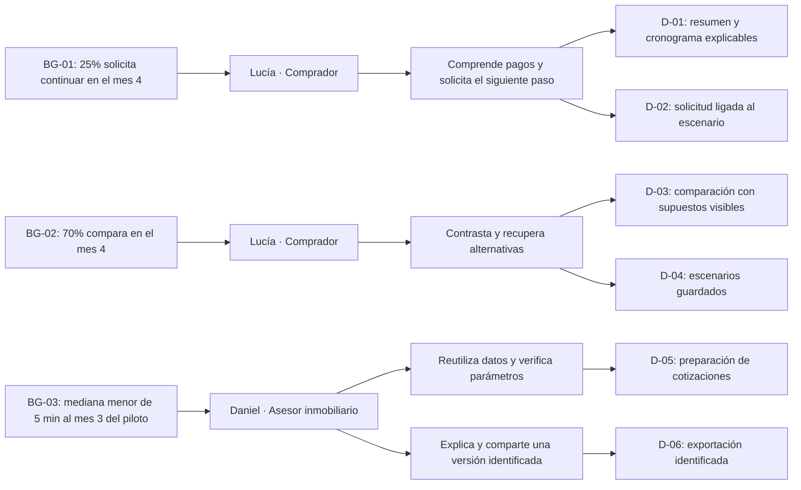
```mermaid
flowchart LR
    G1["BG-01: 25% solicita continuar en el mes 4"] --> A1["Lucía · Comprador"]
    A1 --> I1["Comprende pagos y solicita el siguiente paso"]
    I1 --> D1["D-01: resumen y cronograma explicables"]
    I1 --> D2["D-02: solicitud ligada al escenario"]
    G2["BG-02: 70% compara en el mes 4"] --> A2["Lucía · Comprador"]
    A2 --> I2["Contrasta y recupera alternativas"]
    I2 --> D3["D-03: comparación con supuestos visibles"]
    I2 --> D4["D-04: escenarios guardados"]
    G3["BG-03: mediana menor de 5 min al mes 3 del piloto"] --> A3["Daniel · Asesor inmobiliario"]
    A3 --> I3["Reutiliza datos y verifica parámetros"]
    A3 --> I4["Explica y comparte una versión identificada"]
    I3 --> D5["D-05: preparación de cotizaciones"]
    I4 --> D6["D-06: exportación identificada"]
```

**Estado del entregable:** la estructura anterior es un borrador local. Falta trasladar el mapa a UXPressia utilizando las fichas de personas, incorporar la captura y añadir los IDs y descripciones de User Stories en formato «Como… deseo… para…» cuando el trabajo de 3.2 esté disponible. Los identificadores D-01 a D-06 representan entregables del mapa y no sustituyen los IDs de historias.

## 3.4. Product Backlog

**Estado:** se prepara el método y la estructura del backlog. Las historias se están desarrollando en 3.2; la lista priorizada y sus estimaciones se incorporarán después de acordar ese catálogo.

**Priorización propuesta:** ordenar las historias por el valor que aportan a BG-01, BG-02 y BG-03, considerando la tarea que resuelven, el alcance de su beneficio y sus dependencias. Primero se evaluará el flujo que permite obtener y comprender una simulación; luego su comparación, recuperación y uso en cotizaciones. Este orden de capacidades es preliminar y no asigna prioridad definitiva a historias aún no disponibles. Seguridad y autenticación se tratarán como requisitos transversales y dependencias técnicas; no se colocarán automáticamente al inicio solo por ser infraestructura, conforme a la guía.

**Estimación propuesta:** el equipo estimará esfuerzo relativo con Story Points de la escala `1, 2, 3, 5, 8`, considerando complejidad, incertidumbre e integración. Se elegirá una historia entendida por todos como referencia, se compararán las demás y se dividirán las que excedan ocho puntos. Los puntos no equivalen a horas ni se asignarán hasta revisar los criterios de aceptación.

**Estructura de la tabla exigida por la guía:**

| # Orden | User Story ID | Título | Descripción | Story Points (1 / 2 / 3 / 5 / 8) |
|---|---|---|---|---|

La tabla se completará con IDs y descripciones de 3.2, evitando duplicar o renombrar las historias de forma independiente. Para cada historia se comprobará su relación con un entregable del Impact Map, sus criterios de aceptación y las dependencias que condicionan su ejecución. El estado y el Sprint se podrán registrar como campos adicionales en la herramienta de gestión.

### Product Backlog Priorizado

| Orden | ID | User Story | Prioridad MoSCoW | Sprint |
|---|---|---|---|---|
| 1 | US01 | Como usuario, quiero utilizar mi correo y contraseña, para ingresar a mi cuenta. | Must | Sprint 1 |
| 2 | US05 | Como usuario, quiero seleccionar entre diversos procesadores de pago, para realizar la transacción con mi método preferido. | Must | Sprint 1 |
| 3 | US07 | Como usuario, quiero registrar un bien inmobiliario, para guardarlo en mi cuenta y gestionar sus detalles. | Must | Sprint 1 |
| 4 | US13 | Como usuario, quiero utilizar una barra de búsqueda en el aplicativo, para localizar inmuebles específicos de manera rápida. | Must | Sprint 1 |
| 5 | US16 | Como usuario, quiero utilizar un sistema de mensajería integrado, para comunicarme directamente con los bancos o propietarios de los inmuebles. | Must | Sprint 1 |
| 6 | US02 | Como usuario, quiero modificar los datos de mi perfil, para mantener mi información actualizada. | Should | Sprint 2 |
| 7 | US03 | Como usuario, quiero habilitar la autenticación de dos pasos, para añadir una capa extra de seguridad a mi cuenta. | Should | Sprint 2 |
| 8 | US04 | Como usuario, quiero cerrar mi sesión activa, para proteger mi cuenta al dejar de usar la plataforma. | Must | Sprint 2 |
| 9 | US08 | Como usuario, quiero eliminar un bien inmobiliario ya registrado, para quitar de mi lista las propiedades que ya no poseo. | Should | Sprint 2 |
| 10 | US10 | Como usuario, quiero recibir una notificación inmediata cuando un banco me ofrezca un crédito, para enterarme al instante de las oportunidades disponibles. | Should | Sprint 2 |
| 11 | US11 | Como usuario, quiero visualizar el cronograma de pagos detallado del crédito ofrecido, para planificar mis finanzas con precisión. | Should | Sprint 2 |
| 12 | US14 | Como usuario, quiero buscar inmuebles utilizando filtros por tags, para encontrar propiedades que se adapten a mis preferencias específicas. | Should | Sprint 2 |
| 13 | US06 | Como usuario, quiero verificar el estado de mi pago, para confirmar que mi suscripción está activa. | Should | Sprint 3 |
| 14 | US09 | Como usuario, quiero verificar la legitimidad de mi bien inmobiliario, para demostrar que es un inmueble genuino y legal. | Should | Sprint 3 |
| 15 | US12 | Como usuario, quiero descargar el cronograma de pagos en un archivo .xlsx, para revisarlo sin conexión o compartirlo fácilmente. | Could | Sprint 3 |
| 16 | US15 | Como usuario, quiero interactuar con una IA de apoyo en la búsqueda, para recibir recomendaciones personalizadas y resolver dudas sobre los inmuebles. | Could | Sprint 3 |
| 17 | US17 | Como usuario, quiero tener la opción de bloquear a otros usuarios en la mensajería, para evitar comunicaciones no deseadas o molestas. | Could | Sprint 3 |
| 18 | US18 | Como usuario, quiero descargar el historial de una conversación en un botón dedicado, para mantener un respaldo de los acuerdos o charlas sostenidas. | Could | Sprint 3 |

# Capítulo IV: Product Architecture Design

## 4.1. Design Concepts, ViewPoints & ER Diagrams

La arquitectura propuesta utiliza microservicios delimitados mediante Domain-Driven Design, Cada servicio posee sus reglas de negocio, contratos de integración y almacenamiento. Dentro de los servicios se aplica Clean Architecture para separar el dominio de los mecanismos de comunicación, persistencia y despliegue.

El dominio financiero constituye el núcleo del producto. La autenticación, el catálogo inmobiliario, las cotizaciones y las notificaciones colaboran con ese núcleo mediante interfaces explícitas, sin incorporar las fórmulas de amortización en componentes de presentación o infraestructura.

### 4.1.1. Principles Statements

Se establecen cinco principios arquitectónicos que orientan la descomposición del sistema y la evaluación de sus decisiones.

| **ID** | **Principio** | **Declaración arquitectónica** | **Aplicación en CrediCasa** | **Evidencia de cumplimiento** |
| --- | --- | --- | --- | --- |
| PA-01 | Single Responsibility | Cada componente debe concentrar responsabilidades que cambien por una misma razón de negocio. | El simulador administra reglas financieras; cotizaciones administra propuestas y versiones; identidad administra autenticación y membresías. | Matriz de responsabilidades y ausencia de fórmulas financieras duplicadas en otros servicios. |
| PA-02 | Determinismo Matemático | Las mismas entradas y versiones de reglas deben producir el mismo resultado financiero canónico. | Toda simulación registra datos normalizados, convención temporal, política de redondeo, versión del motor y condiciones utilizadas. | Reejecución de escenarios y comparación de resultados financieros y hashes canónicos. |
| PA-03 | API-First | Los contratos se definen y revisan antes de desarrollar las integraciones. | APIs REST documentadas con OpenAPI; eventos documentados con esquemas versionados; errores y reglas de compatibilidad explícitos. | Contratos publicados, pruebas de contrato y revisión de cambios incompatibles. |
| PA-04 | Security by Design | La autorización, la minimización de datos y la protección de información forman parte del diseño inicial. | Autenticación centralizada; autorización por objeto y tenant en cada servicio; cifrado y auditoría de operaciones sensibles. | Matriz de permisos y pruebas negativas de acceso entre usuarios e inmobiliarias. |
| PA-05 | Autonomía de Datos | Cada bounded context administra sus datos y sus invariantes mediante su propio servicio. | Ningún microservicio consulta directamente tablas de otro; las referencias externas se resuelven mediante APIs, eventos o snapshots. | Credenciales separadas, restricciones locales y ausencia de joins entre bases de servicios. |

**Aplicación del determinismo.** La reproducibilidad financiera comprende importes, tasas, cronogramas e indicadores. Los identificadores técnicos y las fechas de registro pueden variar entre ejecuciones. Por ello, el hash financiero excluye metadatos operativos y se calcula sobre una representación canónica de entradas, reglas y resultados.

**Aplicación de la autonomía.** La independencia de datos no elimina la necesidad de consistencia. Las invariantes internas se protegen mediante transacciones ACID; los procesos entre servicios utilizan estados explícitos, idempotencia y consistencia eventual.

### 4.1.2. Approaches Statements Architectural Styles & Patterns

#### Estilo arquitectónico de microservicios

CrediCasa adopta microservicios para separar capacidades con reglas, riesgos y ritmos de cambio diferentes. El motor financiero requiere precisión decimal y validación matemática; el catálogo inmobiliario necesita búsqueda y administración de propiedades; las cotizaciones requieren conservación histórica; las notificaciones dependen de proveedores externos.

Esta separación permite desplegar cambios del motor financiero sin modificar necesariamente el catálogo o los canales de comunicación. También permite asignar recursos adicionales al simulador cuando aumenta la demanda, mientras la exportación y las notificaciones se procesan de forma asíncrona.

El estilo introduce costos operativos: comunicación de red, observabilidad distribuida, administración de contratos y tratamiento de fallos parciales. Para contenerlos, el diseño limita la descomposición inicial a cinco bounded contexts y evita crear un microservicio por entidad o por operación CRUD.

#### Domain-Driven Design

DDD permite organizar el sistema alrededor de conceptos del negocio y de un lenguaje ubicuo. Se distinguen los siguientes términos:

**Escenario de simulación:** conjunto de entradas financieras que define una alternativa hipotecaria.

**Cronograma:** secuencia de obligaciones, intereses, amortizaciones, seguros y saldos.

**Condición financiera:** tasa, plazo, seguro, cargo y regla comercial de un producto identificado.

**Cotización:** propuesta comercial construida a partir de una simulación y una propiedad.

**Versión de cotización:** representación histórica inmutable de una propuesta.

**Tenant:** ámbito de una inmobiliaria o espacio personal de un comprador.

El lenguaje diferencia la **cuota financiera**, compuesta por capital e intereses, del **pago total**, que incorpora seguros y cargos aplicables. Asimismo, distingue una propuesta referencial de una aprobación bancaria.

#### Clean Architecture

Cada servicio se organiza en cuatro capas:

**Dominio:** entidades, value objects, invariantes y políticas de negocio.

**Aplicación:** casos de uso, coordinación transaccional y puertos.

**Adaptadores:** controladores REST, consumidores de eventos y repositorios.

**Infraestructura:** bases de datos, RabbitMQ, almacenamiento de archivos y clientes externos.

Las dependencias del código apuntan hacia el dominio. En particular, el núcleo financiero no depende de Spring MVC, de una base de datos ni de RabbitMQ para ejecutar sus fórmulas.

#### Comunicación híbrida REST/Event-Driven

REST se utiliza cuando el solicitante necesita una respuesta inmediata: consultar una propiedad, ejecutar una simulación o recuperar una cotización.

La comunicación Event-Driven con RabbitMQ se utiliza para acciones desacopladas: notificar la emisión de una propuesta, generar documentos y propagar cambios de estado.

| **Operación** | **Mecanismo** | **Justificación** |
| --- | --- | --- |
| Ejecutar una simulación | REST síncrono | El usuario necesita resultados para ajustar y comparar parámetros. |
| Obtener una propiedad para cotizar | REST síncrono | Debe comprobarse su existencia, acceso y versión antes de emitir la propuesta. |
| Crear una versión de cotización | REST síncrono | El asesor necesita confirmación de la persistencia de la propuesta. |
| Generar PDF/​XLSX | Evento asíncrono | La generación puede tardar y no debe prolongar la transacción comercial. |
| Enviar una notificación | Evento asíncrono | Un fallo del proveedor no debe invalidar una cotización persistida. |
| Informar una actualización de reglas | Evento asíncrono | Permite actualizar consumidores sin depender de una llamada simultánea. |

Se adopta entrega **al menos una vez**. Los consumidores deben tolerar duplicados. RabbitMQ distingue las confirmaciones del productor de los acknowledgements del consumidor; ambas participan en la confiabilidad, pero no sustituyen la idempotencia de negocio.

Para publicar eventos relacionados con cambios de negocio se utiliza **Transactional Outbox**: la actualización del agregado y el registro del evento se confirman en la misma transacción local. Un publicador posterior remite el evento al broker.

#### API Gateway

El API Gateway constituye el punto de entrada para Web y Android. Sus responsabilidades son:

Enrutar solicitudes.

Validar tokens y aplicar controles generales de acceso.

Limitar consumo y tamaño de solicitudes.

Propagar identificadores de correlación.

Estandarizar respuestas de infraestructura.

Aplicar políticas CORS para el cliente Web.

El Gateway no ejecuta fórmulas, no modifica cotizaciones y no reemplaza la autorización dentro de los servicios. Cada microservicio comprueba los permisos sobre los objetos que administra.

### 4.1.3. Context Diagram

La vista C4 de nivel 1 delimita CrediCasa, sus usuarios y las dependencias externas relevantes. El contexto evita detalles de implementación y presenta las relaciones necesarias para comprender el alcance del producto.

  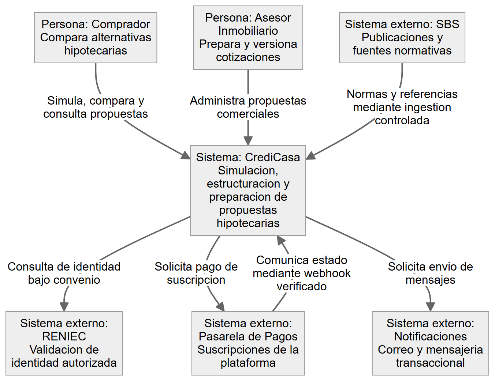

<em>Figura 1 — Vista arquitectónica. Código Mermaid en el Anexo A.</em>

**Comprador.** Configura escenarios, revisa costos, compara alternativas y consulta propuestas compartidas con su cuenta.

**Asesor inmobiliario.** Selecciona propiedades, estructura financiamiento y emite cotizaciones versionadas dentro de su inmobiliaria.

**SBS.** Proporciona el marco normativo y fuentes públicas pertinentes. La actualización de reglas se realiza mediante revisión e incorporación controlada de documentos; no se presupone una API que apruebe simulaciones.

**RENIEC.** Representa una integración de validación de identidad condicionada a acceso autorizado. En AV2 puede utilizarse un adaptador simulado identificado como tal. Esta integración no acredita propiedad ni situación registral de un inmueble.

**Pasarela de Pagos.** Procesa suscripciones de CrediCasa. No participa en el desembolso ni en el cobro del crédito hipotecario.

**Notificaciones.** Provee canales transaccionales. Deben distinguirse los estados de solicitud, aceptación del proveedor y entrega confirmada.

### 4.1.4. Approach Driven ViewPoints Diagrams

**Vista C4 de nivel 2: contenedores**

La vista de contenedores identifica aplicaciones, servicios, broker y almacenes. El término “contenedor C4” representa una unidad ejecutable o almacén de datos; no implica que cada elemento sea necesariamente un contenedor Docker.

  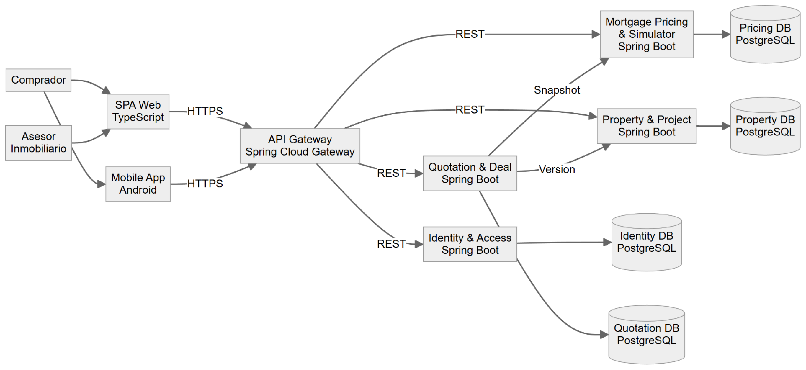

<em>Figura 2a — Contenedores: canales, servicios y bases propietarias.</em>

  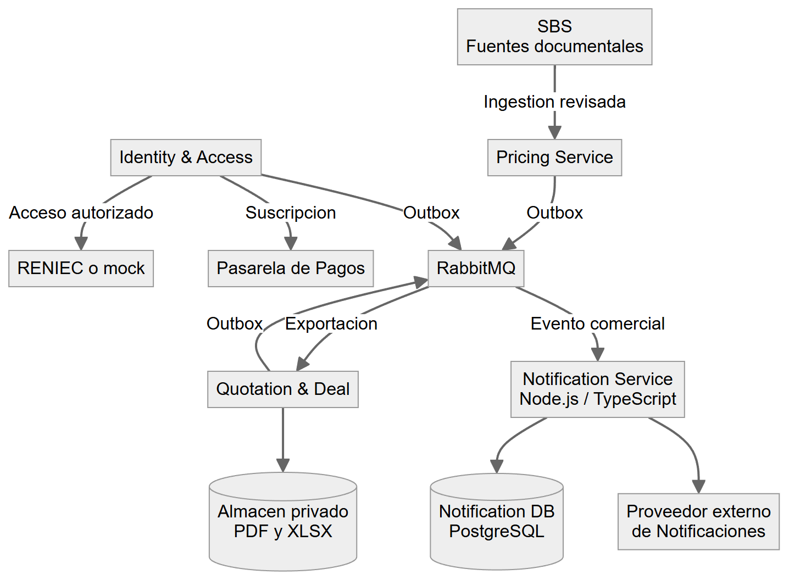

<em>Figura 2b — Contenedores: integraciones, eventos y notificaciones. Modelo completo en el Anexo A.</em>

El procesamiento de exportaciones se realiza mediante un worker perteneciente al bounded context de cotizaciones. Puede desplegarse en un proceso independiente del API para aislar consumo de CPU y memoria, conservando la misma propiedad funcional.

La interacción con pagos se encapsula inicialmente en un módulo de suscripciones de Identity & Access. Si su alcance aumenta, puede evaluarse un bounded context específico de facturación mediante un ADR posterior.

#### Mapeo de bounded contexts

| **Bounded context** | **Responsabilidades** | **Agregados o conceptos principales** | **Interfaces** |
| --- | --- | --- | --- |
| Identity & Access | Identidad, autenticación, MFA, membresías, roles y acceso a la plataforma. | User, Tenant, Membership, Session. | OIDC/​OAuth 2.0; consulta de membresías; eventos de cambios de acceso. |
| Mortgage Pricing & Simulator | Condiciones financieras, conversión de tasas, cronogramas y evaluación de costos. | SimulationScenario, FinancialProductVersion, RuleSet, AmortizationSchedule. | API de simulaciones; lectura autorizada de snapshots; eventos de publicación de reglas. |
| Property & Project | Proyectos, propiedades, precios publicados y disponibilidad comercial. | Project, Property. | API de catálogo; consulta de versión de propiedad. |
| Quotation & Deal | Propuestas comerciales, versiones, snapshots, estados y exportación. | Quotation, QuotationVersion, Deal, ExportJob. | API de cotizaciones; eventos de emisión y exportación. |
| Notification | Preferencias de canal, solicitudes de envío, reintentos y confirmaciones. | NotificationRequest, DeliveryAttempt. | Consumo de eventos; adaptadores de proveedores; callbacks verificados. |

#### Relaciones estratégicas de DDD

**Pricing → Quotation.** Pricing publica un contrato estable de resultado financiero. Quotation conserva un snapshot de ese resultado. No interpreta nuevamente las fórmulas.

**Property → Quotation.** Property proporciona información comercial versionada. Quotation copia los datos necesarios para mantener la propuesta aunque cambie el catálogo.

**Identity → otros contextos.** Identity proporciona identidad y membresía mediante contratos de seguridad. Cada contexto determina si ese principal puede ejecutar la operación sobre su objeto.

**Quotation → Notification.** Quotation publica hechos comerciales. Notification traduce esos hechos en mensajes y administra la entrega.

**Sistemas externos → adaptadores.** Los contratos de RENIEC, pagos y proveedores de mensajes se aíslan mediante Anti-Corruption Layers. Una modificación del proveedor debe afectar principalmente al adaptador correspondiente.

#### Vista de aislamiento por tenant

Toda información privada pertenece a un ámbito de acceso. En B2B, el tenant representa una inmobiliaria. En B2C, puede representar un espacio personal. Compartir una propuesta con un comprador requiere un permiso explícito, revocable y auditable.

El tenantId enviado por el cliente nunca se acepta sin validación. El servicio lo obtiene o contrasta con el contexto autenticado y verifica la membresía. Las consultas incluyen filtros de tenant y, cuando corresponda, propietario o permiso de compartición.

### 4.1.5. Relational/Non Relational Database Diagram

#### Estrategia de persistencia

Se propone PostgreSQL para los datos transaccionales. Los escenarios, cronogramas y versiones de cotización requieren restricciones, relaciones internas y atomicidad.

Los snapshots financieros se almacenan en JSONB dentro de registros relacionales. Esto permite preservar estructuras versionadas sin renunciar a transacciones ACID. Los archivos PDF y XLSX se almacenan en un repositorio de objetos privado; sus metadatos y estados permanecen en Quotation DB.

No se introduce inicialmente una base documental independiente porque el caso de uso puede resolverse con almacenamiento relacional y JSONB.

#### Diagrama entidad-relación

El diagrama representa el modelo integrado del dominio. Las relaciones entre contextos son **referencias lógicas**, no claves foráneas físicas entre bases de datos.

El modelo integrado se presenta por bases propietarias para facilitar su lectura. Las referencias a otros contextos son lógicas; el código completo se conserva en el Anexo A.

  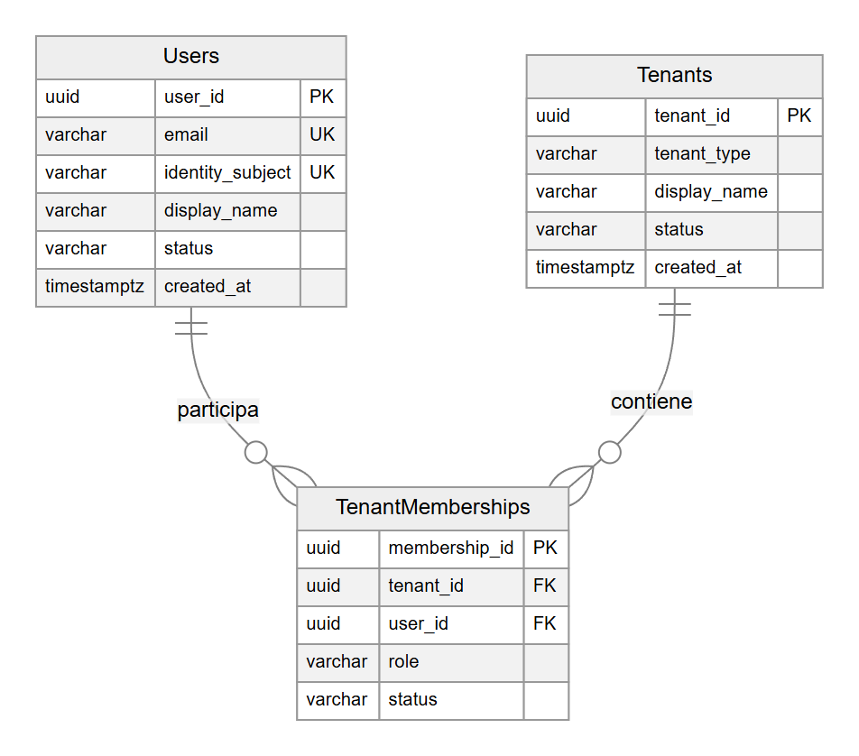

<em>Figura 3 — Identidad y membresías.</em>

  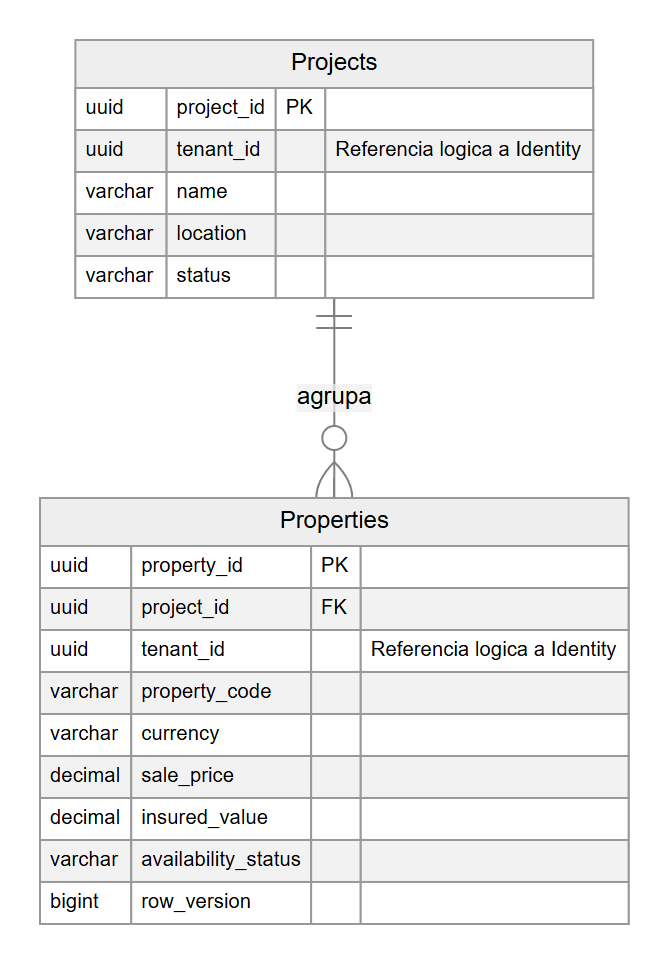

<em>Figura 3 — Proyectos y propiedades.</em>

  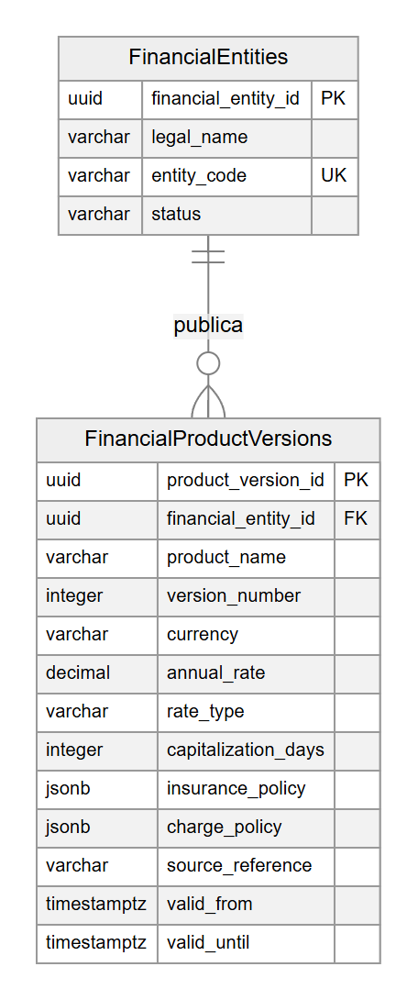

<em>Figura 3 — Pricing: products.</em>

  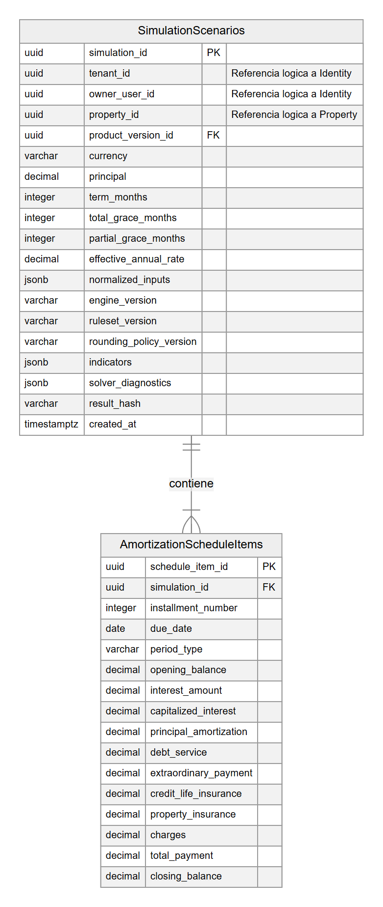

<em>Figura 3 — Pricing: schedule.</em>

  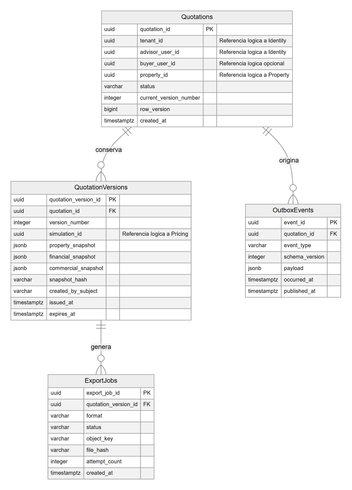

<em>Figura 3 — Cotizaciones y exportaciones.</em>

**Interpretación de relaciones.** Las líneas continuas representan relaciones locales. Las líneas discontinuas representan asociaciones lógicas entre servicios. Una simulación puede ejecutarse sin una propiedad seleccionada; una cotización comercial requiere identificar la propiedad propuesta.

#### Tipos y restricciones físicas

| **Elemento** | **Especificación propuesta** |
| --- | --- |
| Identificadores | UUID. |
| Importes contabilizados | NUMERIC(19,2). |
| Tasas | NUMERIC(24,16), expresadas como fracción decimal. |
| Valores intermedios | BigDecimal con precisión de 34 dígitos; no se redondean prematuramente a centavos. |
| Fechas de vencimiento | DATE. |
| Instantes operativos | TIMESTAMPTZ, almacenados en UTC. |
| Moneda | Restricción CHECK para PEN o USD. |
| Secuencia del cronograma | UNIQUE(simulation_​id, installment_​number). |
| Versiones de cotización | UNIQUE(quotation_​id, version_​number). |
| Membresías | UNIQUE(tenant_​id, user_​id). |
| Principal y plazo | Principal mayor que cero y plazo dentro del rango admitido por el producto. |
| Control de concurrencia | row_​version para optimistic locking. |

La información ampliada de versiones y políticas se conserva en snapshots JSONB. Los campos utilizados en búsquedas y restricciones se mantienen también en columnas tipadas.

#### Integridad y conservación histórica

El escenario y sus filas de cronograma se persisten en una transacción local. La cotización, su versión emitida y su evento outbox se persisten en otra transacción local del servicio de cotizaciones.

No se emplean transacciones distribuidas entre Pricing y Quotation. Antes de confirmar la propuesta, Quotation obtiene un resultado autorizado, comprueba su integridad y copia el snapshot.

Las versiones emitidas no se actualizan. Una modificación origina una nueva versión. La conservación histórica debe coexistir con políticas de retención, minimización y tratamiento de datos personales; no justifica almacenar información identificatoria indefinidamente.

### 4.1.6. Design Patterns

#### Strategy Pattern para algoritmos de amortización

Se define la interfaz AmortizationStrategy, que recibe un escenario normalizado y devuelve un cronograma financiero.

La implementación inicial FrenchOrdinaryStrategy aplica el Método Francés Vencido Ordinario. Las variantes de gracia y pagos extraordinarios se expresan mediante políticas que colaboran con la estrategia, evitando una proliferación de clases para cada combinación de parámetros.

El patrón permite sustituir un algoritmo completo cuando exista una necesidad de negocio validada. CrediCasa mantiene el método francés como alcance del núcleo solicitado.

**Justificación:** separa el algoritmo de los casos de uso, permite pruebas aisladas y evita condicionales de selección distribuidos en controladores.

#### Factory Method para cronogramas

Se utiliza un creador abstracto ScheduleCreator con el método fábrica createScheduleBuilder(). El creador concreto FrenchScheduleCreator devuelve un constructor de cronogramas compatible con la estrategia francesa.

El creador administra el proceso común de preparación; el objeto creado administra la construcción del cronograma. Los productos resultantes incorporan moneda, precisión, reglas temporales y política de redondeo.

**Justificación:** centraliza la creación de objetos coherentes y evita que los clientes ensamblen cronogramas con políticas incompatibles. Una clase con un único método estático de selección sería una fábrica simple; la propuesta utiliza un método de creación redefinible para conservar la semántica de Factory Method.

#### Repository Pattern para persistencia

Las interfaces SimulationRepository y QuotationRepository pertenecen al límite de aplicación/dominio. Sus implementaciones utilizan PostgreSQL.

Los repositorios trabajan con agregados: no obligan a los casos de uso a conocer tablas ni sentencias SQL. La unidad de trabajo confirma el escenario completo o la versión de cotización junto con su outbox.

**Justificación:** desacopla persistencia, facilita pruebas y concentra el acceso autorizado a los agregados. Los métodos incluyen el ámbito de tenant para reducir consultas incompletas.

#### Circuit Breaker con Resilience4j

Los adaptadores Java de APIs externas utilizan Resilience4j. El circuito transita por los estados CLOSED, OPEN y HALF_OPEN según los resultados y umbrales configurados.

Configuración inicial propuesta para una consulta externa:

| **Parámetro** | **Valor inicial** |
| --- | --- |
| Ventana por número de llamadas | 20 |
| Mínimo de llamadas para evaluar | 10 |
| Umbral de fallos | 50 % |
| Tiempo en OPEN | 30 segundos |
| Llamadas de prueba en HALF_​OPEN | 3 |
| Timeout por consulta | 1 segundo |

Estos valores deben ajustarse mediante pruebas y contratos del proveedor. El Circuit Breaker se complementa con timeout y bulkhead; por sí solo no limita duración ni concurrencia.

#### Fallback por operación:

- Condiciones referenciales: utilizar una versión previamente validada y permitida por la política de vigencia, identificando su fecha y fuente.
- RENIEC: registrar PENDING_VERIFICATION; no afirmar identidad validada.
- Pagos: registrar estado pendiente de conciliación; no conceder una suscripción pagada por un timeout.
- Notificaciones: conservar el envío para reintento.
Los fallback no crean resultados positivos ficticios ni modifican el costo financiero para ocultar un fallo.

### 4.1.7. Tactics

| **Atributo** | **Táctica** | **Aplicación concreta** | **Compromiso o costo** | **Verificación** |
| --- | --- | --- | --- | --- |
| Rendimiento | Reducir dependencias del camino crítico | Calcular con reglas locales versionadas, sin consultas externas durante el motor. | Requiere gestión explícita de vigencia. | Medición de latencia e inspección de trazas. |
| Rendimiento | Limitar demanda | Rate limiting y límite de períodos y tamaño del escenario. | Solicitudes excesivas reciben rechazo controlado. | Pruebas de saturación y respuestas 429. |
| Rendimiento | Procesamiento asíncrono | Generar PDF/​XLSX mediante jobs. | El archivo no está disponible inmediatamente. | Tiempo de finalización y estados del job. |
| Rendimiento | Caché selectiva | Cachear condiciones públicas por versión. | Riesgo de datos desactualizados si la clave es incompleta. | Pruebas de invalidación y versionado. |
| Disponibilidad | Detección y contención de fallos | Timeout, Circuit Breaker y bulkhead en adaptadores. | Mayor configuración operativa. | Inyección de fallos externos. |
| Disponibilidad | Persistencia de mensajes | Outbox, colas durables y confirmaciones. | Almacenamiento y procesamiento adicional. | Reinicios y recuperación de eventos. |
| Disponibilidad | Recuperación idempotente | Deduplicación por eventId y clave de negocio. | Requiere tabla inbox o registro equivalente. | Reentrega deliberada de mensajes. |
| Disponibilidad | Redundancia | Réplicas de servicios sin estado y respaldo de datos. | Costo de infraestructura. | Failover y restauración documentada. |
| Seguridad | Autorización por objeto | Validar tenant, rol y permiso sobre cotización y archivo. | Evaluación adicional por operación. | Pruebas de IDOR/​BOLA. |
| Seguridad | Mínimo privilegio | Usuarios de base y permisos de broker por servicio. | Administración de credenciales. | Revisión de permisos. |
| Seguridad | Protección de información | TLS, cifrado en reposo y almacenamiento privado. | Gestión de claves. | Inspección de configuración y acceso. |
| Seguridad | Auditoría | Registrar actor, operación, versión y correlación. | Retención y protección de logs. | Reconstrucción de una operación. |
| Modificabilidad | Encapsular reglas variables | RuleSets y políticas de seguros versionadas. | Mayor disciplina de publicación. | Incorporación de una regla sin alterar contextos ajenos. |
| Modificabilidad | Estabilizar interfaces | OpenAPI y eventos con compatibilidad explícita. | Administración de versiones. | Pruebas de contrato. |
| Modificabilidad | Aislar proveedores | Anti-Corruption Layers. | Código de adaptación adicional. | Sustitución de un proveedor por un mock. |
| Verificabilidad | Controlar entradas | Núcleo puro sin reloj ni llamadas de red implícitas. | Más parámetros explícitos. | Repetición de casos financieros. |
| Verificabilidad | Observar decisiones | Versiones, hash y diagnósticos del solver. | Datos técnicos adicionales. | Reejecución y comparación. |
| Verificabilidad | Comprobar invariantes | Balance, pagos, monotonicidad esperada y saldo final. | Desarrollo de un oráculo independiente. | Pruebas de propiedades y casos de referencia. |

## 4.2. Architectural Drivers

Los architectural drivers son los requisitos que tienen una influencia significativa sobre la estructura del sistema. Para CrediCasa se consideran el propósito del diseño, las funciones principales, los escenarios de calidad, las restricciones y las inquietudes arquitectónicas.

| **Categoría** | **Identificadores** |
| --- | --- |
| Funcionalidad principal | HU-ARQ-01 a HU-ARQ-04 |
| Escenarios de calidad | QA-01 a QA-04 |
| Restricciones | CON-01 a CON-06 |
| Inquietudes arquitectónicas | AC-01 a AC-05 |

### 4.2.1. Design Purpose

El propósito del diseño es establecer una arquitectura implementable que permita simular y comparar créditos hipotecarios con resultados reproducibles y transformar esos resultados en propuestas comerciales versionadas.

El diseño debe proporcionar:

1. Un núcleo financiero independiente de presentación y persistencia.

2. Contratos explícitos entre capacidades de negocio.

3. Protección de información personal y comercial.

4. Conservación de la evidencia utilizada en cada propuesta.

5. Adaptación controlada a cambios de reglas y condiciones.

6. Criterios medibles para evaluar rendimiento, seguridad y recuperación.

Para AV2, el resultado arquitectónico comprende límites de servicios, modelos de datos, interfaces, decisiones ADR y criterios de validación. La arquitectura no demuestra por sí misma que las métricas se hayan alcanzado; estas se comprueban con la implementación.

### 4.2.2. Primary Functionality

Se seleccionan cuatro historias que ejercitan el núcleo financiero y su uso comercial. Los IDs siguientes son provisionales y deberán reconciliarse con el catálogo del capítulo III, conservando su trazabilidad.

| **ID** | **Historia conductora** | **Criterios de aceptación esenciales** | **Relación con AV1** |
| --- | --- | --- | --- |
| HU-ARQ-01 | Como comprador, deseo simular un crédito en PEN o USD con tasa nominal o efectiva, para conocer su cronograma y pago total. | Conversión de tasas explícita; método francés; desglose de seguros; rechazo de entradas incompatibles; saldo final conciliado. | E04 y escenario de simulación del comprador. |
| HU-ARQ-02 | Como comprador, deseo comparar escenarios con gracia y pagos extraordinarios utilizando TCEA, VAN y TIR, para evaluar su costo desde mi perspectiva. | Mismas bases temporales; moneda identificada; flujos completos; diagnóstico de indicadores no calculables; reglas visibles. | Comparación financiera de los capítulos I y III. |
| HU-ARQ-03 | Como asesor inmobiliario, deseo emitir y versionar una cotización vinculada a una propiedad, para conservar las condiciones propuestas a cada cliente. | Snapshot inmutable; autor y fecha; vigencia; cambio mediante nueva versión; aislamiento de tenant. | Escenario del asesor y E03/​E04. |
| HU-ARQ-04 | Como asesor inmobiliario, deseo exportar y compartir una versión de cotización en PDF y XLSX, para explicar la propuesta y dar seguimiento a su entrega. | Ambos formatos usan el mismo snapshot; estados de exportación y envío; reintentos sin duplicar versiones; acceso autorizado. | Exportación de cronograma en E04. |

La identidad y la autorización son dependencias transversales de estas historias. Otras capacidades del AV1 pueden conservarse en el product backlog sin convertirse en drivers de las tres iteraciones desarrolladas.

### 4.2.3. Quality Attribute Scenarios

Los escenarios siguientes incluyen las seis partes estándar y definen medidas verificables.

#### QA-01. Rendimiento del cálculo financiero

| **Parte** | **Especificación** |
| --- | --- |
| Fuente del estímulo | Comprador o asesor autenticado. |
| Estímulo | Envía un escenario válido de hasta 360 períodos mensuales, con gracia, seguros y pagos extraordinarios. |
| Artefacto | Endpoint de cálculo de Mortgage Pricing & Simulator Service. |
| Entorno | Operación estable, servicio precalentado, reglas locales; instancia de referencia de 2 vCPU y 4 GiB; carga sostenida de 20 solicitudes por segundo. |
| Respuesta | Normaliza entradas, calcula cronograma e indicadores y devuelve el resultado sin consultar proveedores externos. |
| Medida de respuesta | Latencia p95 menor de 400 ms y p99 menor de 800 ms en una prueba de 15 minutos; errores técnicos menores de 0,5 %. |

La latencia se mide desde la recepción HTTP en Pricing hasta completar su respuesta. Excluye Internet, el cliente, exportaciones y persistencia opcional del escenario. El tiempo extremo a extremo se registra como una métrica adicional.

#### QA-02. Disponibilidad mediante degradación controlada

| **Parte** | **Especificación** |
| --- | --- |
| Fuente del estímulo | Proveedor externo consultado por un adaptador de condiciones referenciales. |
| Estímulo | Presenta timeouts o errores de servidor que superan el umbral del circuito. |
| Artefacto | Adaptador externo y resolución de condiciones utilizadas en una simulación. |
| Entorno | Operación normal con una versión local previamente validada y permitida por su política de vigencia. |
| Respuesta | Abre el circuito, utiliza la versión local y comunica fuente, fecha y condición de fallback. Si no existe una versión permitida, devuelve indisponibilidad controlada. |
| Medida de respuesta | Timeout máximo de 1 segundo en CLOSED; en OPEN, selección del fallback en menos de 100 ms p95; ninguna respuesta etiqueta datos desactualizados como actuales. |

La prueba debe incluir una caída de al menos diez minutos y comprobar que las simulaciones con parámetros locales continúan disponibles. La verificación de identidad y el pago no utilizan un fallback de aprobación.

#### QA-03. Seguridad contra IDOR/BOLA

| **Parte** | **Especificación** |
| --- | --- |
| Fuente del estímulo | Usuario autenticado sin permiso sobre el recurso solicitado. |
| Estímulo | Sustituye IDs de cotizaciones, simulaciones, versiones o archivos por IDs de otro usuario o tenant. |
| Artefacto | APIs y mecanismos de descarga de Pricing y Quotation. |
| Entorno | Operación normal con al menos dos inmobiliarias y varios usuarios por ámbito. |
| Respuesta | Comprueba permisos sobre cada objeto; rechaza lectura y modificación; registra el intento sin revelar datos sensibles. |
| Medida de respuesta | El 100 % de casos negativos de la matriz de pruebas se rechaza; cero lecturas, modificaciones o descargas no autorizadas; evento de auditoría correlacionado para cada rechazo. |

La autenticación no acredita acceso a cualquier objeto. OWASP exige controles de autorización en las operaciones que reciben identificadores; utilizar UUID tampoco sustituye esos controles.

#### QA-04. Modificabilidad frente a cambios regulatorios

| **Parte** | **Especificación** |
| --- | --- |
| Fuente del estímulo | Responsable de cumplimiento y analista financiero. |
| Estímulo | Solicita incorporar una disposición aplicable que modifica una regla de seguro, cargo o presentación del costo. |
| Artefacto | RuleSet, políticas financieras y pruebas de Pricing. |
| Entorno | Plataforma operativa con cotizaciones históricas y contratos públicos vigentes. |
| Respuesta | Crea una nueva versión, valida casos de referencia y activa su vigencia sin sobrescribir resultados históricos. |
| Medida de respuesta | Para un cambio compatible con las extensiones previstas: implementación y validación técnica en un máximo de dos días hábiles desde la recepción de una especificación aprobada; cambios limitados a Pricing y sus pruebas; cero modificaciones de snapshots emitidos. |

El umbral excluye interpretación legal y aprobación de la especificación. Un cambio que exija nuevas capacidades o un contrato incompatible requiere una estimación y revisión arquitectónica propias.

### 4.2.4. Constraints

| **ID** | **Restricción** | **Implicación arquitectónica** |
| --- | --- | --- |
| CON-01 | Transparencia conforme al marco financiero peruano aplicable. | Registrar condiciones, fuentes, vigencias y componentes del costo; gestionar reglas versionadas. |
| CON-02 | Protección de datos personales. | Minimización, control de acceso, retención y tratamiento conforme a base jurídica identificada. |
| CON-03 | Plataforma Docker/​Spring Boot/​Node.js. | Servicios Java para dominio y transacciones; Node.js/​TypeScript para notificaciones; despliegue reproducible. |
| CON-04 | Precisión decimal y convención 30/​360 del proyecto. | BigDecimal, políticas de redondeo y períodos normalizados explícitos. |
| CON-05 | Integridad ACID local. | Persistencia atómica de agregados y outbox; consistencia eventual entre servicios. |
| CON-06 | Integraciones sujetas a acceso real y autorizado. | Adaptadores y mocks diferenciados; ninguna capacidad depende de una API pública no confirmada. |

#### Restricciones normativas

El Reglamento de Gestión de Conducta de Mercado del Sistema Financiero, aprobado mediante Resolución SBS N.º 3274-2017 y sus modificatorias, constituye una referencia para el tratamiento transparente de condiciones financieras. Su aplicabilidad concreta depende del rol de CrediCasa y de las entidades participantes; una plataforma de simulación no adquiere automáticamente la condición de entidad supervisada.

La TCEA representa el costo del crédito considerando los componentes aplicables al cliente. El motor conserva una política explícita de inclusión y exclusión de flujos, sustentada en las condiciones del producto y la normativa pertinente. No incorpora indiscriminadamente cualquier gasto asociado a la compra de una vivienda.

La Resolución SBS N.º 00890-2025 modificó disposiciones sobre el seguro de desgravamen. Esta evolución confirma la necesidad de versionar políticas y evitar reglas generales aplicadas a todos los créditos sin distinguir el producto.

El tratamiento de datos considera la Ley N.º 29733 y su reglamento aprobado mediante Decreto Supremo N.º 016-2024-JUS. La arquitectura debe facilitar el ejercicio de derechos, la seguridad y la administración de retención según las obligaciones aplicables.

El método francés y la convención 30/360 son restricciones financieras del proyecto. No se presentan como la única modalidad legalmente admitida para cualquier crédito hipotecario peruano.

#### Restricciones técnicas

- Los servicios financieros y transaccionales se desarrollan en Spring Boot.
- Notification Service utiliza Node.js/TypeScript y no recalcula importes.
- Docker encapsula la ejecución y la configuración por ambiente.
- PostgreSQL conserva los datos transaccionales.
- RabbitMQ administra los eventos y trabajos asíncronos.
- Los importes y tasas se transmiten como cadenas decimales, junto con moneda y semántica.
- Los clientes presentan los resultados del servidor y no generan cronogramas oficiales mediante aritmética binaria.
#### Restricciones ACID

La atomicidad se aplica al límite de cada servicio. Una caída del broker no debe revertir una cotización confirmada: el evento queda pendiente en outbox.

Una consulta fallida a Pricing antes de obtener el snapshot impide emitir la cotización. Una caída posterior de notificaciones no invalida la versión ya emitida.

### 4.2.5. Architectural Concerns

#### AC-01. Auditoría de fórmulas

Cada escenario debe identificar:

- Entradas originales y normalizadas.
- Tipo de tasa y período de capitalización.
- Convención temporal.
- Versión del motor y RuleSet.
- Políticas de seguros, cargos y redondeo.
- Resultado y hash financiero.
- Estado, tolerancias y método del solver.
La auditoría debe reconstruir el cálculo sin depender de condiciones bancarias actuales.

#### AC-02. Ajuste del saldo final

El redondeo de pagos y componentes puede producir diferencias acumuladas. Se conserva precisión extendida en el cálculo y se construye después un cronograma monetario consistente.

El último pago de deuda se determina a partir del saldo anterior y del interés final conforme a la política publicada. El ajuste se registra; no se asigna simplemente 0.00 al saldo para ocultar una diferencia.

Se verifican:

- Balance de cada período.
- Relación entre deuda, pagos y capitalización.
- Saldo final igual a 0.00.
- Correspondencia entre cronograma mostrado y flujos de TCEA/TIR.
- Ajuste dentro del límite previsto por la política de redondeo.
Si el ajuste supera ese límite, el escenario se rechaza para revisión.

#### AC-03. Aislamiento multi-tenancy

El tenant se verifica en APIs, repositorios, eventos y exportaciones. Los consumidores no confían en un tenantId sin comprobar su asociación con el agregado local.

Los índices y claves de unicidad incluyen el tenant cuando corresponda. Las pruebas deben cubrir lectura, escritura, listado, búsqueda y descarga entre inmobiliarias.

Para documentos sensibles se prefiere una descarga autenticada. Los enlaces temporales de acceso requieren una política explícita porque pueden actuar como credenciales de portador.

#### AC-04. Riesgo numérico de TCEA/TIR

Newton-Raphson puede no converger, salir del dominio válido o encontrar una raíz no pertinente. Se utiliza como método acelerador dentro de un solver acotado, con respaldo por bisección cuando exista un intervalo válido.

Se informa un resultado no calculable cuando no se cumplen las condiciones matemáticas. Los flujos con varios cambios de signo requieren análisis adicional; no deben producir una TIR aparentemente única por defecto.

#### AC-05. Consistencia comercial

Una cotización debe describir lo que se ofreció en una fecha determinada. Cambios de precio, tasas o disponibilidad no modifican versiones emitidas.

La vigencia comercial se almacena por separado de la integridad histórica. Una propuesta íntegra puede estar vencida y debe mostrarse con ese estado.

## 4.3. ADD Iterations — Attribute-Driven Design

Se emplea ADD 3.0 como marco de diseño guiado por drivers, manteniendo la trazabilidad y la descomposición presentes en ADD 2.0. El método permite seleccionar elementos y conceptos arquitectónicos de acuerdo con funciones, calidad y restricciones.

La estructura solicitada por el curso incorpora el backlog como primera subsección. La revisión de entradas de ADD se registra en ese backlog; la definición de interfaces se incluye junto con la asignación de responsabilidades. Así se mantienen las actividades del método y los siete apartados exigidos.

Las tres iteraciones refinan sucesivamente la estructura global, el núcleo financiero y el proceso comercial.

### 4.3.1. Iteration 1: Estructura Global del Sistema y Asignación de Responsabilidades

#### 4.3.1.1. Architectural Design Backlog 1

| **ID** | **Elemento de diseño** | **Driver** | **Prioridad** | **Criterio de salida** |
| --- | --- | --- | --- | --- |
| AD-01 | Delimitar bounded contexts | HU-ARQ-01 a 04; PA-01 | Alta | Cinco contextos con responsabilidades y propietarios de datos. |
| AD-02 | Definir contexto y contenedores | Propósito de diseño | Alta | Vistas C4 de niveles 1 y 2 consistentes. |
| AD-03 | Diseñar autenticación y acceso | QA-03; CON-02 | Alta | Flujo de identidad y autorización por objeto. |
| AD-04 | Definir Gateway y contratos | PA-03; CON-03 | Alta | Rutas, errores y contexto de seguridad definidos. |
| AD-05 | Definir aislamiento de datos | PA-05; AC-03 | Alta | Sin acceso directo entre bases de servicios. |
| AD-06 | Delimitar integraciones externas | QA-02; CON-06 | Media | Adaptadores, estados pendientes y mocks identificados. |

**Revisión de entradas.** Se consideran los segmentos del AV1, las cuatro historias conductoras, los escenarios de calidad y las restricciones técnicas. Se identifica que la evaluación crediticia bancaria permanece fuera del sistema.

#### 4.3.1.2. Establish Iteration Goal by Selecting Drivers

**Objetivo:** definir una estructura que permita implementar el recorrido de autenticación, simulación y cotización con responsabilidades separadas y aislamiento de información.

Drivers seleccionados:

- HU-ARQ-01 y HU-ARQ-03.
- QA-03: autorización frente a IDOR/BOLA.
- CON-02, CON-03 y CON-06.
- AC-03: multi-tenancy.
La seguridad se selecciona porque condiciona el modelo de datos, los contratos y las consultas. Incorporarla después exigiría modificar transversalmente el sistema.

**Resultado esperado:** toda operación privada debe ejecutarse bajo un principal y un tenant verificados; ningún servicio requiere acceso a las tablas de otro.

#### 4.3.1.3. Choose One or More Elements of the System to Refine

Se refina el sistema completo y se identifican:

- Canales Web y Android.
- API Gateway.
- Identity & Access.
- Pricing, Property, Quotation y Notification.
- Almacenes de datos por contexto.
- Adaptadores externos.
Identity se refina con mayor detalle. Los algoritmos del simulador y las exportaciones se mantienen como interfaces que serán desarrolladas en las siguientes iteraciones.

#### 4.3.1.4. Choose One or More Design Concepts That Satisfy the Selected Drivers

| **Concepto** | **Driver atendido** | **Aplicación** |
| --- | --- | --- |
| Microservicios y DDD | PA-01, PA-05 | Separación por capacidades de negocio. |
| API Gateway | PA-03, CON-03 | Entrada y políticas generales. |
| OIDC/​OAuth 2.0 con PKCE | QA-03 | Autenticación segura de Web y Android. |
| RBAC y políticas por objeto | QA-03, AC-03 | Rol, membresía, propiedad y compartición. |
| Database per Service | PA-05 | Autonomía y credenciales independientes. |
| Clean Architecture | Modificabilidad | Dominio separado de adaptadores. |
| Anti-Corruption Layer | CON-06, QA-02 | Encapsulamiento de integraciones. |

En Web se recomienda mantener el access token en memoria y proteger el mecanismo de renovación. Android utiliza almacenamiento protegido del sistema. No se implementa criptografía propia ni un protocolo de identidad ad hoc.

#### 4.3.1.5. Instantiate Architectural Elements, Allocate Responsibilities, and Define Interfaces

| **Elemento** | **Responsabilidad** | **Interfaz** |
| --- | --- | --- |
| Identity Provider y su adaptador | Autenticar, emitir tokens y publicar claves. | Endpoints OIDC/​OAuth 2.0 y JWKS. |
| Membership Application Service | Resolver membresías y roles. | GET
/​api/​v1/​me/​memberships. |
| API Gateway | Validar contexto general y enrutar. | Rutas /​api/​v1/​*. |
| Resource Authorization Policy | Decidir acceso sobre objetos. | Puerto authorize(principal, action, resource). |
| Pricing API | Ejecutar y guardar simulaciones. | POST
/​api/​v1/​simulations/​calculate; POST
/​api/​v1/​simulations. |
| Property API | Consultar propiedades autorizadas. | GET
/​api/​v1/​properties/​{id}. |
| Quotation API | Administrar propuestas. | POST
/​api/​v1/​quotations; GET
/​api/​v1/​quotations/​{id}. |

El contexto interno incluye subject, tenant validado, roles, permisos y correlationId. Los servicios verifican firma, emisor, audiencia y vencimiento del token.

**Política de errores:**

- 400: solicitud mal formada.
- 401: autenticación ausente o inválida.
- 404: recurso inexistente o no visible, según política.
- 409: conflicto de versión o de idempotencia.
- 422: escenario financiero incompatible.
- 429: límite de consumo.
- 503: dependencia necesaria indisponible.
#### 4.3.1.6. Sketch Views — C4 & UML — and Record Design Decisions

Las vistas C4 globales corresponden a 4.1.3 y 4.1.4. La siguiente secuencia UML refina el acceso a una cotización.

  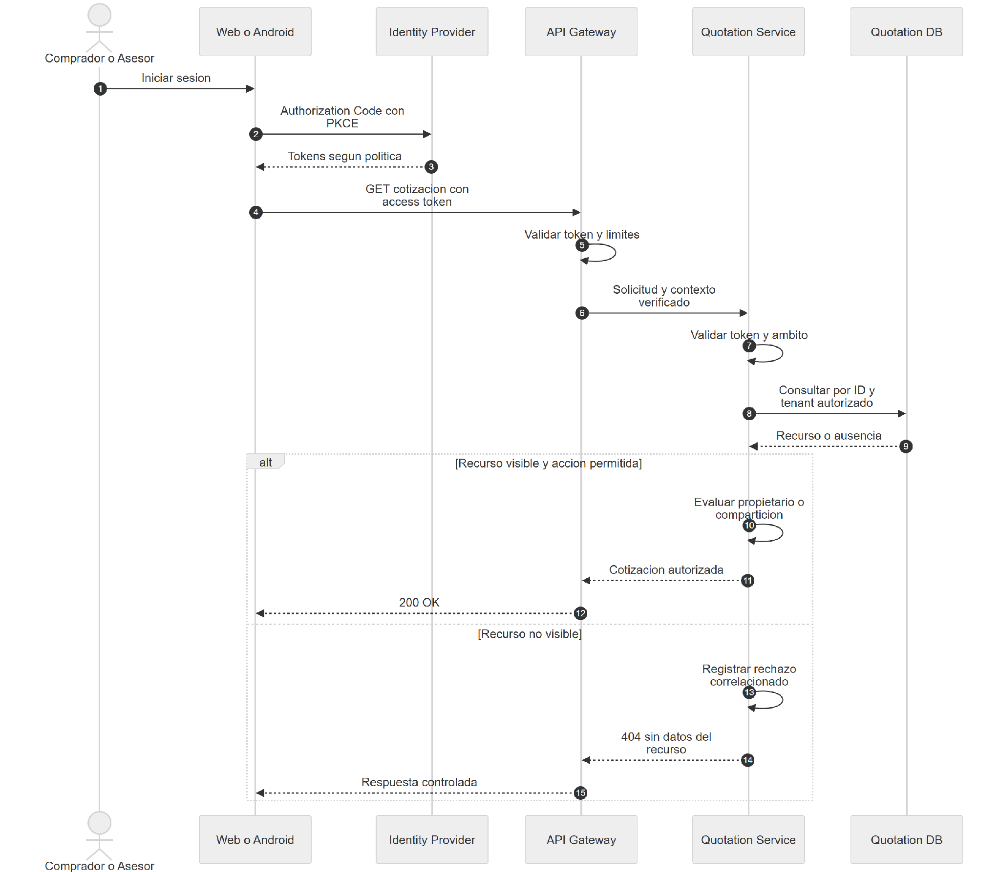

<em>Figura 4 — Vista arquitectónica. Código Mermaid en el Anexo A.</em>

#### ADR-001: Separación por bounded contexts y autorización distribuida

| **Campo** | **Registro** |
| --- | --- |
| Estado | Propuesta para adopción en AV2. |
| Contexto | CrediCasa combina datos personales, cálculos y propuestas privadas de varias inmobiliarias. |
| Decisión | Implementar cinco servicios delimitados por DDD, con Gateway y autorización por objeto dentro de cada servicio. |
| Alternativas | Monolito modular; autorización exclusivamente en Gateway; microservicios por entidad CRUD. |
| Justificación | Los límites propuestos corresponden a reglas y cambios de negocio; la autorización local protege recursos conocidos por cada contexto. |
| Consecuencias | Se requieren contratos, trazas y pruebas distribuidas. Aumenta el costo operativo. |
| Criterio de revisión | Revisar la descomposición si el equipo no puede operar los servicios o si los límites generan llamadas excesivas. |

El monolito modular es una alternativa válida para un equipo pequeño. La elección de microservicios responde al enfoque solicitado y a la necesidad de explorar límites independientes; sus beneficios deben evaluarse frente al costo real de operación.

#### 4.3.1.7. Analysis of Current Design and Review Iteration Goal

**Análisis.** El diseño asigna propietarios de datos y diferencia autenticación de autorización. El Gateway concentra controles generales y los servicios conservan decisiones de acceso sobre sus recursos.

Persisten riesgos relacionados con la configuración del proveedor de identidad, revocación de membresías y operación de múltiples servicios. Estos requieren pruebas; no se consideran resueltos por la existencia del diagrama.

#### Kanban de cierre de diseño:

| **Por hacer** | **En curso** | **En revisión** | **Hecho de diseño** |
| --- | --- | --- | --- |
| Implementar acceso y pruebas entre tenants. | Preparar contratos ejecutables. | ADR-001 y matriz de permisos. | Vistas C4, límites y responsabilidades. |

**Revisión de la meta:** satisfecha a nivel de especificación. Su aceptación técnica requiere demostrar que los accesos cruzados se rechazan y que los servicios no acceden a bases ajenas.

### 4.3.2. Iteration 2: Diseño y Refinamiento del Núcleo Financiero

#### 4.3.2.1. Architectural Design Backlog 2

| **ID** | **Elemento de diseño** | **Driver** | **Prioridad** | **Criterio de salida** |
| --- | --- | --- | --- | --- |
| AD-07 | Normalizar tasas y períodos | HU-ARQ-01; CON-04 | Alta | Fórmulas y unidades sin ambigüedad. |
| AD-08 | Diseñar método francés y gracia | HU-ARQ-01/​02 | Alta | Recurrencias y reglas definidas. |
| AD-09 | Incorporar cuotas extraordinarias | HU-ARQ-02 | Alta | Calendario, pesos y balón explícitos. |
| AD-10 | Diseñar TCEA, VAN y TIR | HU-ARQ-02; AC-04 | Alta | Flujos y solver definidos. |
| AD-11 | Definir precisión y conciliación | PA-02; AC-02 | Alta | Política decimal y saldo final. |
| AD-12 | Diseñar versionado y auditoría | QA-04; AC-01 | Alta | Snapshot y reproducción histórica. |
| AD-13 | Definir presupuesto de latencia | QA-01 | Alta | Camino crítico y prueba reproducible. |

#### 4.3.2.2. Establish Iteration Goal by Selecting Drivers

**Objetivo:** diseñar un motor financiero reproducible que genere cronogramas e indicadores consistentes con los flujos del deudor y con el objetivo de cálculo inferior a 400 ms p95.

Drivers seleccionados:

- HU-ARQ-01 y HU-ARQ-02.
- QA-01 y QA-04.
- CON-04 y CON-05.
- AC-01, AC-02 y AC-04.
La exactitud tiene prioridad sobre la entrega de un indicador aparente. Si el escenario no permite construir un cronograma válido o una raíz financiera admisible, el servicio debe explicar el problema y detener la emisión del resultado correspondiente.

#### 4.3.2.3. Choose One or More Elements of the System to Refine

Se refina Mortgage Pricing & Simulator Service en:

- Normalizador y validador.
- Conversor de tasas.
- Resolución de condiciones y RuleSet.
- Estrategia de amortización.
- Políticas de gracia y pagos extraordinarios.
- Políticas de seguros y cargos.
- Constructor de flujos.
- Solver de TIR/TCEA.
- Política de redondeo.
- Repositorio y snapshot financiero.
Quotation y los clientes se mantienen como consumidores del contrato.

#### 4.3.2.4. Choose One or More Design Concepts That Satisfy the Selected Drivers

Se aplican Strategy, Factory Method, value objects, cálculo decimal, núcleo funcional y políticas versionadas.

Los value objects principales son:

- Money(amount, currency).
- InterestRate(value, type, referencePeriod, capitalizationPeriod).
- LoanTerm(totalPeriods, graceSequence).
- PaymentPlan(weights, balloonPayments).
- CalculationPolicy(dayCount, precision, roundingVersion).
- FinancialResult(schedule, indicators, diagnostics, versions).
**Precision decimal.** Se propone MathContext.DECIMAL128 para operaciones intermedias y una política monetaria explícita para presentación. BigDecimal permite controlar precisión y redondeo, pero su pow estándar utiliza exponentes enteros; las conversiones con exponentes fraccionarios requieren una implementación decimal validada.

#### Modelo financiero

##### a. Conversión de tasas

Para una TEA y un período de d días bajo base 360:

Para el mes de 30 días:

Para una tasa nominal anual , capitalizable  veces al año:

Por tanto:

En capitalización mensual se utiliza ; en capitalización diaria sobre año comercial, . Una tasa nominal referida a otro período se normaliza usando su período declarado.

Los contratos no aceptan “12 %” sin indicar tipo de tasa, referencia temporal y capitalización.

##### b. Método francés vencido ordinario

Para principal , tasa mensual  y  pagos regulares:

Para :

En un período ordinario:

Donde  es el interés,  la amortización y  el saldo.

La cuota  no incluye automáticamente seguros ni cargos. El pago total es:

Donde  es el servicio de deuda completo del período; , desgravamen; , seguro de inmueble; y , cargos aplicables.

##### c. Gracia total

Durante un período de gracia total:

Los intereses se capitalizan. La ausencia de servicio de deuda no implica que todos los seguros o cargos se difieran: esa condición pertenece al producto.

##### d. Gracia parcial

Durante un período de gracia parcial:

Al terminar la gracia se determina la cuota de amortización con el saldo resultante y el plazo restante. El plazo de entrada indica expresamente si incluye la gracia; la propuesta adopta por defecto plazo total inclusivo.

##### e. Cuotas dobles y balón

Para representar pagos programados se utiliza:

Donde  es el peso de la cuota regular y  un pago extraordinario fijo. Para julio y diciembre puede utilizarse , de acuerdo con el calendario y las condiciones del producto.

En la etapa de amortización, la cuota base satisface:

De donde:

representa el saldo al inicio de esa etapa. El cronograma se obtiene mediante la recurrencia de saldos y debe comprobar que ningún pago genera un saldo negativo no previsto.

Una cuota doble no se implementa duplicando una cuota calculada bajo un calendario diferente. La estructura completa debe participar en la determinación de la cuota base.

Para un balón final fijo :

El contrato distingue si el balón se añade al pago regular final o lo sustituye. La ecuación anterior corresponde al caso adicional.

##### f. Seguros

El desgravamen se calcula conforme a la política del producto: puede depender del saldo, de una base asegurada o de condiciones personales declaradas.

El seguro de inmueble utiliza el valor asegurable definido por el producto, que no debe confundirse automáticamente con el precio comercial ni con el principal.

Cada política especifica:

- Base de cálculo.
- Tasa y período.
- Forma de prorrateo.
- Condiciones de vigencia.
- Tratamiento durante gracia.
- Inclusión en los flujos de costo.
##### g. Flujos del deudor

El desembolso neto recibido constituye un flujo positivo . Los pagos posteriores constituyen flujos negativos.

Para una tasa de descuento mensual :

La tasa  debe ser explícita y compatible con moneda y período. El VAN financiero del préstamo no representa por sí solo el valor económico integral de adquirir la vivienda.

La TIR mensual satisface:

Su equivalente anual sobre períodos mensuales es:

La TCEA utiliza los flujos incluidos por la política de costo aplicable. Si TIR y TCEA emplean exactamente los mismos flujos y convención, sus valores anualizados coinciden; no se inventa una diferencia conceptual para mostrar indicadores distintos.

##### h. Newton-Raphson con respaldo

Se calcula:

El solver:

1. Verifica flujos y cambios de signo.

2. Busca un intervalo permitido con cambio de signo.

3. Ejecuta Newton-Raphson dentro de límites válidos.

4. Sustituye pasos inseguros por bisección.

5. Evalúa convergencia y residual.

6. Devuelve un estado explícito si no encuentra una solución admisible.

Se propone una tolerancia de tasa de , residual monetario máximo de 0.01 y límite de 100 iteraciones, sujetos a verificación con casos de referencia.

#### 4.3.2.5. Instantiate Architectural Elements, Allocate Responsibilities, and Define Interfaces

| **Elemento** | **Responsabilidad** | **Interfaz interna** |
| --- | --- | --- |
| InputNormalizer | Normalizar moneda, tasas, períodos y pagos. | normalize(request) |
| ScenarioValidator | Verificar compatibilidad y límites. | validate(scenario, rules) |
| RateConverter | Convertir tasas mediante aritmética decimal. | toPeriodicRate(rate, dayCount) |
| RuleSetResolver | Seleccionar versiones aplicables. | resolve(productVersion, calculationDate) |
| FrenchOrdinaryStrategy | Construir la evolución de deuda. | calculate(scenario, policies) |
| InsurancePolicy | Calcular primas por período. | premium(periodContext) |
| CashFlowBuilder | Construir flujos según propósito. | build(schedule, inclusionPolicy) |
| FinancialIndicatorSolver | Resolver VAN, TIR y TCEA. | evaluate(cashFlows, settings) |
| RoundingPolicy | Crear cronograma monetario conciliado. | reconcile(rawSchedule) |
| SnapshotAssembler | Generar resultado canónico y hash. | assemble(inputs, results, versions) |
| SimulationRepository | Persistir escenario y cronograma. | save(aggregate, tenantContext) |

#### Contrato de cálculo

POST /api/v1/simulations/calculate

La solicitud contiene principal, moneda, plazo, tasa, fecha inicial, secuencia de gracia, pagos extraordinarios y versiones de condiciones.

La respuesta contiene:

- Cronograma y componentes por período.
- TEA normalizada.
- TCEA/TIR y su periodicidad.
- VAN y tasa de descuento.
- Versiones y hash.
- Diagnósticos y advertencias.
- Estado de cada indicador.
#### Contrato de persistencia

POST /api/v1/simulations

Persiste un escenario y su resultado. El servidor recalcula o verifica un token de resultado emitido por Pricing; no acepta un cronograma arbitrario proporcionado por el cliente.

#### Presupuesto de latencia orientativo

| **Etapa** | **Presupuesto** |
| --- | --- |
| Validación y normalización | 30 ms |
| Resolución local de reglas | 20 ms |
| Cronograma y seguros | 100 ms |
| Flujos y solver | 150 ms |
| Serialización y margen | 100 ms |

El presupuesto guía el perfilado. No representa mediciones ni permite sumar percentiles independientes para demostrar el p95 total.

#### Caso numérico de referencia

Para , tasa mensual de 1 %, 12 pagos y ausencia de seguros, cargos o gracia:

Este caso verifica la fórmula base. El cronograma a centavos debe aplicar la política de conciliación y ajustar el último pago de manera trazable.

#### 4.3.2.6. Sketch Views — C4 & UML — and Record Design Decisions

#### Vista C4 de componentes del simulador

  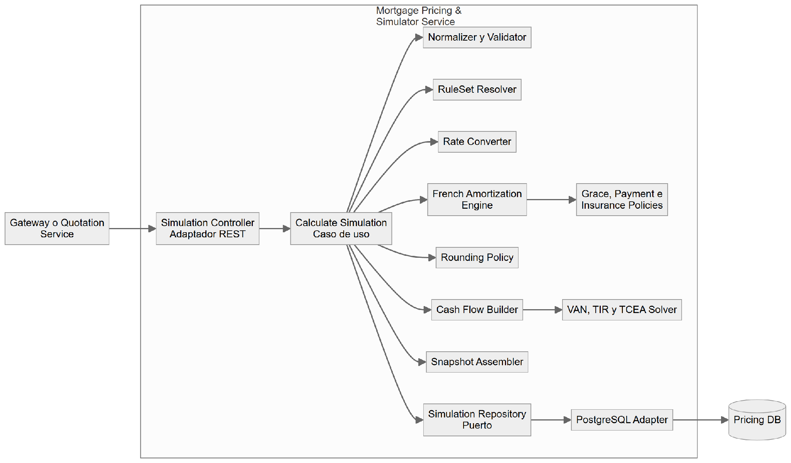

<em>Figura 5 — Vista arquitectónica. Código Mermaid en el Anexo A.</em>

#### Vista UML de Strategy y Factory Method

  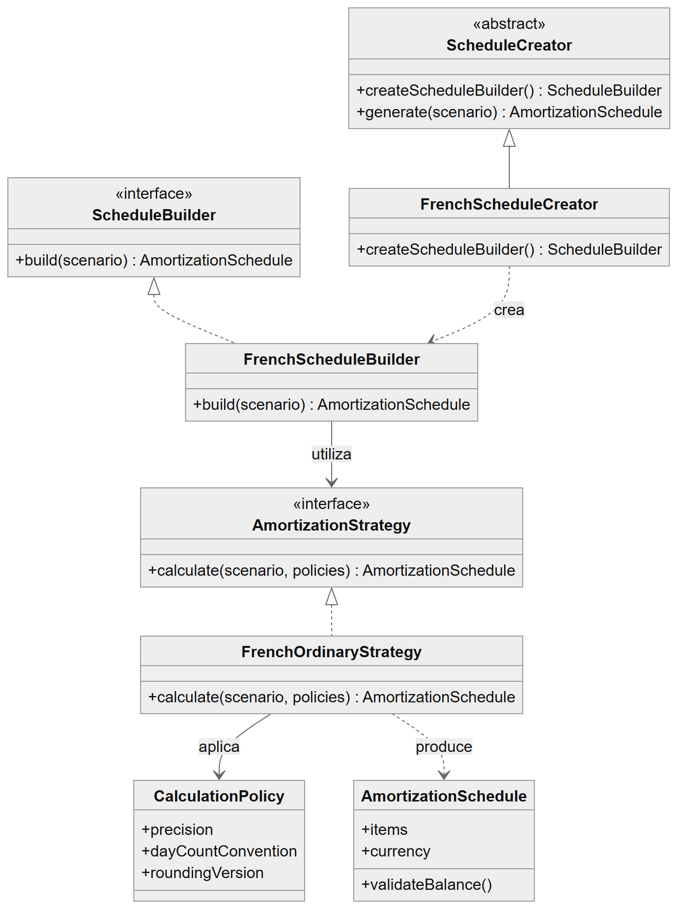

<em>Figura 6 — Vista arquitectónica. Código Mermaid en el Anexo A.</em>

#### ADR-002: Núcleo decimal determinista y reglas versionadas

| **Campo** | **Registro** |
| --- | --- |
| Estado | Propuesta para adopción en AV2. |
| Contexto | Tasas, gracia y redondeo pueden afectar materialmente el costo y el saldo. |
| Decisión | Implementar un núcleo puro con BigDecimal, estrategias y políticas versionadas; resolver indicadores con Newton-Raphson acotado y respaldo por bisección. |
| Alternativas | Aritmética double; cálculo en el cliente; fórmulas ligadas al controlador; Newton-Raphson sin protección. |
| Justificación | Facilita reproducción, auditoría, pruebas y gestión de cambios. |
| Consecuencias | Requiere funciones decimales validadas y una política consistente de precisión. |
| Criterio de revisión | Revisar implementación o precisión si falla un caso de referencia o el perfilado demuestra incumplimiento de QA-01. |

#### 4.3.2.7. Analysis of Current Design and Review Iteration Goal

**Análisis.** El diseño diferencia deuda, seguros, cargos y flujos del deudor. La gracia se incorpora a la evolución del saldo y los pagos extraordinarios participan en la determinación de la cuota.

La estructura permite cambiar una política sin sobrescribir resultados anteriores. El riesgo principal pendiente es la verificación del motor con un oráculo independiente.

**Validación requerida:**

- Tasas nominales y efectivas equivalentes.
- Tasa cero.
- Gracia total, parcial y secuencias admitidas.
- Cuotas dobles según fecha inicial.
- Balón adicional y sustitutorio.
- Seguros sobre bases diferentes.
- Redondeo acumulado.
- Solver sin convergencia o sin raíz admisible.
- Reproducción de versiones históricas.
- Prueba de carga definida en QA-01.
#### Kanban de cierre de diseño:

| **Por hacer** | **En curso** | **En revisión** | **Hecho de diseño** |
| --- | --- | --- | --- |
| Implementar y ejecutar validación financiera y de carga. | Preparar datos de referencia independientes. | Política de redondeo, seguros y flujos. | Componentes, fórmulas, contratos y ADR-002. |

**Revisión de la meta:** completa como diseño; pendiente de aceptación matemática y de rendimiento. El caso numérico base no sustituye las pruebas del conjunto de variantes.

### 4.3.3. Iteration 3: Trazabilidad, Versionado y Exportación de Cotizaciones

#### 4.3.3.1. Architectural Design Backlog 3

| **ID** | **Elemento de diseño** | **Driver** | **Prioridad** | **Criterio de salida** |
| --- | --- | --- | --- | --- |
| AD-14 | Diseñar snapshots inmutables | HU-ARQ-03; AC-01/​05 | Alta | Versiones independientes de condiciones actuales. |
| AD-15 | Definir concurrencia y estados | HU-ARQ-03; CON-05 | Alta | Sin sobrescritura ni duplicación de versiones. |
| AD-16 | Diseñar exportaciones | HU-ARQ-04; QA-01 | Alta | Jobs asíncronos vinculados a una versión. |
| AD-17 | Diseñar publicación confiable | HU-ARQ-04; QA-02 | Alta | Outbox y consumidores idempotentes. |
| AD-18 | Diseñar acceso a documentos | QA-03; AC-03 | Alta | Descarga autorizada por recurso. |
| AD-19 | Diseñar auditoría comercial | AC-01/​05 | Alta | Reconstrucción de emisión, exportación y envío. |

#### 4.3.3.2. Establish Iteration Goal by Selecting Drivers

**Objetivo:** conservar la evidencia de cada propuesta y producir documentos consistentes sin depender de datos actuales ni de la disponibilidad inmediata de proveedores.

Drivers seleccionados:

- HU-ARQ-03 y HU-ARQ-04.
- QA-02 y QA-03.
- CON-05.
- AC-01, AC-03 y AC-05.
La emisión se considera exitosa cuando la versión y su outbox se confirman localmente. La exportación y la entrega tienen estados propios, posteriores a esa confirmación.

**Resultado esperado:** una versión emitida puede reconstruirse y exportarse; los reintentos no crean versiones adicionales; usuarios sin permiso no acceden a sus archivos.

#### 4.3.3.3. Choose One or More Elements of the System to Refine

Se refinan:

- Agregado Quotation.
- Entidad inmutable QuotationVersion.
- Snapshot comercial y financiero.
- Máquina de estados.
- Outbox y publicador.
- Worker de exportación.
- Registro de deduplicación.
- Almacenamiento de archivos.
- Notification Service.
La simulación se utiliza mediante su contrato; no se trasladan fórmulas a los generadores de documentos.

#### 4.3.3.4. Choose One or More Design Concepts That Satisfy the Selected Drivers

| **Concepto** | **Aplicación** |
| --- | --- |
| Snapshots inmutables | Conservar condiciones y resultados emitidos. |
| Optimistic Locking | Detectar cambios concurrentes del agregado. |
| Idempotency Key | Repetir solicitudes sin duplicar la operación. |
| Transactional Outbox | Confirmar datos y evento en la misma transacción. |
| Idempotent Consumer | Evitar efectos duplicados ante reentregas. |
| Procesamiento asíncrono | Separar exportación de la emisión. |
| Estados explícitos | Diferenciar emisión, generación y entrega. |
| Almacenamiento privado | Controlar acceso a documentos comerciales. |

La inmutabilidad de versiones no equivale a Event Sourcing. El sistema conserva snapshots y auditoría sin exigir reconstruir todo el estado a partir de una secuencia de eventos.

#### 4.3.3.5. Instantiate Architectural Elements, Allocate Responsibilities, and Define Interfaces

#### Contenido mínimo del snapshot

| **Grupo** | **Contenido** |
| --- | --- |
| Identificación | Cotización, versión, tenant, autor y fecha. |
| Propiedad | Código, descripción, precio, moneda y versión del catálogo. |
| Financiamiento | Principal, inicial, plazo, tasa, capitalización y fecha inicial. |
| Estructura | Gracia, cuotas dobles, balón y pagos extraordinarios. |
| Costos | Seguros, cargos, bases y políticas utilizadas. |
| Resultados | Cronograma, TCEA, VAN, TIR y diagnósticos. |
| Reproducibilidad | Versiones del motor, reglas y redondeo; hash canónico. |
| Condiciones comerciales | Vigencia, supuestos y alcance referencial. |

Se conserva solo la información personal necesaria. El snapshot no debe incluir datos de identidad ajenos al propósito de la propuesta.

#### Interfaces REST

| **Operación** | **Endpoint** | **Comportamiento** |
| --- | --- | --- |
| Crear borrador | POST
/​api/​v1/​quotations | Crea el agregado dentro del tenant. |
| Emitir versión | POST
/​api/​v1/​quotations/​{id}/​versions | Obtiene snapshots autorizados y confirma la versión. |
| Consultar versión | GET
/​api/​v1/​quotations/​{id}/​versions/​{number} | Devuelve el snapshot histórico permitido. |
| Solicitar exportación | POST
/​api/​v1/​quotation-versions/​{id}/​exports | Registra un job y devuelve 202 Accepted. |
| Consultar job | GET
/​api/​v1/​exports/​{jobId} | Informa progreso y resultado. |
| Descargar archivo | GET
/​api/​v1/​exports/​{jobId}/​file | Reevalúa permisos y transmite el archivo. |
| Compartir propuesta | POST
/​api/​v1/​quotation-versions/​{id}/​shares | Registra destinatario y permiso explícito. |

Las operaciones de creación aceptan Idempotency-Key. Si una clave se reutiliza con otro contenido, el servicio devuelve conflicto. La emisión incluye la versión esperada del agregado para detectar concurrencia.

#### Contratos de eventos

| **Evento** | **Productor** | **Consumidor** | **Contenido mínimo** |
| --- | --- | --- | --- |
| QuotationVersionIssued.​v1 | Quotation | Notification | Evento, tenant, versión, destinatario autorizado y correlación. |
| QuotationExportRequested.​v1 | Quotation | Export Worker | Job, versión, formato y hash esperado. |
| QuotationExportCompleted.​v1 | Quotation | Notification | Job, versión y referencia de descarga autorizada. |
| NotificationDeliveryUpdated.​v1 | Notification | Quotation | Notificación, estado, referencia de proveedor y correlación. |

Cada evento incluye eventId, eventType, schemaVersion, occurredAt, tenantId y correlationId. Se evita transportar datos personales y cronogramas completos cuando basta una referencia.

#### Entrega e idempotencia

El worker utiliza una clave de negocio como (quotationVersionId, format, templateVersion). Antes de generar un archivo comprueba si ya existe un resultado válido.

El consumidor confirma el mensaje después de persistir su efecto. Los fallos transitorios se reintentan con espera creciente; los fallos permanentes se trasladan a una Dead Letter Queue con diagnóstico.

El envío de mensajes externos utiliza una clave de idempotencia cuando el proveedor la admite. Si no la admite y un timeout deja el resultado incierto, se registra ese estado y se reconcilia antes de repetir, evitando asumir entrega exactamente una vez.

#### Consistencia de PDF y XLSX

Ambos formatos se generan desde la misma versión. No consultan tasas actuales ni recalculan el préstamo.

El PDF presenta condiciones, indicadores, cronograma y alcance de la propuesta. El XLSX conserva importes y puede incorporar hojas de entradas, resultados y trazabilidad. Las fórmulas auxiliares, si se incluyen, no reemplazan el resultado emitido.

Como objetivos iniciales de exportación se proponen p95 menor de 15 segundos para PDF y menor de 20 segundos para XLSX de hasta 360 períodos, bajo carga de referencia definida para el worker.

#### 4.3.3.6. Sketch Views — C4 & UML — and Record Design Decisions

#### Vista de componentes del contexto de cotizaciones

  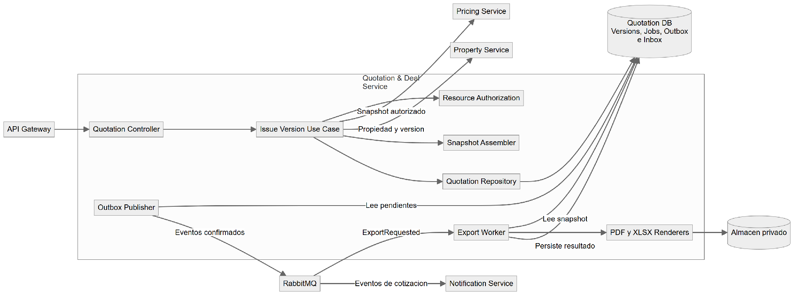

<em>Figura 7 — Vista arquitectónica. Código Mermaid en el Anexo A.</em>

#### Secuencia UML de emisión y exportación

  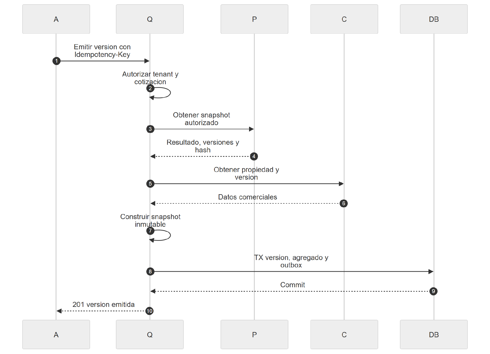

<em>Figura 8a — Emisión transaccional de la cotización.</em>

  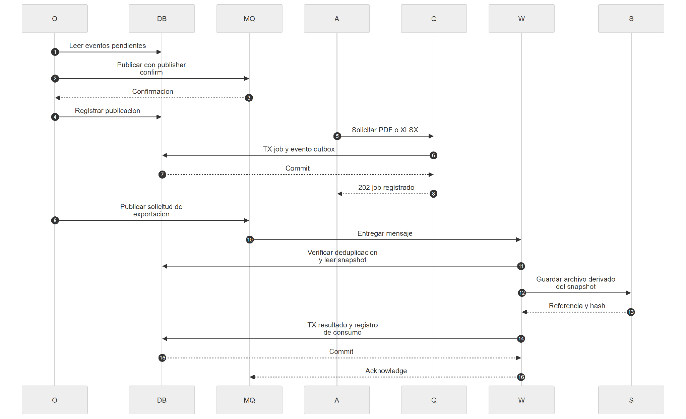

<em>Figura 8b — Publicación y exportación asíncrona. Código completo en el Anexo A.</em>

#### Máquina de estados de cotización

  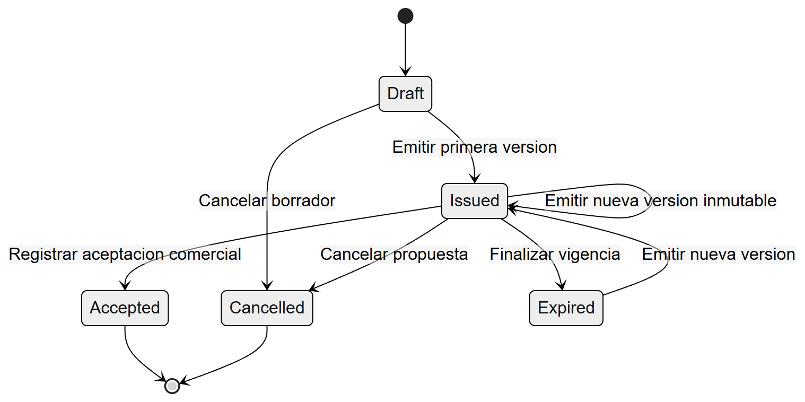

<em>Figura 9 — Vista arquitectónica. Código Mermaid en el Anexo A.</em>

Accepted representa aceptación comercial de la propuesta y no aprobación bancaria. Los estados de exportación y entrega se gestionan por separado.

#### ADR-003: Snapshots inmutables y exportación asíncrona

| **Campo** | **Registro** |
| --- | --- |
| Estado | Propuesta para adopción en AV2. |
| Contexto | Las condiciones cambian y los proveedores pueden fallar después de emitir una propuesta. |
| Decisión | Persistir versiones inmutables; confirmar emisión y outbox localmente; generar documentos y notificaciones de forma asíncrona e idempotente. |
| Alternativas | Actualizar cotizaciones emitidas; exportar con tasas actuales; generar documentos dentro de la transacción; publicar sin outbox. |
| Justificación | Conserva evidencia histórica y separa fallos comerciales, de exportación y de entrega. |
| Consecuencias | Mayor almacenamiento, jobs y estados visibles; necesidad de deduplicación y recuperación. |
| Criterio de revisión | Revisar costos y retención si el volumen crece; reevaluar contratos si el flujo exige nuevas garantías regulatorias. |

#### 4.3.3.7. Analysis of Current Design and Review Iteration Goal

**Análisis.** La emisión posee un límite transaccional definido. Los documentos dependen de una versión concreta y los reintentos no necesitan recalcular el crédito.

La arquitectura distingue la durabilidad de la cotización de la disponibilidad del archivo y de la entrega al destinatario. El hash detecta divergencias, pero no sustituye una firma digital ni aporta por sí solo no repudio.

**Validación requerida:**

- Emitir versiones concurrentes sin sobrescritura.
- Repetir una solicitud idempotente.
- Reiniciar el publicador antes y después de una confirmación.
- Reentregar mensajes al worker.
- Fallar después de guardar un archivo y antes de confirmar el job.
- Cambiar tasas y propiedades sin alterar una versión histórica.
- Comparar importes entre snapshot, PDF y XLSX.
- Rechazar descargas y comparticiones no autorizadas.
- Diferenciar envío pendiente, aceptación del proveedor y entrega.
#### Kanban de cierre de diseño:

| **Por hacer** | **En curso** | **En revisión** | **Hecho de diseño** |
| --- | --- | --- | --- |
| Implementar workers y pruebas de recuperación. | Preparar formatos de exportación. | Eventos, retención y política de compartición. | Snapshots, estados, interfaces y ADR-003. |

**Revisión de la meta:** satisfecha como especificación. La aceptación operativa requiere pruebas de duplicación, concurrencia, recuperación y equivalencia documental.

#### Trazabilidad consolidada de las iteraciones

| **Driver** | **Iteración principal** | **Decisión o mecanismo** | **Evidencia requerida** |
| --- | --- | --- | --- |
| HU-ARQ-01 | 2 | Motor francés, conversión y políticas. | Casos financieros de referencia. |
| HU-ARQ-02 | 2 | Flujos del deudor y solver protegido. | Comparación de indicadores y escenarios. |
| HU-ARQ-03 | 1 y 3 | Autorización y versiones inmutables. | Acceso por objeto y preservación histórica. |
| HU-ARQ-04 | 3 | Exportación asíncrona y notificación. | Equivalencia PDF/​XLSX y recuperación. |
| QA-01 | 2 | Núcleo local y camino crítico acotado. | Prueba de carga reproducible. |
| QA-02 | 1 y 3 | Adaptadores resilientes y outbox. | Inyección de fallos. |
| QA-03 | 1 y 3 | Políticas por objeto y tenant. | Matriz negativa de acceso. |
| QA-04 | 2 | RuleSets versionados. | Cambio controlado sin alterar snapshots. |
| AC-01/​02 | 2 y 3 | Auditoría y conciliación. | Reproducción y balance del cronograma. |
| AC-03/​05 | 1 y 3 | Aislamiento y evidencia comercial. | Pruebas entre tenants y versiones. |

# Conclusiones

Se consolidó con éxito el diseño arquitectónico de **CrediCasa** mediante el desacoplamiento en cinco *bounded contexts* estratégicos (Identity & Access, Mortgage Pricing & Simulator, Property & Project, Quotation & Deal, y Notification). Este enfoque aisla completamente la complejidad matemática y regulatoria del motor financiero de las operaciones comerciales y de autenticación, asegurando alta cohesión y bajo acoplamiento.

# Recomendaciones

Para el inicio del Sprint 1 (Capítulo V), se recomienda establecer la configuración estricta del Software Development Management: configurar la organización en GitHub aplicando la convención de ramas **GitFlow** (main, develop, feature/*), estandarizar las guías de estilo de código (Clean Code) y parametrizar los Dockerfile y docker-compose.yml para el levantamiento reproducible del entorno local (PostgreSQL, RabbitMQ y microservicios).

# Referencias Bibliográficas

Autoridad Nacional de Protección de Datos Personales. (2024). Resolución Directoral N.° 016-2024-JUS/DGTAIPD: Lineamientos y directivas para el tratamiento de datos personales en plataformas digitales. Ministerio de Justicia y Derechos Humanos. [https://www.gob.pe/institucion/anpd/normas-legales/6554453-n-016-2024-jus](https://www.gob.pe/institucion/anpd/normas-legales/6554453-n-016-2024-jus)

C4 Model. (s.f.). System context diagram: Core diagrams and notation overview. The C4 Model for Visualising Software Architecture. [https://c4model.com/diagrams/system-context](https://c4model.com/diagrams/system-context)

Open Worldwide Application Security Project. (2023). API1:2023 Broken object level authorization (BOLA). OWASP Foundation. [https://apisecurity.owasp.org/editions/2023/en/0xa1-broken-object-level-authorization/](https://apisecurity.owasp.org/editions/2023/en/0xa1-broken-object-level-authorization/)

Oracle Corporation. (s.f.). Class BigDecimal (Java SE Platform API specification). Oracle Help Center. [https://docs.oracle.com/en/java/javase/25/docs/api/java.base/java/math/BigDecimal.html](https://docs.oracle.com/en/java/javase/25/docs/api/java.base/java/math/BigDecimal.html)

RabbitMQ. (s.f.). Reliability guide: Clustering, acknowledgements and publisher confirms. RabbitMQ Documentation. [https://www.rabbitmq.com/docs/reliability](https://www.rabbitmq.com/docs/reliability)

Resilience4j. (s.f.). CircuitBreaker: Core modules, state transitions and fallback mechanisms. Resilience4j Documentation. [https://resilience4j.readme.io/docs/circuitbreaker](https://resilience4j.readme.io/docs/circuitbreaker)

Software Engineering Institute. (2006). Attribute-Driven Design (ADD) version 2.0 (Technical Report CMU/SEI-2006-TR-006). Carnegie Mellon University. [https://sei.cmu.edu/library/attribute-driven-design-add-version-20/](https://sei.cmu.edu/library/attribute-driven-design-add-version-20/)

Software Engineering Institute. (2016). ADD 3.0: Rethinking drivers and decisions in the software architecture design process. Carnegie Mellon University. [https://www.sei.cmu.edu/library/add-30-rethinking-drivers-and-decisions-in-the-design-process/](https://www.sei.cmu.edu/library/add-30-rethinking-drivers-and-decisions-in-the-design-process/)

Superintendencia de Banca, Seguros y Administradoras Privadas de Fondos de Pensiones. (2017, 21 de agosto). Resolución SBS N.° 3274-2017: Reglamento de gestión de conducta de mercado del sistema financiero. Diario Oficial El Peruano. [https://elperuano.pe/normaselperuano/2017/08/21/1556283-1/1556283-1.htm](https://elperuano.pe/normaselperuano/2017/08/21/1556283-1/1556283-1.htm)

Superintendencia de Banca, Seguros y Administradoras Privadas de Fondos de Pensiones. (2022). SBS establece precisiones sobre la contratación y cálculo del seguro de desgravamen. Superintendencia de Banca, Seguros y AFP. [https://www.sbs.gob.pe/noticia/detallenoticia/idnoticia/3821](https://www.sbs.gob.pe/noticia/detallenoticia/idnoticia/3821)

Superintendencia de Banca, Seguros y Administradoras Privadas de Fondos de Pensiones. (s.f.). Rendimiento y costo del crédito: Información de tasas activas y metodología de la TCEA. Superintendencia de Banca, Seguros y AFP. [https://www.sbs.gob.pe/download/TipoTasa/files/00083_2_15.htm](https://www.sbs.gob.pe/download/TipoTasa/files/00083_2_15.htm)

# Anexos

  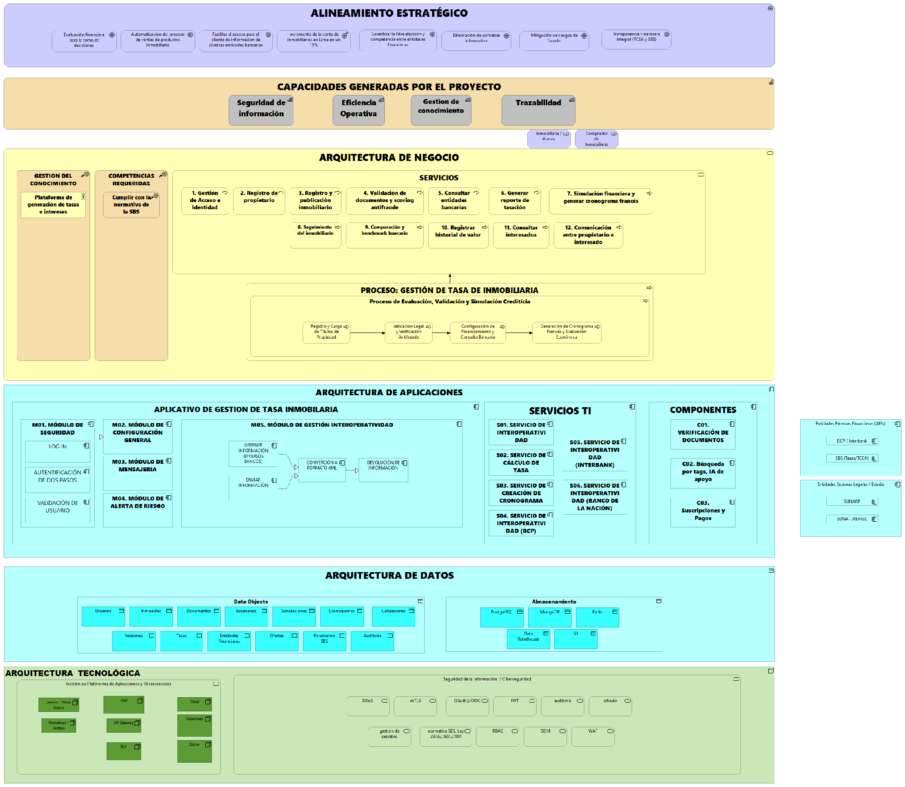

## Anexo A — Código fuente de los diagramas Mermaid

Los bloques siguientes conservan los diagramas completos y pueden copiarse a un editor compatible con Mermaid. Las figuras del cuerpo se generaron a partir de estos modelos.

### A.1. Código Mermaid de la figura 1

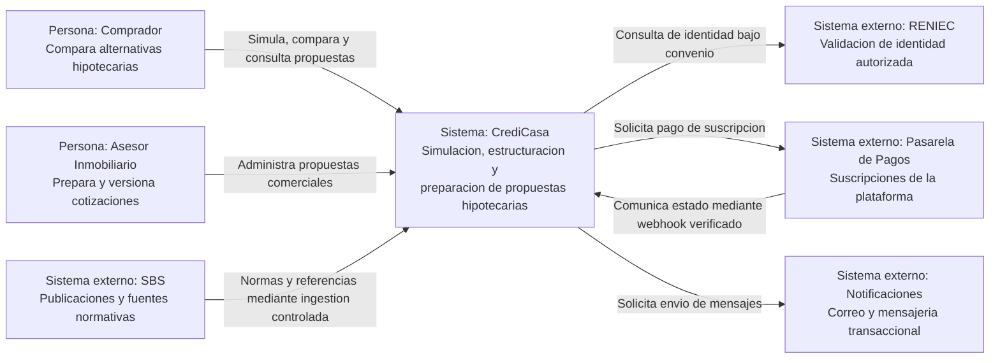
```mermaid
flowchart LR
    %% C4 Nivel 1: personas, sistema y sistemas externos.
    %% Las conexiones no afirman la existencia de APIs publicas.

    comprador["Persona: Comprador<br/>Compara alternativas hipotecarias"]
    asesor["Persona: Asesor Inmobiliario<br/>Prepara y versiona cotizaciones"]

    credicasa["Sistema: CrediCasa<br/>Simulacion, estructuracion y<br/>preparacion de propuestas hipotecarias"]

    sbs["Sistema externo: SBS<br/>Publicaciones y fuentes normativas"]
    reniec["Sistema externo: RENIEC<br/>Validacion de identidad autorizada"]
    pagos["Sistema externo: Pasarela de Pagos<br/>Suscripciones de la plataforma"]
    notificaciones["Sistema externo: Notificaciones<br/>Correo y mensajeria transaccional"]

    comprador -->|"Simula, compara y consulta propuestas"| credicasa
    asesor -->|"Administra propuestas comerciales"| credicasa

    sbs -->|"Normas y referencias mediante ingestion controlada"| credicasa
    credicasa -->|"Consulta de identidad bajo convenio"| reniec
    credicasa -->|"Solicita pago de suscripcion"| pagos
    pagos -->|"Comunica estado mediante webhook verificado"| credicasa
    credicasa -->|"Solicita envio de mensajes"| notificaciones
```

### A.2. Código Mermaid de la figura 2

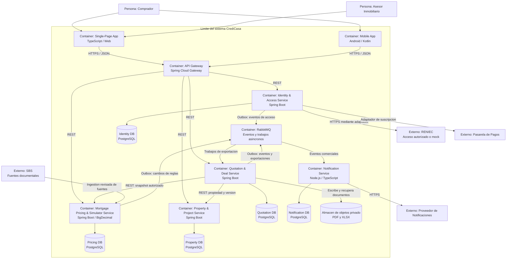
```mermaid
flowchart TB
    %% C4 Nivel 2 representado con flowchart para portabilidad.
    %% Cada servicio posee su almacenamiento.

    comprador["Persona: Comprador"]
    asesor["Persona: Asesor Inmobiliario"]

    subgraph CC["Limite del sistema CrediCasa"]
        web["Container: Single-Page App<br/>TypeScript / Web"]
        mobile["Container: Mobile App<br/>Android / Kotlin"]
        gateway["Container: API Gateway<br/>Spring Cloud Gateway"]

        identity["Container: Identity & Access Service<br/>Spring Boot"]
        pricing["Container: Mortgage Pricing & Simulator Service<br/>Spring Boot / BigDecimal"]
        property["Container: Property & Project Service<br/>Spring Boot"]
        quotation["Container: Quotation & Deal Service<br/>Spring Boot"]
        notification["Container: Notification Service<br/>Node.js / TypeScript"]

        broker["Container: RabbitMQ<br/>Eventos y trabajos asincronos"]

        identitydb[("Identity DB<br/>PostgreSQL")]
        pricingdb[("Pricing DB<br/>PostgreSQL")]
        propertydb[("Property DB<br/>PostgreSQL")]
        quotationdb[("Quotation DB<br/>PostgreSQL")]
        notificationdb[("Notification DB<br/>PostgreSQL")]
        files[("Almacen de objetos privado<br/>PDF y XLSX")]
    end

    sbs["Externo: SBS<br/>Fuentes documentales"]
    reniec["Externo: RENIEC<br/>Acceso autorizado o mock"]
    payment["Externo: Pasarela de Pagos"]
    provider["Externo: Proveedor de Notificaciones"]

    comprador --> web
    comprador --> mobile
    asesor --> web

    web -->|"HTTPS / JSON"| gateway
    mobile -->|"HTTPS / JSON"| gateway

    gateway -->|"REST"| identity
    gateway -->|"REST"| pricing
    gateway -->|"REST"| property
    gateway -->|"REST"| quotation

    identity --> identitydb
    pricing --> pricingdb
    property --> propertydb
    quotation --> quotationdb
    notification --> notificationdb

    quotation -->|"REST: snapshot autorizado"| pricing
    quotation -->|"REST: propiedad y version"| property

    sbs -->|"Ingestion revisada de fuentes"| pricing
    identity -->|"HTTPS mediante adaptador"| reniec
    identity -->|"Adaptador de suscripcion"| payment

    quotation -->|"Outbox: eventos y exportaciones"| broker
    pricing -->|"Outbox: cambios de reglas"| broker
    identity -->|"Outbox: eventos de acceso"| broker

    broker -->|"Eventos comerciales"| notification
    broker -->|"Trabajos de exportacion"| quotation

    quotation -->|"Escribe y recupera documentos"| files
    notification -->|"HTTPS"| provider
```

### A.3. Código Mermaid de la figura 3

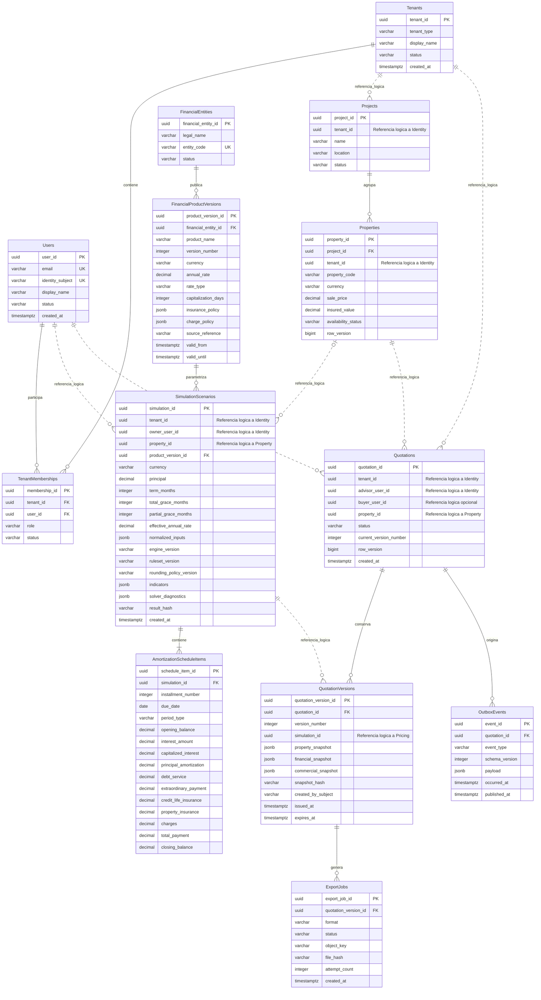
```mermaid
erDiagram
    %% Modelo integrado.
    %% FK indica una restriccion dentro de la base del servicio.
    %% Las referencias entre contextos se documentan como logicas.

    Tenants {
        uuid tenant_id PK
        varchar tenant_type
        varchar display_name
        varchar status
        timestamptz created_at
    }

    Users {
        uuid user_id PK
        varchar email UK
        varchar identity_subject UK
        varchar display_name
        varchar status
        timestamptz created_at
    }

    TenantMemberships {
        uuid membership_id PK
        uuid tenant_id FK
        uuid user_id FK
        varchar role
        varchar status
    }

    Projects {
        uuid project_id PK
        uuid tenant_id "Referencia logica a Identity"
        varchar name
        varchar location
        varchar status
    }

    Properties {
        uuid property_id PK
        uuid project_id FK
        uuid tenant_id "Referencia logica a Identity"
        varchar property_code
        varchar currency
        decimal sale_price
        decimal insured_value
        varchar availability_status
        bigint row_version
    }

    FinancialEntities {
        uuid financial_entity_id PK
        varchar legal_name
        varchar entity_code UK
        varchar status
    }

    FinancialProductVersions {
        uuid product_version_id PK
        uuid financial_entity_id FK
        varchar product_name
        integer version_number
        varchar currency
        decimal annual_rate
        varchar rate_type
        integer capitalization_days
        jsonb insurance_policy
        jsonb charge_policy
        varchar source_reference
        timestamptz valid_from
        timestamptz valid_until
    }

    SimulationScenarios {
        uuid simulation_id PK
        uuid tenant_id "Referencia logica a Identity"
        uuid owner_user_id "Referencia logica a Identity"
        uuid property_id "Referencia logica a Property"
        uuid product_version_id FK
        varchar currency
        decimal principal
        integer term_months
        integer total_grace_months
        integer partial_grace_months
        decimal effective_annual_rate
        jsonb normalized_inputs
        varchar engine_version
        varchar ruleset_version
        varchar rounding_policy_version
        jsonb indicators
        jsonb solver_diagnostics
        varchar result_hash
        timestamptz created_at
    }

    AmortizationScheduleItems {
        uuid schedule_item_id PK
        uuid simulation_id FK
        integer installment_number
        date due_date
        varchar period_type
        decimal opening_balance
        decimal interest_amount
        decimal capitalized_interest
        decimal principal_amortization
        decimal debt_service
        decimal extraordinary_payment
        decimal credit_life_insurance
        decimal property_insurance
        decimal charges
        decimal total_payment
        decimal closing_balance
    }

    Quotations {
        uuid quotation_id PK
        uuid tenant_id "Referencia logica a Identity"
        uuid advisor_user_id "Referencia logica a Identity"
        uuid buyer_user_id "Referencia logica opcional"
        uuid property_id "Referencia logica a Property"
        varchar status
        integer current_version_number
        bigint row_version
        timestamptz created_at
    }

    QuotationVersions {
        uuid quotation_version_id PK
        uuid quotation_id FK
        integer version_number
        uuid simulation_id "Referencia logica a Pricing"
        jsonb property_snapshot
        jsonb financial_snapshot
        jsonb commercial_snapshot
        varchar snapshot_hash
        varchar created_by_subject
        timestamptz issued_at
        timestamptz expires_at
    }

    ExportJobs {
        uuid export_job_id PK
        uuid quotation_version_id FK
        varchar format
        varchar status
        varchar object_key
        varchar file_hash
        integer attempt_count
        timestamptz created_at
    }

    OutboxEvents {
        uuid event_id PK
        uuid quotation_id FK
        varchar event_type
        integer schema_version
        jsonb payload
        timestamptz occurred_at
        timestamptz published_at
    }

    Users ||--o{ TenantMemberships : participa
    Tenants ||--o{ TenantMemberships : contiene

    Tenants ||..o{ Projects : referencia_logica
    Projects ||--o{ Properties : agrupa

    FinancialEntities ||--o{ FinancialProductVersions : publica
    FinancialProductVersions ||--o{ SimulationScenarios : parametriza
    SimulationScenarios ||--|{ AmortizationScheduleItems : contiene

    Users ||..o{ SimulationScenarios : referencia_logica
    Properties o|..o{ SimulationScenarios : referencia_logica

    Tenants ||..o{ Quotations : referencia_logica
    Users ||..o{ Quotations : referencia_logica_asesor
    Properties ||..o{ Quotations : referencia_logica

    Quotations ||--o{ QuotationVersions : conserva
    SimulationScenarios ||..o{ QuotationVersions : referencia_logica

    QuotationVersions ||--o{ ExportJobs : genera
    Quotations ||--o{ OutboxEvents : origina
```

### A.4. Código Mermaid de la figura 4

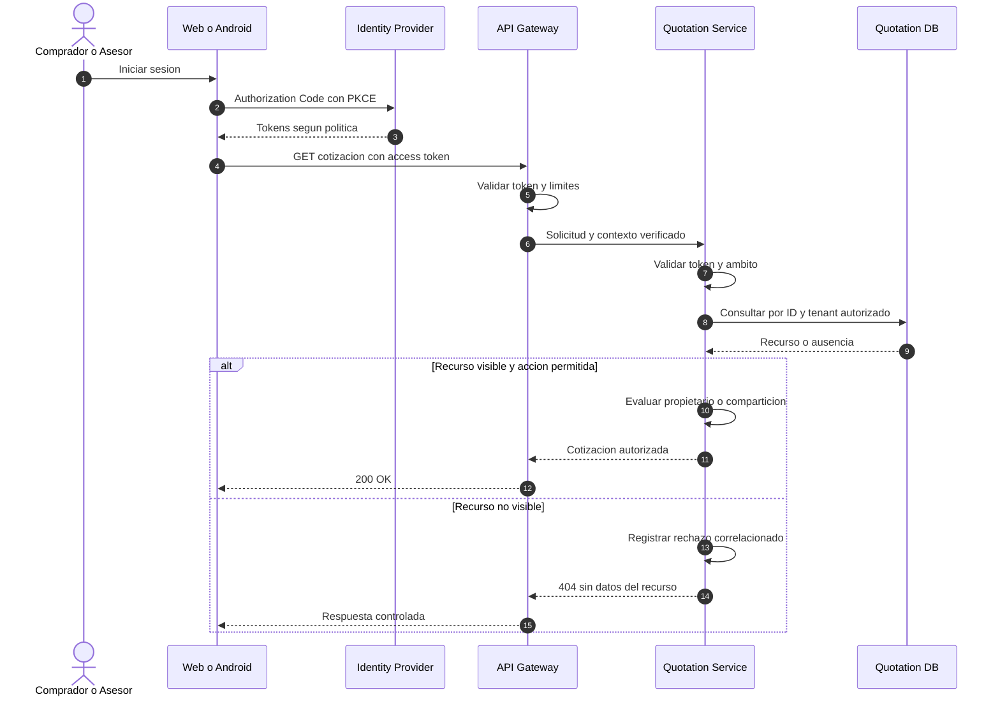
```mermaid
sequenceDiagram
    autonumber
    actor U as Comprador o Asesor
    participant C as Web o Android
    participant ID as Identity Provider
    participant G as API Gateway
    participant Q as Quotation Service
    participant DB as Quotation DB

    U->>C: Iniciar sesion
    C->>ID: Authorization Code con PKCE
    ID-->>C: Tokens segun politica

    C->>G: GET cotizacion con access token
    G->>G: Validar token y limites
    G->>Q: Solicitud y contexto verificado
    Q->>Q: Validar token y ambito
    Q->>DB: Consultar por ID y tenant autorizado
    DB-->>Q: Recurso o ausencia

    alt Recurso visible y accion permitida
        Q->>Q: Evaluar propietario o comparticion
        Q-->>G: Cotizacion autorizada
        G-->>C: 200 OK
    else Recurso no visible
        Q->>Q: Registrar rechazo correlacionado
        Q-->>G: 404 sin datos del recurso
        G-->>C: Respuesta controlada
    end
```

### A.5. Código Mermaid de la figura 5

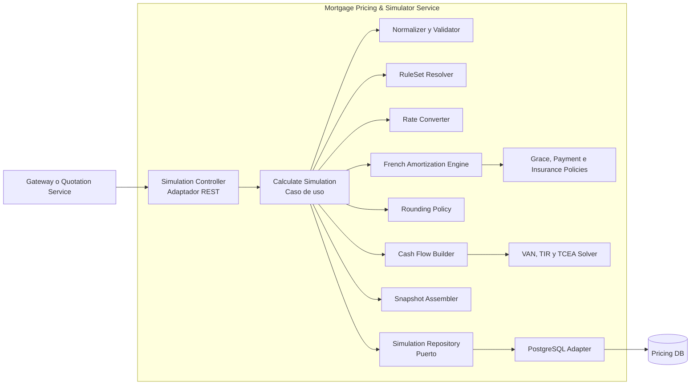
```mermaid
flowchart LR
    %% C4 Nivel 3: componentes de Pricing.

    caller["Gateway o Quotation Service"]

    subgraph PR["Mortgage Pricing & Simulator Service"]
        api["Simulation Controller<br/>Adaptador REST"]
        usecase["Calculate Simulation<br/>Caso de uso"]
        normalizer["Normalizer y Validator"]
        resolver["RuleSet Resolver"]
        rate["Rate Converter"]
        engine["French Amortization Engine"]
        policies["Grace, Payment e Insurance Policies"]
        rounding["Rounding Policy"]
        flows["Cash Flow Builder"]
        solver["VAN, TIR y TCEA Solver"]
        snapshot["Snapshot Assembler"]
        repo["Simulation Repository<br/>Puerto"]
        adapter["PostgreSQL Adapter"]
    end

    db[("Pricing DB")]

    caller --> api
    api --> usecase
    usecase --> normalizer
    usecase --> resolver
    usecase --> rate
    usecase --> engine
    engine --> policies
    usecase --> rounding
    usecase --> flows
    flows --> solver
    usecase --> snapshot
    usecase --> repo
    repo --> adapter
    adapter --> db
```

### A.6. Código Mermaid de la figura 6

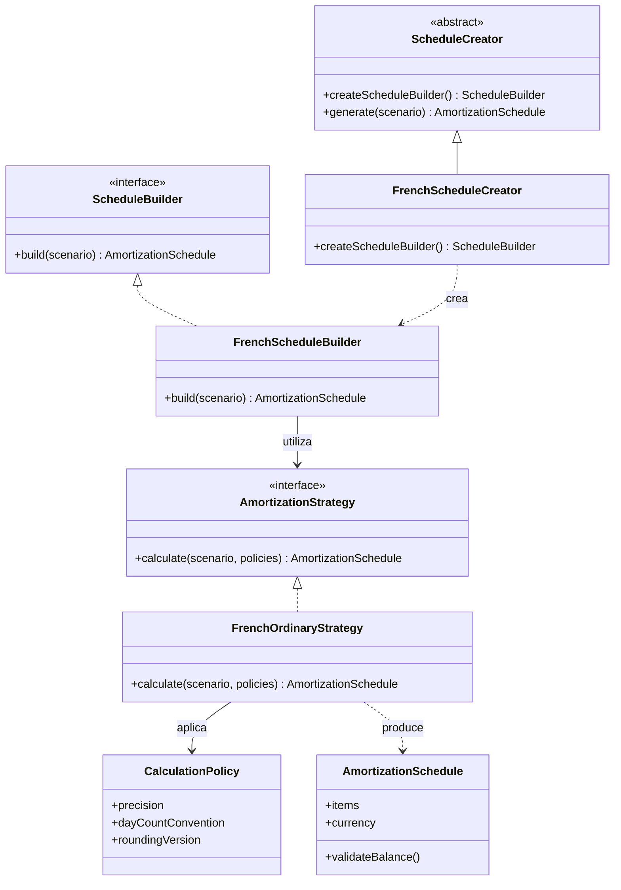
```mermaid
classDiagram
    class ScheduleCreator {
        <<abstract>>
        +createScheduleBuilder() ScheduleBuilder
        +generate(scenario) AmortizationSchedule
    }

    class FrenchScheduleCreator {
        +createScheduleBuilder() ScheduleBuilder
    }

    class ScheduleBuilder {
        <<interface>>
        +build(scenario) AmortizationSchedule
    }

    class FrenchScheduleBuilder {
        +build(scenario) AmortizationSchedule
    }

    class AmortizationStrategy {
        <<interface>>
        +calculate(scenario, policies) AmortizationSchedule
    }

    class FrenchOrdinaryStrategy {
        +calculate(scenario, policies) AmortizationSchedule
    }

    class CalculationPolicy {
        +precision
        +dayCountConvention
        +roundingVersion
    }

    class AmortizationSchedule {
        +items
        +currency
        +validateBalance()
    }

    ScheduleCreator <|-- FrenchScheduleCreator
    ScheduleBuilder <|.. FrenchScheduleBuilder
    AmortizationStrategy <|.. FrenchOrdinaryStrategy
    FrenchScheduleCreator ..> FrenchScheduleBuilder : crea
    FrenchScheduleBuilder --> AmortizationStrategy : utiliza
    FrenchOrdinaryStrategy --> CalculationPolicy : aplica
    FrenchOrdinaryStrategy ..> AmortizationSchedule : produce
```

### A.7. Código Mermaid de la figura 7

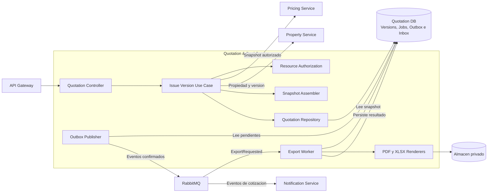
```mermaid
flowchart LR
    %% C4 Nivel 3: componentes de Quotation.

    gateway["API Gateway"]
    pricing["Pricing Service"]
    property["Property Service"]

    subgraph QS["Quotation & Deal Service"]
        api["Quotation Controller"]
        app["Issue Version Use Case"]
        auth["Resource Authorization"]
        assembler["Snapshot Assembler"]
        repository["Quotation Repository"]
        publisher["Outbox Publisher"]
        worker["Export Worker"]
        renderer["PDF y XLSX Renderers"]
    end

    db[("Quotation DB<br/>Versions, Jobs, Outbox e Inbox")]
    mq["RabbitMQ"]
    storage[("Almacen privado")]
    notify["Notification Service"]

    gateway --> api
    api --> app
    app --> auth
    app -->|"Snapshot autorizado"| pricing
    app -->|"Propiedad y version"| property
    app --> assembler
    app --> repository
    repository --> db

    publisher -->|"Lee pendientes"| db
    publisher -->|"Eventos confirmados"| mq

    mq -->|"ExportRequested"| worker
    worker -->|"Lee snapshot"| db
    worker --> renderer
    renderer --> storage
    worker -->|"Persiste resultado"| db

    mq -->|"Eventos de cotizacion"| notify
```

### A.8. Código Mermaid de la figura 8

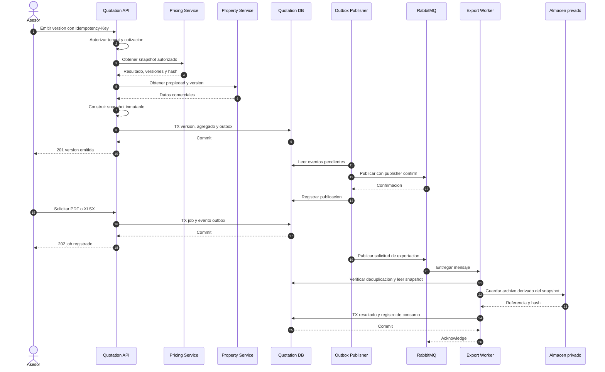
```mermaid
sequenceDiagram
    autonumber
    actor A as Asesor
    participant Q as Quotation API
    participant P as Pricing Service
    participant C as Property Service
    participant DB as Quotation DB
    participant O as Outbox Publisher
    participant MQ as RabbitMQ
    participant W as Export Worker
    participant S as Almacen privado

    A->>Q: Emitir version con Idempotency-Key
    Q->>Q: Autorizar tenant y cotizacion
    Q->>P: Obtener snapshot autorizado
    P-->>Q: Resultado, versiones y hash
    Q->>C: Obtener propiedad y version
    C-->>Q: Datos comerciales
    Q->>Q: Construir snapshot inmutable
    Q->>DB: TX version, agregado y outbox
    DB-->>Q: Commit
    Q-->>A: 201 version emitida

    O->>DB: Leer eventos pendientes
    O->>MQ: Publicar con publisher confirm
    MQ-->>O: Confirmacion
    O->>DB: Registrar publicacion

    A->>Q: Solicitar PDF o XLSX
    Q->>DB: TX job y evento outbox
    DB-->>Q: Commit
    Q-->>A: 202 job registrado

    O->>MQ: Publicar solicitud de exportacion
    MQ->>W: Entregar mensaje
    W->>DB: Verificar deduplicacion y leer snapshot
    W->>S: Guardar archivo derivado del snapshot
    S-->>W: Referencia y hash
    W->>DB: TX resultado y registro de consumo
    DB-->>W: Commit
    W-->>MQ: Acknowledge
```

### A.9. Código Mermaid de la figura 9

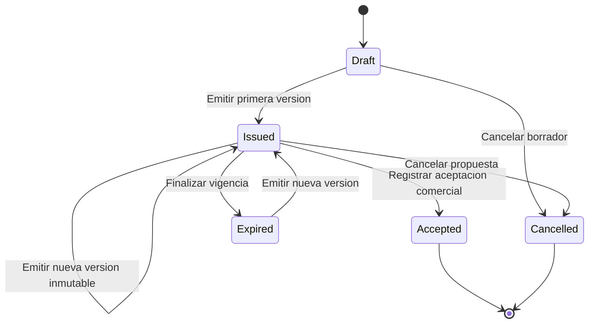
```mermaid
stateDiagram-v2
    [*] --> Draft
    Draft --> Issued: Emitir primera version
    Draft --> Cancelled: Cancelar borrador
    Issued --> Issued: Emitir nueva version inmutable
    Issued --> Accepted: Registrar aceptacion comercial
    Issued --> Expired: Finalizar vigencia
    Issued --> Cancelled: Cancelar propuesta
    Expired --> Issued: Emitir nueva version
    Accepted --> [*]
    Cancelled --> [*]
```

**Links**

| **Descripción** | **Enlace** |
| --- | --- |
| Repositorio del Reporte | [Abrir repositorio](https://github.com/FidiaCorp/upc-pre-202620-1ASI0657-15987-FidiaCorp-report) |
| Repositorio del Frontend (Vue 3 + Vite) | [Abrir repositorio](https://github.com/FidiaCorp/upc-pre-202620-1ASI0657-15987-FidiaCorp-FrontEnd) |

